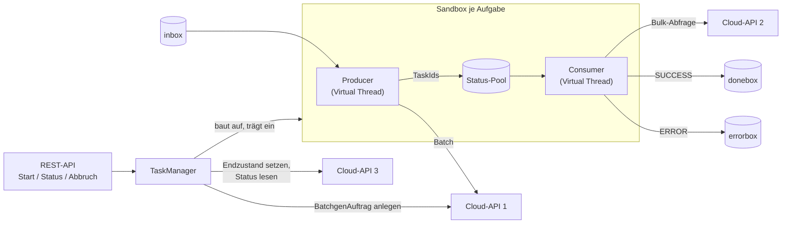

# Asynchrone Testdaten-Pipeline

Spring-Boot-Anwendung, die Testdaten je Benutzer:in in der Cloud erzeugen lässt. Für jede Aufgabe legt sie in der
Cloud einen BatchgenAuftrag an, übermittelt die Dateien aus dem lokalen Ordner `inbox` stapelweise, verfolgt den
Erzeugungsstatus, den die Cloud selbst aktualisiert, und verschiebt jede Datei je nach Ergebnis in die `donebox` oder
`errorbox`. Den Endzustand des BatchgenAuftrags schreibt die Anwendung zurück in die Cloud.

Jede Aufgabe läuft isoliert in einer eigenen Sandbox aus Producer, Consumer und Status-Pool (Producer-Consumer-Muster
auf Virtual Threads). Der Ablauf ist in [`funktionsweise_sequenz.md`](docs/architect/funktionsweise_sequenz.md)
beschrieben; der Code verweist auf dessen Abschnitte.

**Technik:** Java 21 · Spring Boot 4.1 (WebFlux für REST-API und WebClient) · Jackson 3 · Java NIO.2 · In-Memory (Phase 1)

## Funktionsweise



1. **Start** – Liegen in der `pendingbox` noch Dateien, wird der Start abgewiesen. Sonst legt der TaskManager über
   Cloud-API 1 einen BatchgenAuftrag an (seine Nummer ist die Aufgabennummer), baut die Sandbox auf, trägt sie in die
   TaskRegistry ein und startet Producer und Consumer. Je Benutzer:in läuft höchstens eine Aufgabe.
2. **Producer** – verschiebt bis zu `batch-size` Dateien aus der `inbox` in die `pendingbox` und übermittelt sie
   zusammen mit der Aufgabennummer in einem Aufruf an Cloud-API 1. Die TaskId jeder umgewandelten Datei sichert er als
   Marker und trägt die Datei in den Status-Pool ein; nicht umgewandelte Dateien kommen in die `errorbox`. Danach
   wartet er, bis der Pool auf `pool-resume-threshold` gesunken ist.
3. **Consumer** – fragt die fälligen TaskIds gebündelt bei Cloud-API 2 ab: `SUCCESS` → `donebox`, `ERROR` →
   `errorbox`, `PENDING` → nach `poll-interval` erneut.
4. **Statusabfrage** – aus der Cloud (Cloud-API 3), solange die Aufgabe läuft zusätzlich der lokale Stand der Sandbox.
5. **Abbruch von außen** – setzt das Abbruchsignal; Producer und Consumer beenden sich, ihre Dateien bleiben liegen.
6. **Abschluss und Abmeldung** – Sind beide Threads beendet, schreibt der TaskManager den Endzustand über Cloud-API 3
   und entfernt die Sandbox aus der TaskRegistry.

Cloud-API 1 ist nicht idempotent und wird nie wiederholt. Schlägt eine Übermittlung fehl, entscheidet die Art des
Fehlers:

| Fehler | Beispiel | Folge |
|---|---|---|
| eindeutig nicht verarbeitet | Verbindung abgelehnt, `4xx`, `503` | Dateien zurück in die `inbox`; erneuter Versuch nach `sweep-interval`, die Wartezeit verdoppelt sich bis `submit-retry-max-wait` |
| Ergebnis unklar | Timeout, sonstige `5xx`, unlesbare Antwort | Dateien bleiben **ohne Marker** in der `pendingbox` und werden nicht erneut übermittelt |

### Endzustände

| Zustand | Auslöser | Was liegen bleibt |
|---|---|---|
| `COMPLETED` | `inbox` vollständig übermittelt und Status-Pool leer | nur Dateien mit unklarem Übermittlungsergebnis |
| `TIMEOUT` | Laufzeit erreicht `task-timeout` | Dateien ohne Ergebnis mit Marker in der `pendingbox`, nicht gelesene in der `inbox` |
| `ERROR` | Fehlerzähler erreicht `error-threshold` | wie bei `TIMEOUT` |
| `TERMINATED` | Abbruch über die REST-API | wie bei `TIMEOUT` |

Die Anwendung schreibt diese Zustände über Cloud-API 3 in den BatchgenAuftrag. Wird die Anwendung beendet oder stoppt
ein unerwarteter Fehler die Sandbox, wird wie bei einem Absturz nichts geschrieben: Der BatchgenAuftrag bleibt
`RUNNING` und muss manuell korrigiert werden (Abschnitt 7).

### Ordner je Benutzer:in

```
<base-directory>/<userId>/
├── inbox/        abgelegte, noch zu übermittelnde Dateien
├── pendingbox/   an Cloud-API 1 übergeben, Ergebnis steht aus
│   └── .taskids/ TaskId je Datei als Marker; eine Datei ohne Marker hat ein unklares Übermittlungsergebnis
├── donebox/      erfolgreich erzeugt
└── errorbox/     nicht umgewandelt, fehlerhaft erzeugt oder unlesbar
```

Die Ordner werden beim ersten Start angelegt. Gültige Benutzerkennungen: `[A-Za-z0-9][A-Za-z0-9._-]{0,63}`.

Es gibt kein Fortsetzen: Eine neue Aufgabe übernimmt keine Dateien aus der `pendingbox`. Solange dort Dateien liegen,
wird der Start mit `PENDINGBOX_NOT_EMPTY` abgewiesen; die Benutzer:in bearbeitet sie zuerst von Hand (Abschnitt 7).

## REST-API

| Methode | Pfad | Wirkung |
|---|---|---|
| `POST` | `/api/users/{userId}/tasks` | Startet eine Aufgabe: `202` mit `Location`-Header und lokalem Stand |
| `GET` | `/api/users/{userId}/tasks/{taskNumber}` | Status aus der Cloud, solange die Aufgabe läuft zusätzlich der lokale Stand |
| `POST` | `/api/users/{userId}/tasks/{taskNumber}/cancel` | Abbruch von außen: `202` mit lokalem Stand; `TERMINATED` wird nach dem Ende der Threads geschrieben |

Die Statusabfrage liefert:

| Feld | Bedeutung |
|---|---|
| `taskNumber`, `userId` | Aufgabennummer (= Nummer des BatchgenAuftrags) und Benutzer:in |
| `cloud` | `status` des BatchgenAuftrags sowie `success`, `error`, `pending` je Datensatzstatus; `null`, wenn die Cloud gerade nicht erreichbar ist |
| `local` | lokaler Stand der Sandbox; `null`, sobald die Aufgabe abgemeldet ist |

Der lokale Stand (auch Antwort von Start und Abbruch) enthält:

| Feld | Bedeutung |
|---|---|
| `state` | `RUNNING`, `COMPLETED`, `TIMEOUT`, `ERROR`, `TERMINATED` oder `ABORTED` |
| `startedAt`, `finishedAt` | Start und Ende (`finishedAt` ist `null`, solange die Aufgabe läuft) |
| `submitted` | Dateien, für die Cloud-API 1 eine TaskId geliefert hat |
| `succeeded`, `failed` | Dateien in der `donebox` bzw. Stand des Fehlerzählers |
| `pending` | Dateien im Status-Pool, deren Ergebnis aussteht |
| `unclear` | Dateien mit unklarem Übermittlungsergebnis |

Der lokale Stand kann den Zahlen der Cloud etwas hinterherhinken. Fehler werden als `ProblemDetail` mit der
Eigenschaft `code` beantwortet:

| Status | `code` | Ursache |
|---|---|---|
| `400` | `INVALID_USER_ID`, `INVALID_TASK_NUMBER` | ungültige Kennung im Pfad |
| `404` | `TASK_NOT_FOUND` | Aufgabe unbekannt, gehört einer anderen Benutzer:in oder läuft beim Abbruch nicht mehr |
| `409` | `USER_TASK_RUNNING` | für die Benutzer:in läuft bereits eine Aufgabe |
| `409` | `PENDINGBOX_NOT_EMPTY` | Restdateien einer früheren Aufgabe in der `pendingbox` |
| `502` | `CLOUD_UNAVAILABLE` | Cloud nicht erreichbar; beim Start wird keine Sandbox angelegt |

## Cloud-Schnittstelle

Der angenommene Vertrag der Cloud-Dienste (Pfade über `pipeline.cloud.*` einstellbar, umgesetzt in
`WebClientCloudClient`):

| Aufruf | Anfrage | Antwort |
|---|---|---|
| Cloud-API 1: BatchgenAuftrag anlegen | `POST /jobs` `{"userId"}` | `{"jobId"}` |
| Cloud-API 1: Batch übermitteln | `POST /tasks` `{"jobId","items":[{"fileName","content"}]}` | `{"tasks":[{"fileName","taskId"}]}`; fehlt eine Datei, wurde sie nicht umgewandelt |
| Cloud-API 2: Bulk-Statusabfrage | `POST /tasks/status` `{"taskIds":[…]}` | `{"results":[{"taskId","status"}]}` mit `SUCCESS`, `ERROR` oder `PENDING` |
| Cloud-API 3: Endzustand setzen | `PUT /jobs/{jobId}/status` `{"status"}` | – |
| Cloud-API 3: BatchgenAuftrag lesen | `GET /jobs/{jobId}` | `{"jobId","userId","status","counts":{"SUCCESS","ERROR","PENDING"}}`; `404`, wenn es ihn nicht gibt |

Cloud-API 2 und 3 werden bei Netzwerk-, Timeout- und `5xx`-Fehlern bis zu `cloud.retries` Mal wiederholt.

## Konfiguration

Alle Werte stehen unter `pipeline.*` in [`application.yml`](src/main/resources/application.yml):

| Schlüssel | Wert | Bedeutung |
|---|---|---|
| `base-directory` | `./data/users` | Basisverzeichnis der Benutzerordner |
| `batch-size` | `4` | Dateien je Aufruf an Cloud-API 1 |
| `pool-resume-threshold` | `2` | der Producer liest weiter, sobald der Pool so klein ist (kleiner als `batch-size`) |
| `sweep-interval` | `1s` | Takt des Consumers; erste Wartezeit nach einer nicht verarbeiteten Übermittlung |
| `poll-interval` | `5s` | Abstand zwischen zwei Statusabfragen derselben TaskId |
| `status-bulk-size` | `200` | höchstens so viele TaskIds je Aufruf an Cloud-API 2 |
| `error-threshold` | `10` | Ende mit `ERROR` nach so vielen fehlerhaften Dateien |
| `task-timeout` | `30m` | Ende mit `TIMEOUT` nach dieser Laufzeit |
| `submit-retry-max-wait` | `1m` | längste Wartezeit vor einem erneuten Übermittlungsversuch |
| `cloud.base-url` | `http://localhost:8081` | Basis-URL der Cloud-Dienste |
| `cloud.job-path` | `/jobs` | BatchgenAufträge (Cloud-API 1 und 3) |
| `cloud.submit-path` | `/tasks` | Batch übermitteln (Cloud-API 1) |
| `cloud.status-path` | `/tasks/status` | Bulk-Statusabfrage (Cloud-API 2) |
| `cloud.submit-timeout` | `30s` | Timeout je Aufruf an Cloud-API 1; danach ist das Ergebnis unklar |
| `cloud.status-timeout` | `30s` | Timeout je Aufruf an Cloud-API 2 und 3 |
| `cloud.retries` | `2` | Wiederholungen bei Cloud-API 2 und 3 |

## Bauen und testen

Voraussetzungen: JDK 21 und Maven.

```bash
mvn test
```

Die Integrationstests starten die Anwendung in der Test-JVM gegen `FakeCloud`, ein Test-Double im Testcode, das den
obigen Vertrag nachbildet; es wird kein externer Dienst benötigt. Abgedeckt sind unter anderem alle Endzustände, die
Fehlerarten von Cloud-API 1, die Abweisungsgründe beim Start und die Isolation der Sandboxen.

```bash
mvn verify
```

baut zusätzlich das JAR und führt die Black-Box-Integrationstests (`PipelineBlackBoxIT`) aus: Die Anwendung (JAR) und
das Fake-Backend laufen dabei als eigene Prozesse; der Test spricht beide nur über HTTP an, übernimmt über die
Admin-Endpunkte die Rolle der Cloud und prüft die Benutzerordner. Die Ausgaben beider Prozesse stehen in
`target/it-logs`.

## Fake-Backend für Integrationstests

`FakeCloudBackendApplication` (`de.wwsstl.asynchrone.fakecloud`) ist eine eigenständige Applikation ohne Spring, die
Cloud-API 1 bis 3 nachbildet, jedoch ohne jede automatische Statuslogik: Jeder BatchgenAuftrag beginnt mit
`RUNNING`, jeder Datensatz mit `PENDING`, und sein Status ändert sich nur über die Admin-Endpunkte. Alle Daten liegen
im Speicher.

```bash
mvn spring-boot:run@fake-backend
```

Optionale Argumente über `-Dspring-boot.run.arguments="…"` in dieser Reihenfolge: Port (`8081`), Job-Pfad
(`/jobs`), Submit-Pfad (`/tasks`), Status-Pfad (`/tasks/status`); sie müssen zu `pipeline.cloud.*` passen.

| Anfrage | Wirkung |
|---|---|
| `GET /jobs` | alle BatchgenAufträge mit Status und Zahl der Datensätze je Status |
| `GET /tasks` | alle Datensätze mit BatchgenAuftrag, Dateiname, TaskId und Status |
| `POST /tasks/{taskId}/status?status=SUCCESS` | Status eines Datensatzes setzen (`SUCCESS`, `ERROR`, `PENDING`) |
| `POST /tasks/reject?fileName=a.json` | die nächste Übermittlung dieser Datei wird nicht umgewandelt: sie kommt in die `errorbox` |
| `POST /tasks/next-response?status=503` | die nächste Übermittlung wird nicht verarbeitet: Dateien zurück in die `inbox`, erneuter Versuch |
| `POST /tasks/next-response?status=500` | die nächste Übermittlung hat ein unklares Ergebnis: Dateien bleiben ohne Marker in der `pendingbox` |

Ist das Fake-Backend beendet, ist die Cloud nicht erreichbar: Ein Start wird dann mit `502` abgewiesen.

## Lokal ausprobieren

Mit dem Fake-Backend lässt sich eine Aufgabe von Hand durchspielen:

1. Fake-Backend starten (Port 8081, eigenes Terminal):

   ```bash
   mvn spring-boot:run@fake-backend
   ```

2. Anwendung starten (Port 8080, eigenes Terminal):

   ```bash
   mvn spring-boot:run
   ```

3. Dateien ablegen und eine Aufgabe starten; die Antwort enthält die Aufgabennummer:

   ```bash
   mkdir -p data/users/alice/inbox
   echo '{"name": "Beispiel"}' > data/users/alice/inbox/a.json
   curl -X POST http://localhost:8080/api/users/alice/tasks
   ```

4. Die TaskId des Datensatzes im Fake-Backend nachsehen und ihn entscheiden; nach dem nächsten Abfragezyklus liegt die
   Datei in der `donebox`, und die Aufgabe ist `COMPLETED`:

   ```bash
   curl http://localhost:8081/tasks
   curl -X POST "http://localhost:8081/tasks/<taskId>/status?status=SUCCESS"
   curl http://localhost:8080/api/users/alice/tasks/<taskNumber>
   ```

Unter Windows PowerShell ist `curl` ein Alias für `Invoke-WebRequest`; dort `curl.exe` verwenden.

## Projektstruktur

```
src/main/java/de/wwsstl/asynchrone/
├── api/       REST-Controller und Fehlerabbildung
├── task/      TaskManager, TaskRegistry, Sandbox, TaskContext, Status und Momentaufnahmen
├── producer/  InboxProducer
├── consumer/  StatusConsumer
├── pool/      Status-Pool je Sandbox
├── cloud/     CloudClient auf Basis von WebClient
├── files/     Benutzerordner (NIO.2)
├── config/    PipelineProperties und Beans
└── fakecloud/ FakeCloudBackendApplication: eigenständiges Fake-Backend für Integrationstests
```

## Dokumentation

| Dokument | Inhalt |
|---|---|
| [`anforderungen.md`](docs/architect/anforderungen.md) | funktionale und nicht-funktionale Anforderungen |
| [`funktionsweise_sequenz.md`](docs/architect/funktionsweise_sequenz.md) | verbindlicher Ablauf einer Aufgabe, Abschnitte 1–7 ([chinesische Fassung](docs/architect/funktionsweise_sequenz_zh.md)) |
| [`funktionsweise_sequenz.mmd`](docs/architect/funktionsweise_sequenz.mmd) | Sequenzdiagramm des Ablaufs, die Sandbox als Blackbox |
| [`sandbox_sequenz.mmd`](docs/architect/sandbox_sequenz.mmd) | Sequenzdiagramm innerhalb einer Sandbox |
| [`anwendungsarchitektur.mmd`](docs/architect/anwendungsarchitektur.mmd) | Anwendungsarchitektur im Überblick |
| [`anwendungsarchitektur_user.mmd`](docs/architect/anwendungsarchitektur_user.mmd) | Anwendungsarchitektur mit zwei Benutzer:innen |
| [`prompt.md`](docs/prompt.md) | Verlauf der Arbeitsaufträge |

## Grenzen der Phase 1

- TaskRegistry und Status-Pools liegen im Speicher; die Anwendung ist für einen einzelnen Server ausgelegt.
- Kein Fortsetzen: Restdateien in der `pendingbox` bearbeitet die Benutzer:in vor dem nächsten Start von Hand.
- Nach einem Absturz, wenn der Endzustand nicht geschrieben werden konnte, oder wenn Cloud-API 1 beim Start in ein
  Timeout lief, den BatchgenAuftrag aber angelegt hat, bleibt dieser `RUNNING` und muss manuell korrigiert werden.
