# Asynchrone Testdaten-Pipeline

Spring-Boot-Anwendung, die Testdatendateien je Benutzer stapelweise aus einem lokalen Ordner liest, über zwei
Cloud-Dienste erzeugen lässt und die Dateien je nach Ergebnis in eine `donebox` oder `errorbox` verschiebt. Jeder
Benutzer-Task läuft vollständig isoliert in einer eigenen Sandbox aus Producer, Consumer und Status-Pool
(Producer-Consumer-Muster auf Virtual Threads).

**Technik:** Java 21 · Spring Boot 4.1 (WebFlux für REST-API und WebClient) · Jackson 3 · Java NIO.2 · rein In-Memory (Phase 1)

## Funktionsweise

```mermaid
flowchart LR
    subgraph Sandbox["Sandbox je Task"]
        P["Producer<br/>(Virtual Thread)"] -->|TaskIds| Pool[("Status-Pool")]
        Pool --> C["Consumer<br/>(Virtual Thread)"]
    end
    API["REST-API<br/>Start / Abbruch / Status"] --> TM["TaskManager"]
    TM -->|baut auf| Sandbox
    Inbox[("inbox")] --> P
    P -->|Batch| API1["Cloud-API 1<br/>Auftrag anlegen"]
    C -->|Bulk-Abfrage| API2["Cloud-API 2<br/>Status"]
    C -->|SUCCESS| Done[("donebox")]
    C -->|ERROR| Error[("errorbox")]
```



1. **Producer** — liest bis zu `batch-size` Dateien aus der `inbox`, verschiebt sie in die `pendingbox`, übermittelt
   sie in einem Aufruf an Cloud-API 1 und legt die zurückgelieferten TaskIds im Status-Pool ab. Danach wartet er, bis
   der Pool auf `pool-resume-threshold` abgebaut ist, und liest die nächste Charge.
2. **Consumer** — fragt die fälligen TaskIds gebündelt bei Cloud-API 2 ab: `SUCCESS` → `donebox`, `ERROR` →
   `errorbox`, `PENDING` → nach `poll-interval` erneut.
3. **Abbruch** — von außen über die REST-API, automatisch nach `error-threshold` fehlerhaften Dateien oder nach
   `task-timeout`.
4. **Lebensende** — sind beide Threads ausgelaufen, wird der Task samt Sandbox abgemeldet; sein Endzustand bleibt
   `task-retention` lang über die Status-Abfrage abrufbar.

Cloud-API 1 ist nicht idempotent: Jede Datei wird höchstens einmal übermittelt. Bereits übermittelte Dateien liegen
mit ihrer TaskId in der `pendingbox`; nach einem Abbruch nimmt der nächste Task desselben Benutzers ihre
Statusabfrage wieder auf, statt sie erneut zu übermitteln.

### Ordner je Benutzer

```
<base-directory>/<userId>/
├── inbox/        vom Benutzer abgelegte, noch zu verarbeitende Dateien
├── pendingbox/   an Cloud-API 1 übermittelt, Ergebnis steht aus
│   └── .taskids/ TaskId je Datei (verhindert eine erneute Übermittlung)
├── donebox/      erfolgreich erzeugt
└── errorbox/     fehlgeschlagen oder Übermittlungsstatus unbekannt
```

Die Ordner werden beim ersten Start eines Tasks angelegt. Gültige Benutzerkennungen:
`[A-Za-z0-9][A-Za-z0-9._-]{0,63}`.

## Voraussetzungen

- JDK 21
- Maven

## Bauen und testen

```bash
mvn test
```

Die Integrationstests starten die Anwendung mit einem eigenen, lokalen Fake der Cloud-Dienste; es wird kein externer
Dienst benötigt.

## Lokal ausprobieren

Für manuelle Tests gibt es ein eigenständiges Fake-Backend der Cloud-Dienste (`FakeCloudBackendApplication`). Dessen
Aufträge bleiben `PENDING`, bis man ihren Status von Hand setzt.

1. Fake-Backend starten (Port 8081, eigenes Terminal):

   ```bash
   mvn -q compile exec:java -Dexec.mainClass=de.wwsstl.asynchrone.fakecloud.FakeCloudBackendApplication
   ```

2. Pipeline starten (Port 8080, eigenes Terminal):

   ```bash
   mvn spring-boot:run
   ```

3. Eine Datei ablegen und einen Task starten:

   ```bash
   mkdir -p data/users/alice/inbox
   echo '{"name": "Beispiel"}' > data/users/alice/inbox/beispiel.json
   curl -X POST http://localhost:8080/api/users/alice/tasks
   ```

4. Den Auftrag im Fake-Backend abschließen — die TaskId des Auftrags liefert die Liste:

   ```bash
   curl http://localhost:8081/tasks
   curl -X POST "http://localhost:8081/tasks/<auftrags-taskId>/status?status=SUCCESS"
   ```

5. Status abfragen (`<taskId>` aus der Antwort von Schritt 3). Nach dem nächsten Abfragezyklus liegt die Datei in
   `data/users/alice/donebox` und der Task ist `COMPLETED`:

   ```bash
   curl http://localhost:8080/api/users/alice/tasks/<taskId>
   ```

Unter Windows PowerShell ist `curl` ein Alias für `Invoke-WebRequest`; dort `curl.exe` verwenden.

## REST-API

| Methode | Pfad | Wirkung |
|---|---|---|
| `POST` | `/api/users/{userId}/tasks` | Startet einen Task. `202` mit `Location`-Header; `409`, wenn für den Benutzer noch ein Task aktiv ist; `400` bei ungültiger Benutzerkennung. |
| `GET` | `/api/users/{userId}/tasks/{taskId}` | Laufender Task: aktueller Zustand. Beendeter Task: Endzustand, bis `task-retention` abgelaufen ist. Sonst `404`. |
| `POST` | `/api/users/{userId}/tasks/{taskId}/cancel` | Bricht einen laufenden Task ab bzw. löscht den Endzustand eines beendeten. Danach liefert die `taskId` `404`. |

Alle Antworten enthalten eine Momentaufnahme des Tasks:

| Feld | Bedeutung |
|---|---|
| `state` | `RUNNING`, `COMPLETED` oder `CANCELLED` |
| `cancelReason` | `USER_REQUEST`, `ERROR_THRESHOLD`, `TIMEOUT`, `INTERNAL_ERROR` oder `SHUTDOWN` |
| `startedAt`, `finishedAt` | Start und Ende (`finishedAt` ist `null`, solange der Task läuft) |
| `submitted` | in diesem Task an Cloud-API 1 übermittelte Dateien |
| `resumed` | von einem früheren Task übernommene Dateien der `pendingbox` |
| `succeeded`, `failed` | nach `donebox` bzw. `errorbox` verschobene Dateien |
| `pending` | Dateien, deren Ergebnis noch aussteht |
| `abandoned` | bei einem Abbruch unentschiedene Dateien (bleiben in der `pendingbox`) |

## Konfiguration

Alle Werte stehen unter `pipeline.*` in [`application.yml`](src/main/resources/application.yml):

| Schlüssel | Wert | Bedeutung |
|---|---|---|
| `base-directory` | `./data/users` | Basisverzeichnis der Benutzerordner |
| `batch-size` | `4` | Dateien je Aufruf an Cloud-API 1 |
| `pool-resume-threshold` | `2` | Poolgröße, ab der der Producer die nächste Charge liest (kleiner als `batch-size`) |
| `sweep-interval` | `1s` | Takt des Consumers |
| `poll-interval` | `5s` | Abstand zwischen zwei Statusabfragen derselben TaskId |
| `status-bulk-size` | `200` | maximale Anzahl TaskIds je Aufruf an Cloud-API 2 |
| `error-threshold` | `10` | Abbruch nach so vielen fehlerhaften Dateien |
| `task-timeout` | `30m` | maximale Laufzeit eines Tasks |
| `task-retention` | `24h` | Aufbewahrungsdauer des Endzustands beendeter Tasks |
| `cloud.base-url` | `http://localhost:8081` | Basis-URL der Cloud-Dienste |
| `cloud.submit-path` | `/tasks` | Pfad von Cloud-API 1 |
| `cloud.status-path` | `/tasks/status` | Pfad von Cloud-API 2 |
| `cloud.submit-timeout` | `30s` | Timeout je Aufruf an Cloud-API 1 |
| `cloud.status-timeout` | `30s` | Timeout je Aufruf an Cloud-API 2 |
| `cloud.submit-retries` | `0` | Wiederholungen bei Cloud-API 1 (nicht idempotent) |
| `cloud.status-retries` | `2` | Wiederholungen bei Cloud-API 2 |

## Projektstruktur

```
src/main/java/de/wwsstl/asynchrone/
├── api/          REST-Controller und Fehlerabbildung
├── taskmanager/  Start, Abbruch, Status; baut und meldet Sandboxen ab
├── registry/     TaskRegistry (laufende Tasks) und TaskHistory (Endzustände)
├── context/      Sandbox, TaskContext, TaskSnapshot
├── producer/     InboxProducer
├── consumer/     StatusConsumer
├── pool/         Status-Pool je Sandbox
├── cloud/        CloudClient auf Basis von WebClient
├── files/        Benutzerordner (NIO.2)
├── config/       PipelineProperties und Beans
└── fakecloud/    eigenständiges Fake-Backend für manuelle Tests
```

## Dokumentation

Die Entwurfsdokumente liegen in [`docs/`](docs/); Code-Kommentare verweisen auf sie über den Dateinamen.

| Dokument | Inhalt |
|---|---|
| [`anforderungen.md`](docs/anforderungen.md) | funktionale und nicht-funktionale Anforderungen |
| [`anforderungen_datenverarbeitung.md`](docs/anforderungen_datenverarbeitung.md) | Batch-Verarbeitung und Rückstau zwischen Producer und Consumer |
| [`anforderungen_integrationtest.md`](docs/anforderungen_integrationtest.md) | Anforderungen an das Fake-Backend |
| [`loesung.md`](docs/loesung.md) | Lösungsskizze mit Optionsanalyse |
| [`feedback_loesung.md`](docs/feedback_loesung.md) | Entscheidungen zu den offenen Punkten der Lösungsskizze |
| [`loesung_final.md`](docs/loesung_final.md) | verbindliche Architekturentscheidungen |
| [`asynchrone-anwendungsarchitektur_final.mmd`](docs/asynchrone-anwendungsarchitektur_final.mmd) | Architekturdiagramm (Mermaid) |
| [`virtuelle_threads_in_java_21.md`](docs/virtuelle_threads_in_java_21.md) | Hintergrund zu Virtual Threads |
| [`fragestellungen.md`](docs/fragestellungen.md) | Fragen und Antworten zur Thread-Topologie |
| [`abbruch_im_containerbetrieb.md`](docs/abbruch_im_containerbetrieb.md) | Abbruch von Tasks im Containerbetrieb |
| [`sandbox_und_containerisierung.md`](docs/sandbox_und_containerisierung.md) | Sandbox-Modell und künftige Containerisierung |
| [`batchauftrag_verwaltung_durch_cloud_api.md`](docs/batchauftrag_verwaltung_durch_cloud_api.md) | Bewertung einer DB-gestützten Batchauftrag-Verwaltung |
| [`architekturalternative_abgleichsschleife.md`](docs/architekturalternative_abgleichsschleife.md) | Zustand im Dateisystem und Abgleichsschleifen; was davon umgesetzt ist und was offen bleibt |
| [`prompt.md`](docs/prompt.md) | Verlauf der Arbeitsaufträge |

## Grenzen der Phase 1

Register und Historie liegen im Speicher und gehen bei einem Neustart verloren. Dateien, die bereits in der
`pendingbox` liegen, werden vom nächsten Task des Benutzers weiter abgefragt. Die Anwendung ist für einen einzelnen
Server ausgelegt; Überlegungen zum Betrieb in Containern stehen in
[`sandbox_und_containerisierung.md`](docs/sandbox_und_containerisierung.md).
