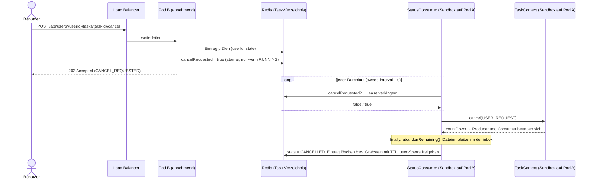

# Aufgaben beenden im Containerbetrieb

> **Fragestellung:** Wie könnten Benutzer – angesichts der aktuellen Architektur und für den Fall, dass die Anwendung künftig in Containern betrieben wird – Aufgaben beenden, die sie durch das Senden einer Anfrage initiiert haben?

## Kurzantwort

Mit mehreren Containern kommt ein Abbruch-Request meist auf einem anderen Pod an als dem, auf dem der Task läuft. Ist Redis vorhanden, genügt ein einfacher Mechanismus:

1. Der Abbruch-Request **markiert den Task in Redis** zur Beendigung. Das kann jeder Pod.
2. Der **`StatusConsumer` der Sandbox fragt diese Markierung bei jedem Durchlauf ab**. Findet er sie, ruft er lokal `TaskContext.cancel(CancelReason.USER_REQUEST)` auf und beendet damit den gesamten Task: Producer und Consumer enden, offene Dateien bleiben in der `inbox`.

Der annehmende Pod muss dafür weder wissen, wo der Task läuft, noch muss er ihn erreichen. Pub/Sub und Weiterleitungen zwischen Pods sind nicht nötig.

## Warum es heute nicht über mehrere Container funktioniert

`InMemoryTaskRegistry` (`src/main/java/de/wwsstl/asynchrone/registry/InMemoryTaskRegistry.java`) und `latestByUser` in `TaskManager` (`src/main/java/de/wwsstl/asynchrone/taskmanager/TaskManager.java`) liegen im Speicher einer einzelnen JVM. Mit zwei oder mehr Replikas hinter einem Load Balancer hat das zwei Folgen:

- **Abbruch auf dem falschen Pod:** `POST /api/users/{userId}/tasks/{taskId}/cancel` landet auf Pod B, der Task läuft aber auf Pod A. Pod B antwortet mit **404**, und der Task läuft weiter.
- **Ein Task pro Benutzer gilt nur noch je Pod:** Derselbe Benutzer kann auf zwei Pods je einen Task starten, weil jeder Pod nur seine eigene `latestByUser`-Map prüft.

Außerdem lässt sich eine `Sandbox` nicht verteilen: Sie enthält Threads und einen `CountDownLatch`, und so etwas kann man nicht in Redis serialisieren. Das Register muss deshalb aufgeteilt werden:

| Teil | Inhalt | Ort |
|---|---|---|
| lokales Sandbox-Register | `taskId → Sandbox` | nur auf dem Pod, dem der Task gehört |
| verteiltes Task-Verzeichnis | `taskId → {userId, ownerPod, state, cancelRequested, lease}` | Redis, für alle Pods sichtbar |

## Lösungsmöglichkeiten

| # | Ansatz | Ablauf | Bewertung |
|---|---|---|---|
| 1 | **Sticky Routing** | Ingress oder Load Balancer leitet per Hash auf `userId` (steht im Pfad) immer an denselben Pod | Am einfachsten, fast kein Code. Bricht aber beim Skalieren, bei Rolling Updates und beim Neustart eines Pods. Nur als Übergang geeignet. |
| 2 | **Weiterleiten an den Besitzer** | Das verteilte Verzeichnis speichert die Adresse des Besitzer-Pods (z. B. über einen Headless Service). Der annehmende Pod leitet den Cancel-Request per HTTP intern dorthin weiter. | Antwortet synchron wie heute. Braucht aber Adressierung zwischen Pods und eine Fehlerbehandlung, falls der Besitzer nicht erreichbar ist. |
| 3 | **Abbruch-Markierung in Redis + Polling durch den `StatusConsumer`** *(Empfehlung)* | Der annehmende Pod setzt `cancelRequested=true` in Redis. Der `StatusConsumer` der Sandbox liest die Markierung bei jedem Durchlauf und bricht den Task lokal ab. | Keine Adressierung zwischen Pods, keine Nachrichten, die verloren gehen können. Die Markierung ist persistent. Reaktionszeit: ein Sweep-Intervall (1 s). |
| 4 | **Wie 3, zusätzlich Pub/Sub** | Zusätzlich zur Markierung wird `cancel:<taskId>` veröffentlicht, und der Besitzer-Pod bricht sofort ab. | Nur sinnvoll, wenn eine Sekunde Reaktionszeit zu langsam ist. Mehr bewegliche Teile, das Polling bleibt trotzdem als Absicherung nötig. |
| 5 | **Task als eigener Job** | Jeder Task läuft als eigener Kubernetes-Job oder Pod. Abbrechen heißt, den Job zu löschen. Das SIGTERM löst `@PreDestroy` aus. | Starke Isolation, aber für zwei virtuelle Threads pro Task viel zu schwer. |

## Empfohlene Variante im Detail (Variante 3)

### Warum der `StatusConsumer` der richtige Ort ist

- **Er läuft ohnehin zyklisch.** `StatusConsumer.loop()` (`src/main/java/de/wwsstl/asynchrone/consumer/StatusConsumer.java`) prüft in jedem Durchlauf schon `context.checkTimeout()`, ruft `sweep()` auf und wartet dann mit `context.awaitCancel(properties.sweepInterval())`. Die Redis-Abfrage kommt einfach als weitere Prüfung dazu, einen zusätzlichen Thread braucht es nicht.
- **Er beendet schon heute den gesamten Task.** `TaskContext.cancel()` löst `cancelSignal.countDown()` aus. Dadurch wacht auch der `InboxProducer` aus `awaitCancel(...)` auf und endet. Der `finally`-Block des Consumers ruft `abandonRemaining()` auf, und die offenen Dateien bleiben in der `inbox`. Das ist genau das Verhalten, das heute ein lokaler Abbruch auslöst.
- **Der Producer bleibt unverändert.** Nur der Consumer bekommt eine zusätzliche Abhängigkeit.

### Ablauf

1. **Request (beliebiger Pod):** Der `TaskController` bzw. `TaskManager.cancel` prüft im Task-Verzeichnis, ob der Task existiert und dem Benutzer gehört. Dann setzt er atomar `cancelRequested=true`, zum Beispiel mit `HSET task:<taskId> cancelRequested 1`, bedingt auf `state=RUNNING` (Lua-Skript oder `WATCH/MULTI`). Antwort: `202 Accepted` mit `CANCEL_REQUESTED`.
2. **Polling (Besitzer-Pod):** Der Consumer fragt pro Durchlauf die Markierung ab: am Anfang von `loop()` neben `checkTimeout()` und zusätzlich in der Chunk-Schleife von `sweep()`, dort, wo heute `context.isCancelled()` geprüft wird. Ist sie gesetzt, ruft er `context.cancel(CancelReason.USER_REQUEST)` auf.
3. **Aufräumen (Besitzer-Pod):** Im `finally` des Consumers schreibt die Sandbox den Endzustand nach Redis (`state=CANCELLED` mit Snapshot-Zählern). Dann löscht sie den Eintrag oder lässt ihn als **Grabstein mit TTL** stehen und gibt die Benutzersperre `user:<userId>` frei. Zuletzt wird die Sandbox aus dem lokalen Register entfernt.

### Abstraktion im Code

Der Consumer sollte nicht direkt mit Redis sprechen, sondern über eine kleine Schnittstelle, analog zu `CloudClient` und `StatusPool`:

```java
public interface CancelRequests {
    /** true, wenn für diesen Task ein externer Abbruch angefordert wurde. */
    boolean isRequested(UUID taskId);
}
```

- `RedisCancelRequests` für den Containerbetrieb
- eine In-Memory-Implementierung für den Einzelserver und die Tests (`TaskPipelineIntegrationTest`)

So läuft die Anwendung auf einem einzelnen Server unverändert weiter.

### Randfälle

| Situation | Verhalten |
|---|---|
| **Consumer steckt in einer Bulk-Statusabfrage** | Die Markierung wird erst nach dem Aufruf gelesen. Im ungünstigsten Fall dauert das `status-timeout` (30 s) + 5 s Puffer (`RESULT_GRACE`). Wer schneller reagieren muss, kombiniert mit Variante 4 oder verkürzt den Timeout. |
| **Redis nicht erreichbar** | Die Abfrage schlägt fehl. Der Consumer protokolliert eine Warnung und arbeitet weiter, er bricht **nicht** ab. Beim nächsten Durchlauf fragt er erneut. |
| **Task ist schon beendet** | Die bedingte Markierung greift nicht. Der Request löscht nur noch den Eintrag, so wie heute. |
| **Zwei gleichzeitige Abbrüche** | Das atomare Setzen sorgt dafür, dass genau einer „gewinnt“. Der zweite erhält `202` (idempotent) oder `404`, je nachdem, wie die Semantik festgelegt wird. |
| **Besitzer-Pod ist abgestürzt** | Niemand liest die Markierung. Das fängt die Owner-Lease ab (siehe unten). |

### Last

Pro laufendem Task gibt es eine Redis-Abfrage pro Sekunde (`sweep-interval: 1s`). Bei 1 000 Tasks sind das rund 1 000 einfache `HGET` pro Sekunde, für Redis vernachlässigbar. Sollte es trotzdem nötig werden, kann ein Pod die Markierungen aller lokalen Tasks in einem Aufruf lesen (`SMISMEMBER cancel-requested …`) und die Ergebnisse an seine Sandboxen verteilen.

### Die Semantik von `cancel` ändert sich

Heute bricht `cancel` synchron ab, löscht den Task aus dem Register und liefert einen Snapshot zurück. Mit Polling ist der Abbruch asynchron:

- Der annehmende Pod antwortet mit `202 Accepted` und `CANCEL_REQUESTED`.
- Den Endzustand zeigt `GET …/tasks/{taskId}`, bis der Eintrag gelöscht ist bzw. der Grabstein abläuft.
- **Achtung:** Damit ändert sich die bisherige Vorgabe „cancel löscht die taskId sofort aus der Registry“. Ob das akzeptabel ist, ist noch zu entscheiden.

### Ein laufender Task pro Benutzer

`latestByUser.compute(...)` in `TaskManager.start` wird durch eine atomare Prüfung in Redis ersetzt, zum Beispiel `SET user:<userId> <taskId> NX`. Ein zweiter Start liefert wie bisher **409**. Die Sperre gibt die Sandbox beim Aufräumen frei.

### Verwaiste Tasks

Stürzt ein Pod ab, liest kein Consumer mehr die Markierung, und der Task steht in Redis weiterhin auf `RUNNING`. Deshalb bekommt jeder Task eine **Owner-Lease** (Schlüssel mit TTL), die der Consumer bei jedem Durchlauf verlängert. Das passt gut zum Polling, denn es ist derselbe Zyklus. Läuft die Lease ab, gilt der Task als verwaist. Ein Cancel löscht dann nur noch den Eintrag und die Benutzersperre.

### Rolling Updates

Das SIGTERM löst `TaskManager.shutdown()` (`@PreDestroy`) aus und bricht alle lokalen Tasks mit `CancelReason.SHUTDOWN` ab. Wichtig sind:

- ein `terminationGracePeriodSeconds`, der lang genug ist, damit Producer und Consumer sauber enden und ihren Endzustand nach Redis schreiben,
- eine Entscheidung, was mit offenen Einträgen im Status-Pool passiert (Cloud-TaskIds, deren Dateien noch nicht verschoben wurden). Entweder werden sie in Redis persistiert und von einem anderen Pod übernommen, oder sie werden als `abandoned` gezählt.

## Weitere Voraussetzung: gemeinsamer Dateizugriff

Die Benutzerordner (`<base-directory>/<userId>/{inbox,donebox,errorbox}`) müssen auf einem **gemeinsamen Volume (ReadWriteMany)** liegen oder durch einen Objektspeicher ersetzt werden. Sonst sieht nur ein Pod die Dateien, und ein Task, der auf einem anderen Pod startet, findet eine leere Inbox.

## Ablauf eines Abbruchs



## Nächste Schritte

1. `TaskRegistry` aufteilen in ein lokales `SandboxRegistry` (heutige `InMemoryTaskRegistry`) und ein verteiltes `TaskDirectory` (Redis).
2. Die Schnittstelle `CancelRequests` einführen (In-Memory- und Redis-Implementierung) und im `StatusConsumer` in `loop()` und `sweep()` abfragen.
3. `TaskManager.cancel` so umbauen, dass es nur noch markiert (`202` / `CANCEL_REQUESTED`), und `TaskManager.start` auf die atomare Benutzersperre umstellen.
4. Endzustand und Freigabe der Benutzersperre im `finally` des Consumers nach Redis schreiben. Die Owner-Lease im selben Zyklus verlängern.
5. Die neue Cancel-Semantik in `TaskController` und in den Integrationstests abbilden.
