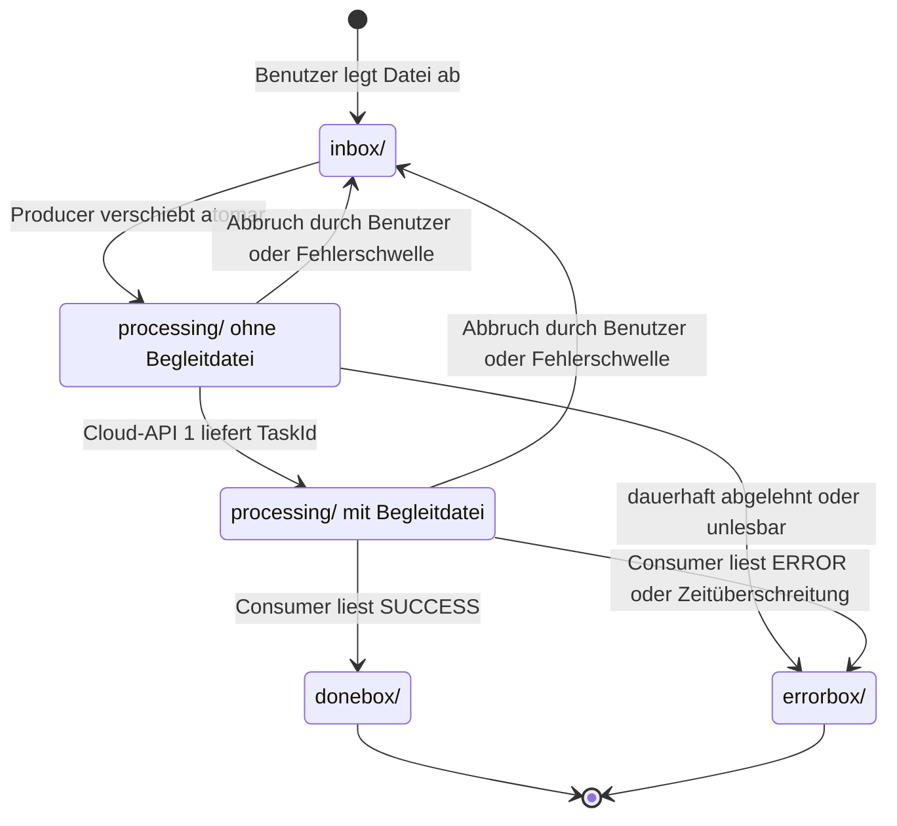

# Architekturalternative: Abgleichsschleife mit Zustand im Dateisystem

> **Fragestellung:** Gibt es – gemessen an den Anforderungen (`anforderungen.md`, `anforderungen_datenverarbeitung.md`) – eine bessere Architektur als das heutige Sandbox-Modell mit In-Memory-Status-Pool (`loesung_final.md`)?

Ergänzt `sandbox_und_containerisierung.md` (Phase A, Schritte 1–3) und `batchauftrag_verwaltung_durch_cloud_api.md`. Der Ordner `processing/` ist dort bereits vorgeschlagen. Dieses Dokument macht daraus das tragende Prinzip der Architektur und prüft es gegen alle Anforderungen.

## Kurzantwort

**Ein Neuentwurf ist nicht nötig.** Unter den Randbedingungen von Phase 1 (ein Server, keine externe Middleware; Sandbox, TaskRegistry und dedizierte Threads sind in den Anforderungen vorgegeben) ist die heutige Zerlegung in `TaskManager`, `TaskRegistry`, Sandbox, `InboxProducer`, `StatusConsumer` und `CloudClient` angemessen.

**Zu ändern ist das Zustandsmodell.** Heute liegt der fachlich entscheidende Zustand nur im Speicher der JVM: `InboxProducer.seen`, `InMemoryStatusPool` und `TaskContext.producerFinished`. Besser ist: Der Zustand jeder Datei ergibt sich **allein aus dem Ordner, in dem sie liegt**, plus einer kleinen Begleitdatei mit der Cloud-TaskId. Producer und Consumer werden zu **Abgleichsschleifen**: Jeder Durchlauf liest den tatsächlichen Stand ab, führt einen wiederholbaren Schritt aus und hält im Speicher nichts, was er nicht jederzeit wieder ablesen könnte.

| Ziel | Heute | Mit Abgleichsschleife |
|---|---|---|
| Neustart der Anwendung | Cloud-TaskIds gehen verloren; offene Dateien werden beim nächsten Start erneut übermittelt | Übermittelte Dateien werden weiter abgefragt, nicht erneut übermittelt |
| Abschlusserkennung | `producerFinished` plus leerer Pool; die Reihenfolge der Threads muss stimmen | `inbox` leer, danach `processing/` leer |
| Koordination zwischen Producer und Consumer | gemeinsame Speicherstrukturen und Signale | feste Zuständigkeit je Datei (Abschnitt 3.3) |
| Übergang auf eine Datenbank („Statusfelder INBOX, DONE, ERROR“) | Zustand muss erst aus dem Speicher herausgelöst werden | Ordner entspricht 1:1 einem Statusfeld |
| Übernahme eines Auftrags durch einen anderen Pod | eigener Wiederaufnahme-Code nötig | derselbe Code wie im Normalbetrieb |

Für Phase 2 empfiehlt dieses Dokument außerdem, die Anforderung „Status-Pool durch eine MQ, Register durch Redis ersetzbar“ zu ändern: **Eine Datenbanktabelle ersetzt beides** (Abschnitt 6).

## 1. Ausgangslage: Warum das Zustandsmodell das eigentliche Problem ist

Die Codeanalyse hat mehrere Fehler gefunden. Die meisten haben dieselbe Ursache: Zustand, den nur ein einzelner Thread im Speicher kennt.

| Befund | Ursache im Zustandsmodell |
|---|---|
| Abbruch und sofortiger Neustart: Zwei Sandboxen arbeiten auf derselben `inbox`. Dateien werden doppelt übermittelt, und der alte Producer verschiebt Dateien des neuen Tasks nach `errorbox` (`InboxProducer.submit`, Fehlerzweig). | Welche Dateien „in Arbeit“ sind, weiß nur `seen` des alten Producers. Der neue Producer kann es nicht sehen. |
| Nach einem Neustart der Anwendung werden alle nicht entschiedenen Dateien erneut an Cloud-API 1 übermittelt. | Die Cloud-TaskIds stehen nur im `InMemoryStatusPool`. |
| Die Abschlusserkennung braucht `producerFinished` und eine genaue Reihenfolge (`StatusConsumer.isFinished`). | Der Consumer kann nicht ablesen, ob der Producer noch Dateien hält. |
| Bei Zeitüberschreitung kann der Producer noch Einträge in den Pool legen, nachdem der Consumer ihn geleert hat. | Pool und Abbruchsignal sind getrennte Speicherstrukturen ohne gemeinsamen Zeitpunkt. |

Nicht vom Zustandsmodell abhängig und in jedem Fall zu beheben: Die Wartezeit auf Cloud-API 2 in `StatusConsumer.queryAndRoute` (`status-timeout` + `RESULT_GRACE`) ist kürzer als die mögliche Dauer aller Wiederholungen (`status-retries + 1` × `status-timeout`).

## 2. Prinzip: Abgleichsschleife

Das Muster ist aus Kubernetes-Controllern bekannt (Reconciliation Loop). Es beruht auf drei Regeln:

1. **Die Wahrheit liegt außerhalb der Threads.** In Phase 1 ist das das Dateisystem, in Phase 2 die Datenbank bzw. der Cloud-Dienst.
2. **Jeder Schritt ist wiederholbar.** Wird er zweimal oder nach einem Absturz erneut ausgeführt, ändert sich am Ergebnis nichts.
3. **Jeder Durchlauf beginnt mit Ablesen, nicht mit Erinnern.** Speicherstrukturen sind nur noch Zwischenspeicher und dürfen jederzeit verloren gehen.

Die Thread-Topologie bleibt, wie sie ist: zwei Virtual Threads je Sandbox, `InboxProducer` und `StatusConsumer`. Es ändert sich nur, **woher** sie ihren Zustand nehmen.

Der wichtigste Nebeneffekt: **Wettläufe am Rand werden unschädlich.** Bleibt durch einen Absturz, einen Abbruch oder ein ungünstiges Timing ein Zwischenzustand zurück, liegt er sichtbar im Dateisystem, und der nächste Durchlauf oder der nächste Task nimmt ihn auf. Es gibt keinen Zustand mehr, der nur in einem beendeten Thread existierte.

## 3. Zustandsmodell in Phase 1

### 3.1 Ordner

```
<base-directory>/<userId>/
├── inbox/          vom Benutzer abgelegt, noch nicht beansprucht
├── processing/     beansprucht (und ggf. schon übermittelt)
├── donebox/
├── errorbox/
└── .pipeline/
    ├── dateien/    je übermittelter Datei eine Begleitdatei <dateiname>.json
    ├── lock        optional, Sperre gegen einen zweiten Prozess (3.7)
    └── auftrag.json  optional, für automatische Wiederaufnahme (3.8)
```

Inhalt einer Begleitdatei:

```json
{ "cloudTaskId": "…", "pipelineTaskId": "…", "uebermitteltAm": "2026-09-27T12:00:00Z" }
```

- Die Begleitdateien liegen in einem eigenen Ordner und nicht neben der Datei in `processing/`. Sonst würde eine Benutzerdatei, die zufällig `a.json.json` heißt, als Begleitdatei missverstanden. Aus demselben Grund stehen `lock` und `auftrag.json` nicht im selben Ordner wie die Begleitdateien: Die Begleitdatei einer Benutzerdatei namens `auftrag` hieße sonst ebenfalls `auftrag.json`.
- Begleitdateien werden atomar geschrieben: erst in eine temporäre Datei mit eindeutigem Namen in `.pipeline/`, dann `Files.move(…, ATOMIC_MOVE)` nach `.pipeline/dateien/`. Eine halb geschriebene Begleitdatei kann so nie gelesen werden.
- Alle Ordner eines Benutzers liegen auf demselben Dateisystem. Nur dann ist `Files.move` ein atomares Umbenennen. Heute verschiebt `UserFolders.moveInto` ohne `StandardCopyOption.ATOMIC_MOVE`; das wird ergänzt.

### 3.2 Zustände einer Datei

| Zustand | Erkennbar an | Zuständig |
|---|---|---|
| neu | Datei in `inbox/` | Producer |
| beansprucht | Datei in `processing/`, **keine** Begleitdatei | Producer |
| übermittelt | Datei in `processing/`, Begleitdatei vorhanden | Consumer |
| erledigt | Datei in `donebox/` oder `errorbox/` | niemand |
| Rest eines Absturzes | Begleitdatei ohne Datei in `processing/` | Consumer löscht sie |



### 3.3 Feste Zuständigkeit statt gemeinsamer Speicherstruktur

**Dateien ohne Begleitdatei gehören dem Producer, Dateien mit Begleitdatei dem Consumer.** Die Zuständigkeit wechselt genau in dem Moment, in dem die Begleitdatei atomar erscheint. Producer und Consumer bearbeiten dadurch nie dieselbe Datei und brauchen untereinander keine Sperren.

Das ist weiterhin das geforderte Producer-Consumer-Muster. Der Puffer zwischen beiden ist nur nicht mehr eine `ConcurrentHashMap`, sondern `processing/` mit den Begleitdateien, und er übersteht einen Neustart.

### 3.4 Ablauf je Durchlauf

**Producer (`InboxProducer`):**

1. Abbruchsignal prüfen.
2. Rückstau: Gibt es mehr **übermittelte** Dateien (mit Begleitdatei) als `pool-resume-threshold`, mit `awaitCancel(sweep-interval)` warten und neu zählen (`anforderungen_datenverarbeitung.md`, Punkte 1 und 3). Beanspruchte Dateien ohne Begleitdatei zählen nicht mit: Sie gehören dem Producer selbst, und würde er auf sie warten, blockierte er sich nach einer gescheiterten Übermittlung dauerhaft.
3. Batch zusammenstellen: zuerst beanspruchte Dateien ohne Begleitdatei (Rest eines früheren Laufs oder einer gescheiterten Übermittlung), dann weitere Dateien aus der `inbox` mit `ATOMIC_MOVE` nach `processing/` verschieben, bis `batch-size` erreicht ist.
   - Scheitert das Verschieben mit `NoSuchFileException`, hat jemand anderes die Datei genommen; sie wird übersprungen.
   - Liegt in `processing/` schon eine gleichnamige Datei (der Benutzer hat sie erneut abgelegt), bleibt die neue in der `inbox`, bis die ältere erledigt ist.
4. Batch an Cloud-API 1 übermitteln.
5. Je zurückgelieferter TaskId die Begleitdatei atomar schreiben. Ab jetzt gehört die Datei dem Consumer.
6. Übermittlung gescheitert, je nach Art des Fehlers:
   - **Verbindungsfehler, 503:** Die Cloud hat nichts angelegt. Die Dateien bleiben beansprucht und werden im nächsten Durchlauf erneut versucht. Das zählt nicht als Dateifehler. Begrenzt wird das durch `task-timeout`, optional durch einen eigenen Schwellenwert für aufeinanderfolgende Übermittlungsfehler.
   - **Zeitüberschreitung nach dem Senden:** Der Ausgang ist unklar. Erneutes Übermitteln ist nur sicher, wenn Cloud-API 1 idempotent ist. Bis das geklärt ist, bleibt es beim heutigen Verhalten: Die Dateien kommen nach `errorbox`.
   - **Dauerhaft (4xx) oder Datei unlesbar:** Datei nach `errorbox`, Fehlerzähler erhöhen.

**Consumer (`StatusConsumer`):**

1. Zeitüberschreitung prüfen (`TaskContext.checkTimeout`) und Abbruchsignal prüfen.
2. Begleitdateien lesen, fällige Einträge sammeln und in einem Bulk-Aufruf an Cloud-API 2 übergeben. Der nächste Prüfzeitpunkt je Eintrag (heute `PollEntry.nextPollAt`) bleibt im Speicher. Nach einem Neustart ist jeder Eintrag sofort fällig; mehr geht nicht verloren.
3. Ergebnis verarbeiten:
   - `SUCCESS`: Datei `processing/ → donebox/`, **danach** Begleitdatei löschen.
   - `ERROR`: Datei `processing/ → errorbox/`, danach Begleitdatei löschen, Fehlerzähler erhöhen.
   - `PENDING`: nächsten Prüfzeitpunkt im Speicher setzen.
4. Begleitdateien ohne Datei in `processing/` löschen.
5. Abschluss prüfen (Abschnitt 3.5).

Die Reihenfolge in Schritt 3 ist wichtig. Stürzt die Anwendung zwischen Verschieben und Löschen ab, bleibt nur eine überzählige Begleitdatei zurück, die Schritt 4 entfernt. Umgekehrt (erst löschen, dann verschieben) sähe der Producer eine beanspruchte Datei ohne Begleitdatei und würde sie erneut übermitteln.

Überzählige Begleitdateien aus einem abgestürzten Lauf müssen **vor dem Start** von Producer und Consumer entfernt werden, nicht erst im ersten Durchlauf des Consumers. Sonst könnte der Producer eine gleichnamige, neu abgelegte Datei nach `processing/` holen, bevor die alte Begleitdatei gelöscht ist. Die neue Datei erbte dann die Cloud-TaskId der bereits erledigten Datei und käme ohne Übermittlung nach `donebox`.

### 3.5 Abschluss ohne `producerFinished`

Der Consumer erklärt den Task für abgeschlossen, wenn er **zuerst** eine leere `inbox` und **danach** ein leeres `processing/` abliest.

Warum diese Reihenfolge genügt: Eine Datei liegt zu jedem Zeitpunkt in genau einem Ordner, weil jedes Verschieben atomar ist. Ist die `inbox` leer, kann keine Datei mehr aus ihr nach `processing/` wandern. Liegt beim anschließenden Blick in `processing/` nichts, ist alles erledigt.

Daraus folgt:

- Der Producer beendet sich nicht mehr selbst, wenn die `inbox` leer ist. Er wartet weiter, bis der Task nicht mehr läuft. Dateien, die der Benutzer während des Laufs ablegt, werden damit zuverlässig mitverarbeitet; nach dem Abschluss abgelegte Dateien gehören zum nächsten Task.
- `TaskContext.complete()` muss dasselbe Signal auslösen wie `cancel()`, damit der wartende Producer sofort aufwacht. Heute zählt nur `cancel()` das `cancelSignal` herunter.
- `producerFinished` wird für die Logik nicht mehr gebraucht und kann höchstens als Anzeige im `TaskSnapshot` bleiben.

Beansprucht der Producer genau im Moment des Abschlusses noch eine Datei, bleibt sie in `processing/` liegen und wird vom nächsten Task aufgenommen (Abschnitt 2, „Wettläufe am Rand“).

### 3.6 Abbruch, Zeitüberschreitung und Herunterfahren

Aufgeräumt wird erst, **wenn beide Threads beendet sind**: Der Thread, der den Lebenszyklus-Zähler (Abschnitt 3.7) als Letzter herunterzählt, führt das Aufräumen aus. So kann nie ein noch laufender Producer mit dem Aufräumen um dieselben Dateien konkurrieren.

| Abbruchgrund | übermittelte Dateien (mit Begleitdatei) | beanspruchte Dateien (ohne Begleitdatei) | Begründung |
|---|---|---|---|
| `USER_REQUEST` | zurück in `inbox`, Begleitdatei löschen | zurück in `inbox` | wie heute (`abandonRemaining`); der Benutzer will Dateien ggf. korrigieren; `TaskPipelineIntegrationTest` erwartet das |
| `ERROR_THRESHOLD` | zurück in `inbox`, Begleitdatei löschen | zurück in `inbox` | wie heute |
| `TIMEOUT` | nach `errorbox` | zurück in `inbox` | wie heute (`failPendingAfterTimeout` betrifft nur übermittelte Dateien) |
| `SHUTDOWN`, `INTERNAL_ERROR` | **liegen lassen** | **liegen lassen** | technischer Abbruch; der nächste Task setzt fort, ohne erneut zu übermitteln |

Wandert eine bereits übermittelte Datei zurück in die `inbox`, läuft der Cloud-Auftrag weiter, und der nächste Task übermittelt sie erneut. Das ist heute genauso. Ob der Cloud-Dienst solche Aufträge stornieren soll, ist bereits offene Frage 4 in `batchauftrag_verwaltung_durch_cloud_api.md`.

### 3.7 Genau ein Ausführer je Benutzer

- **Innerhalb der JVM:** `TaskContext` erhält einen Lebenszyklus-Zähler mit Startwert 2 (z. B. `AtomicInteger`), den `InboxProducer.run` und `StatusConsumer.run` im `finally` herunterzählen. Wer ihn auf 0 bringt, räumt auf (3.6) und löst danach ein Signal aus, auf das andere warten können. `TaskManager.start` gibt einen Benutzer erst wieder frei, wenn dieses Signal ausgelöst ist, und prüft nicht mehr nur `state() == RUNNING`. Ein Start während des Beendens liefert `409` mit dem Hinweis „wird noch beendet“.
- `cancel` darf die taskId weiterhin sofort aus der `TaskRegistry` löschen (bisherige Vorgabe). Den Eintrag in `latestByUser` entfernt es dagegen nicht mehr: Die Sperre des Benutzers hängt am Lebenszyklus-Zähler, nicht am Register.
- **Gegen einen zweiten Prozess auf denselben Ordnern** (z. B. versehentlich zwei Instanzen): optional `FileChannel.tryLock()` auf `.pipeline/lock`. In Phase 2 übernimmt die Lease diese Rolle.

Dieser Schritt behebt den Fehler „Abbruch und sofortiger Neustart“ auch dann, wenn der Rest dieses Dokuments nicht umgesetzt wird.

### 3.8 Neustart der Anwendung

Nach einem Neustart ist die `TaskRegistry` leer. Startet der Benutzer den Task erneut, nimmt der neue Task alles auf, was im Dateisystem steht:

| Vorgefunden | Verhalten |
|---|---|
| Begleitdatei ohne Datei in `processing/` | wird vor dem Start der Threads gelöscht (3.4) |
| Datei in `processing/` mit Begleitdatei | Consumer fragt den Status weiter ab; **keine** erneute Übermittlung |
| Datei in `processing/` ohne Begleitdatei | Producer übermittelt sie (sie wurde nie bestätigt) |
| Datei in `inbox/` | normal |

Grenzen:

- Stürzt die Anwendung zwischen der Antwort von Cloud-API 1 und dem Schreiben der Begleitdatei ab, wird die Datei erneut übermittelt. Dieses Fenster schließt nur ein idempotenter Cloud-Dienst, wie in `batchauftrag_verwaltung_durch_cloud_api.md`, Abschnitt 2.4, beschrieben. Es ist aber um Größenordnungen kleiner als heute, wo **jeder** offene Eintrag betroffen ist.
- Die Zähler im `TaskContext` (`succeeded`, `failed` …) bleiben Statistik des laufenden Tasks und beginnen nach einem Neustart bei 0. Das gilt auch für den Fehlerzähler und damit für `error-threshold`. In Phase 2 werden sie aus der Datenbank berechnet.
- Eine **automatische** Wiederaufnahme nach dem Neustart, ohne dass der Benutzer neu startet, ist optional: Eine Datei `.pipeline/auftrag.json` mit `pipelineTaskId` und Startzeitpunkt genügt, damit `TaskManager` beim Hochfahren laufende Tasks findet und mit dem ursprünglichen Startzeitpunkt für `task-timeout` fortsetzt.

## 4. Abgleich mit den Anforderungen

✔ erfüllt · ◐ erfüllt, aber der Wortlaut der Anforderung sollte angepasst werden

| Anforderung | | Umsetzung |
|---|---|---|
| Nutzung von Cloud-Diensten | ✔ | unverändert über `CloudClient` |
| Lokale Dateiverwaltung (`inbox`, `errorbox`, `donebox`) | ✔ | zusätzlich `processing/` und `.pipeline/` |
| Stapelverarbeitung | ✔ | `batch-size`, unverändert |
| Parallele Statusüberwachung in eigenem Thread | ✔ | `StatusConsumer` bleibt eigener Virtual Thread |
| Unabhängige Benutzeraufgaben | ✔ | besser als heute: Zustand je Benutzerordner, genau ein Ausführer je Benutzer (3.7) |
| Externer Abbruch | ✔ | REST-API unverändert; Verhalten je Abbruchgrund (3.6) |
| Nicht-blockierender HTTP-Client | ✔ | `WebClient`, unverändert |
| Java NIO.2 | ✔ | zusätzlich `ATOMIC_MOVE` |
| Jackson | ✔ | auch für die Begleitdateien |
| Virtual Threads | ✔ | unverändert |
| Producer-Consumer-Muster | ✔ | Puffer ist `processing/` + Begleitdateien; Zuständigkeit strikt getrennt (3.3) |
| Zentrales Task-Management (`TaskRegistry`, `TaskContext`) | ✔ | unverändert |
| Übergang auf Spring Batch möglich | ✔ | nicht berührt |
| Sandbox-Muster mit eigenem Status-Pool **im Speicher** | ◐ | Jede Sandbox behält ihre eigene `StatusPool`-Instanz. Die Implementierung schreibt aber ins Dateisystem durch; im Speicher liegen nur noch die Prüfzeitpunkte. |
| Ordner durch DB-Tabellen mit Statusfeldern (INBOX, DONE, ERROR) ablösbar | ✔ | direkt: Jeder Ordner entspricht einem Statuswert. Zu ergänzen sind die Werte für „beansprucht“ und „übermittelt“. |
| Status-Pool durch MQ, Register durch Redis ersetzbar | ◐ | Die Abstraktionen bleiben erhalten. Empfehlung: Anforderung ändern (Abschnitt 6). |
| Einzelserver ohne externe Middleware | ✔ | nur Dateisystem |
| Container-Ready | ✔ | besser als heute (Abschnitt 5) |
| Rückstau: nächste Charge erst bei `pool-resume-threshold` (`anforderungen_datenverarbeitung.md`) | ✔ | gezählt werden die übermittelten Dateien (mit Begleitdatei), also dieselbe Größe wie heute `pool.size()` |

## 5. Phase 2: Container und Datenbank

Die Schleifen bleiben dieselben; es ändert sich nur, wo die Wahrheit liegt.

### 5.1 Der Cloud-Dienst führt `batchauftrag` und Dateistatus (aktueller Entwurf)

Das ist der Entwurf aus `batchauftrag_verwaltung_durch_cloud_api.md`.

- **Die Begleitdateien entfallen**, sobald Cloud-API 1 Übermittlungen idempotent je `(batchauftrag_id, dateiname)` speichert. „Übermittelt“ heißt dann: Es gibt einen Unterdatensatz. Der Consumer liest ihn über Cloud-API 2 nach Auftrag.
- **`processing/` bleibt**, weil es im Dateisystem zeigt, welche Dateien beansprucht sind.
- **Übernahme nach einem Pod-Absturz:** Der neue Besitzer (Lease, dort Abschnitt 2.7) startet einfach dieselben zwei Schleifen. Der Abgleich von `processing/` mit den Unterdatensätzen, der dort als eigener Schritt beschrieben ist (`sandbox_und_containerisierung.md`, Schritt 12), **ist hier der ganz normale erste Durchlauf**. Es gibt keinen gesonderten Wiederaufnahme-Code, der nur im Fehlerfall läuft und entsprechend selten getestet wird.

### 5.2 Die Pipeline führt eine eigene Tabelle

Das ist Variante b) aus `batchauftrag_verwaltung_durch_cloud_api.md`, Abschnitt 2.2, und entspricht am direktesten der Anforderung „Statusfelder INBOX, DONE, ERROR“:

```
datei (
  batchauftrag_id, dateiname,     -- Primärschlüssel
  status,                         -- INBOX | BEANSPRUCHT | UEBERMITTELT | DONE | ERROR
  cloud_task_id,
  naechste_pruefung,              -- ersetzt PollEntry.nextPollAt
  versuche                        -- ersetzt PollEntry.attempts
)
```

- Die Regel aus 3.3 gilt unverändert: Der Statuswert bestimmt, welche Schleife zuständig ist.
- Mehrere Pods holen sich fällige Zeilen mit `SELECT … WHERE naechste_pruefung <= now() FOR UPDATE SKIP LOCKED`. Das verteilt die Arbeit ohne zusätzliche Komponente.
- Abbruchwunsch, Benutzersperre (partieller Unique-Index) und Lease sind Spalten beim Auftrag.
- Die Dateien selbst bleiben im gemeinsamen Volume; für die Reihenfolge zwischen Dateisystem und Tabelle gilt `batchauftrag_verwaltung_durch_cloud_api.md`, Abschnitt 2.8.

## 6. Empfehlung zur Anforderung „MQ und Redis“

`anforderungen.md` verlangt, den Status-Pool durch eine Message Queue (RabbitMQ, RocketMQ) und das Register durch Redis ersetzbar zu machen. Für dieses Problem ist eine Datenbanktabelle die bessere Zielarchitektur:

| Bedarf | Message Queue | Tabelle |
|---|---|---|
| „Status unverändert, später erneut prüfen“ | nur über verzögerte Neuzustellung (TTL mit Dead-Letter oder Zusatz-Plugin); jede unveränderte Antwort ist ein weiterer Nachrichtenumlauf | Spalte `naechste_pruefung` aktualisieren |
| Rückstau: Wie viele Dateien dieses Auftrags sind offen? | nicht je Auftrag abfragbar | `COUNT(*)` je Auftrag und Status |
| Bulk-Abfrage an Cloud-API 2: alle fälligen Einträge auf einmal | Nachrichten einzeln entnehmen | eine Abfrage |
| Statusanzeige für den Benutzer | Nachrichten sind nicht abfragbar | Abfrage |
| Abbruch, Benutzersperre, Lease (heute für Redis vorgesehen) | eigene Komponente nötig | Spalten und Constraints in derselben Datenbank |

Die Zweifel an einer Warteschlange wurden schon früh geäußert (`prompt.md`, Rückmeldung zu Punkt 7; `loesung.md`, Abschnitt 7). Aus denselben Gründen wurde `DelayQueue` als Status-Pool verworfen (`loesung_final.md`, Abschnitt 5). Eine verteilte MQ hätte dieselben Schwächen. Redis bleibt nur dann sinnvoll, wenn es in Phase 2 keine Datenbank gibt (`abbruch_im_containerbetrieb.md`).

**Vorschlag für den neuen Wortlaut in `anforderungen.md`, Abschnitt Skalierbarkeit:**

> Austauschbare Zustandshaltung: Der Status-Pool ist hinter der Schnittstelle `StatusPool` so zu abstrahieren, dass er künftig durch eine relationale Tabelle mit Statusfeld und nächstem Prüfzeitpunkt ersetzt werden kann. Abbruchwunsch, Benutzersperre und Zuständigkeit eines Pods (Lease) werden im Cluster-Betrieb in derselben Datenbank geführt.

## 7. Geprüfte und verworfene Alternativen

| Alternative | Vorteil | Warum nicht (jetzt) |
|---|---|---|
| **Ein Thread je Task** statt Producer und Consumer: eine Schleife, die beansprucht, übermittelt, abfragt und verschiebt | Noch einfacher. Bei `batch-size` 4 und Schwellenwert 2 arbeiten beide Threads ohnehin fast im Gleichschritt; mit der Abgleichsschleife entfiele jede Koordination zwischen ihnen. | Widerspricht dem Wortlaut „separater Prozess (oder Thread)“ und dem geforderten Producer-Consumer-Muster. Sinnvoll, falls die Anforderung gelockert wird. |
| **Workflow-Engine** (z. B. Temporal, Camunda) | Zeitüberschreitung, Wiederholung, Abbruch, Wiederaufnahme und Übersichtsoberfläche sind fertig vorhanden. | Braucht einen eigenen Server, also externe Middleware, die in Phase 1 ausgeschlossen ist. Für zwei Schritte je Datei überdimensioniert. |
| **Spring Batch** | Etabliertes Chunk-Modell mit Job-Repository | Das Chunk-Modell passt nicht zum überlappenden Fenster: Charge N+1 wird übermittelt, während Charge N noch abgefragt wird. Bestätigt `loesung_final.md`, Abschnitt 5. |
| **Reaktive Pipeline** (Reactor `Flux`) | Rückstau ist eingebaut. | Mit Virtual Threads kein Durchsatzvorteil; schwerer zu lesen und zu debuggen. Löst das Zustandsproblem nicht. |
| **Rückruf (Webhook) von Cloud-API 2** statt Abfragen | Das regelmäßige Abfragen entfällt. | Hängt vom Cloud-Dienst ab. Auch dann braucht es einen Abgleich als Absicherung gegen verlorene Rückrufe; die Abgleichsschleife bleibt also richtig. Beim Cloud-Dienst nachfragen. |
| **Zentraler Scheduler** statt Threads je Sandbox | Weniger Threads | Bereits in `loesung_final.md`, Abschnitt 5, aus Wartbarkeitsgründen verworfen; keine neue Erkenntnis. |

## 8. Umsetzungsschritte

| # | Schritt | Betroffene Klassen |
|---|---|---|
| 1 | Lebenszyklus-Zähler und Sperre je Benutzer (3.7). Behebt den Neustart-Wettlauf auch ohne die übrigen Schritte. | `TaskContext`, `TaskManager`, `InboxProducer.run`, `StatusConsumer.run` |
| 2 | Ordner `processing/` und `.pipeline/` anlegen, Verschieben mit `ATOMIC_MOVE` (3.1) | `UserFolders`, `NioUserFolderResolver` |
| 3 | Dateibasierter Status-Pool als neue Implementierung von `StatusPool`: `add` schreibt die Begleitdatei, `due` liest sie, `remove` löscht sie, `size` zählt die Begleitdateien. Die Schnittstelle bekommt eine Methode für beanspruchte Dateien ohne Begleitdatei. `InMemoryStatusPool` kann für Unit-Tests bleiben. | `pool/*` |
| 4 | Producer: `seen` entfällt; erst beanspruchen, dann lesen; Fehlerarten unterscheiden (3.4). Dafür muss `CloudClient` die Fehlerart erkennbar machen (Verbindungsfehler, Zeitüberschreitung, Ablehnung). | `InboxProducer`, `WebClientCloudClient` |
| 5 | Consumer: Reihenfolge „verschieben, dann Begleitdatei löschen“; überzählige Begleitdateien vor dem Start der Threads entfernen (3.4); neue Abschlussbedingung (3.5); `complete()` weckt den Producer | `StatusConsumer`, `TaskContext`, `TaskManager` |
| 6 | Aufräumen je Abbruchgrund nach Ende beider Threads (3.6); ersetzt `abandonRemaining` und `failPendingAfterTimeout` | `StatusConsumer` bzw. neue Klasse für das Aufräumen |
| 7 | Tests, siehe unten | `src/test/…` |
| 8 | Dokumente nachziehen: `loesung_final.md` 4.6, 4.7 und 4.9 (4.7 beschreibt noch „sofort weiterlesen“ statt Rückstau), `asynchrone-anwendungsarchitektur_final.mmd`, `anforderungen.md` (Abschnitt 6) | Dokumentation |

Neue Tests:

- **Neustart mitten im Lauf:** Anwendung mit offenen Dateien beenden und neu starten. Erwartung: Keine Datei wird ein zweites Mal übermittelt. Dafür muss der Test-`FakeCloud` die übermittelten Dateinamen festhalten; heute zählt er nur Batchgrößen (`submitBatchSizes()`).
- **Abbruch und sofortiger Neustart:** Erwartung: Der zweite Start wird abgewiesen oder wartet, bis der erste beendet ist; keine Datei landet fälschlich in `errorbox`.
- **Datei während des Laufs ablegen:** Erwartung: Sie wird mitverarbeitet, der Task endet danach.
- **Absturz zwischen Verschieben und Löschen der Begleitdatei:** Begleitdatei ohne Datei anlegen und eine gleichnamige neue Datei in die `inbox` legen. Erwartung: Die Begleitdatei wird vor dem Start entfernt, und die neue Datei wird übermittelt, statt die alte Cloud-TaskId zu erben.

**Unverändert bleiben:** `TaskController`, `ApiExceptionHandler`, `TaskRegistry` mit `InMemoryTaskRegistry`, die `CloudClient`-Schnittstelle bis auf die Fehlerarten, `PipelineProperties` bis auf mögliche neue Werte, und das Fake-Backend (`FakeCloudBackendApplication`).

**Aufwand:** mittel. Der Schwerpunkt liegt in `InboxProducer`, `StatusConsumer` und dem neuen dateibasierten Pool. REST-Schicht und Register bleiben unberührt.

## 9. Zu entscheiden

1. **Abbruch durch den Benutzer:** Übermittelte Dateien wie heute zurück in die `inbox` legen, oder in `processing/` lassen, damit der nächste Task ohne erneute Übermittlung weitermacht?
2. **Automatische Wiederaufnahme nach einem Neustart** schon in Phase 1 (`.pipeline/auftrag.json`, 3.8) oder erst mit Phase 2?
3. **Unklarer Ausgang bei Zeitüberschreitung von Cloud-API 1:** bis zur Klärung der Idempotenz nach `errorbox` wie heute?
4. **Anforderungstext ändern:** „Status-Pool im Speicher“ und „MQ/Redis“ (Abschnitt 6)?
5. **Zwei Threads je Sandbox beibehalten** oder zu einer Schleife zusammenlegen (Abschnitt 7)?
6. **Sichtbarkeit von `processing/` und `.pipeline/`** für Benutzer: Dürfen sie dort Dateien anfassen? Falls nein, Rechte setzen oder deutlich kennzeichnen.

## Fazit

Die Aufteilung in Sandbox, Producer, Consumer und Register ist richtig und bleibt. Der Mangel liegt darin, dass der Zustand nur in den Threads lebt. Legt man ihn in das Dateisystem, wo die Dateien ohnehin liegen, und macht jeden Schritt wiederholbar, werden Neustarts, Abbrüche und Wettläufe am Rand beherrschbar, und der Weg zu Datenbank und Containern wird kürzer: Aus Ordnern werden Statuswerte, aus der Wiederaufnahme wird der normale erste Durchlauf. Schritt 1 lohnt sich sofort und unabhängig vom Rest.
