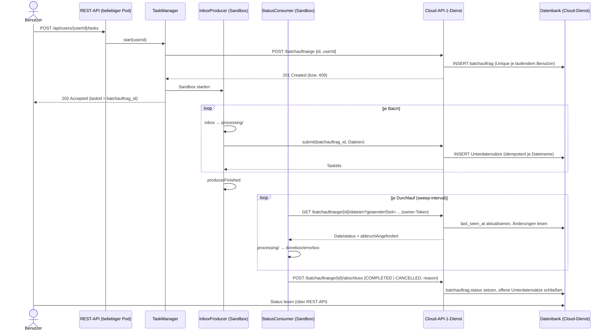

# Batchauftrag-Verwaltung durch Cloud-API 1: Überlegungen und Bewertung

> **Fragestellung:** Wenn ein Benutzer eine Aufgabe initiiert, sendet `InboxProducer` die ursprüngliche Anfrage an den Cloud-API-1-Dienst, der daraufhin einen `batchauftrag`-Datensatz in der Datenbank erstellt. Sobald eine Datei aus dem Posteingang an Cloud-API 1 übermittelt wird, übernimmt der Cloud-API-1-Dienst deren Abwicklung: Er speichert die empfangene Anfrage in einer dem `batchauftrag` zugeordneten Untertabelle und aktualisiert schließlich den Status der zu bearbeitenden Datei. Der `StatusConsumer` in der Sandbox fragt lediglich den Bearbeitungsstatus dieser Unterdatensätze ab; er verändert deren Status nicht. Unterstützt die aktuelle Sandbox-Architektur eine künftige Containerisierung, und wie tragfähig ist dieser Entwurf?

Ergänzt `sandbox_und_containerisierung.md`. Dort ist der Entwurf in den Gesamtplan eingearbeitet.

## Ergebnis vorab

**Ja, die Sandbox-Architektur unterstützt die Containerisierung, und der Entwurf ist tragfähig.** Er ist in einem wichtigen Punkt sogar besser als der vorherige Entwurf, bei dem die Sandbox selbst in die Datenbank schreibt:

- Es gibt **genau einen Schreiber** für `batchauftrag` und die Dateistatus: den Cloud-API-1-Dienst. Doppelte Schreibzugriffe und Wettläufe zwischen Pod und Cloud entfallen.
- Weil der Dienst jede Datei **vor** der Antwort in der Untertabelle speichert, lässt sich nach einem Absturz der Sandbox **aus der Datenbank rekonstruieren**, welche Dateien schon übermittelt wurden. Das kritische Absturzfenster „übermittelt, aber TaskId nicht gespeichert“ schließt sich dadurch, wenn der Dienst Übermittlungen idempotent annimmt.
- Die Sandbox wird **nahezu zustandslos**: Was sie zum Weiterarbeiten braucht, steht in der Datenbank oder im Dateisystem.

**Es bleiben vier Lücken**, die der Entwurf in der beschriebenen Form nicht abdeckt:

1. **Lebenszyklus des `batchauftrag`:** Abschluss, Abbruch, Zeitüberschreitung und Fehlerschwelle entscheidet heute die Sandbox. Wenn der Consumer nur liest, fehlt ein Weg, diese Entscheidungen in die Datenbank zu bringen. Sonst steht der Auftrag dort dauerhaft auf „läuft“.
2. **Wer gerade an einem Auftrag arbeitet (Owner, Lease), ist nirgends vermerkt.** Ohne diese Information kann nach einem Pod-Absturz niemand sicher übernehmen.
3. **Zeitpunkt der Anlage des `batchauftrag`:** Legt ihn erst der `InboxProducer` an, ist die ID beim Antworten auf `POST …/tasks` noch nicht bekannt, und die Regel „ein Task pro Benutzer“ (409) kann nicht synchron geprüft werden.
4. **Zugriffsweg für das Statuslesen:** Liest der Consumer direkt die Tabellen eines fremden Dienstes, koppelt sich die Pipeline an dessen Schema.

Alle vier lassen sich mit wenigen zusätzlichen Endpunkten des Cloud-Dienstes lösen, ohne das Prinzip „der Consumer ändert keine Dateistatus“ aufzugeben. Details und Vorschläge folgen.

## 1. Annahmen

| # | Annahme | Quelle |
|---|---|---|
| A1 | Der Cloud-API-1-Dienst legt auf die erste Anfrage hin einen `batchauftrag` an. | Fragestellung |
| A2 | Jede übermittelte Datei wird vom Cloud-API-1-Dienst in einer Untertabelle mit `batchauftrag_id` gespeichert; der Dienst schreibt deren Status fort. | Fragestellung |
| A3 | Der `StatusConsumer` liest die Dateistatus nur und schreibt sie nie. | Fragestellung |
| A4 | Benutzer fragen den Status aus der Datenbank ab. | vorheriger Entwurf |
| A5 | Die Dateien selbst liegen weiterhin in den Benutzerordnern (`inbox`, `donebox`, `errorbox`), und das Verschieben übernimmt weiterhin die Sandbox. | heutiger Code (`UserFolders`), nicht anders beschrieben |
| A6 | Der Cloud-Dienst speichert den Unterdatensatz **transaktional vor** seiner Antwort an den Producer. | abgeleitet aus „speichert die empfangene Anfrage“; muss bestätigt werden |

## 2. Überlegungen Schritt für Schritt

### 2.1 Wer besitzt welchen Zustand?

Heute besitzt die Sandbox alles. Im Entwurf verteilt sich der Zustand so:

| Zustand | Heute (Code) | Im Entwurf | Schreiber |
|---|---|---|---|
| Auftrag existiert, gehört Benutzer X | `TaskContext`, `InMemoryTaskRegistry` | `batchauftrag` | Cloud-API-1-Dienst |
| Datei übermittelt, TaskId | `InboxProducer.seen`, `InMemoryStatusPool` | Untertabelle | Cloud-API-1-Dienst |
| Verarbeitungsstatus je Datei | Antwort von Cloud-API 2 | Untertabelle | Cloud-API-1-Dienst |
| Datei nach `donebox`/`errorbox` verschoben | Dateisystem | Dateisystem | Sandbox |
| Zähler (`succeeded`, `failed` …) | `TaskContext` | aus der Untertabelle ableitbar | niemand; wird berechnet |
| Endzustand, `cancelReason` | `TaskContext.cancel/complete` | **offen** | **offen (Lücke 1)** |
| „Producer fertig“ | `TaskContext.producerFinished` | **offen** | **offen (Lücke 1)** |
| Abbruchwunsch des Benutzers | `TaskManager.cancel` | **offen** | **offen (Lücke 1)** |
| Besitzer-Pod, Lease | implizit: JVM | **offen** | **offen (Lücke 2)** |

Die Dateistatus sind damit klar geregelt. Offen ist der Status des **Auftrags selbst**, denn den kennt der Cloud-Dienst nicht vollständig.

### 2.2 Warum der Cloud-Dienst den Auftragsstatus nicht allein kennt

- **Abschluss:** Dass alle Unterdatensätze fertig sind, heißt nicht, dass der Auftrag fertig ist. In der `inbox` können noch Dateien liegen, die der Producer noch nicht übermittelt hat (Rückstau über `pool-resume-threshold`). Nur der Producer weiß, dass keine Datei mehr kommt (`TaskContext.producerFinished()`).
- **Zeitüberschreitung** (`task-timeout`) und **Fehlerschwelle** (`error-threshold`) prüft heute der Consumer (`TaskContext.checkTimeout()`, `recordError()`). Bei Zeitüberschreitung legt er offene Dateien nach `errorbox` (`StatusConsumer.failPendingAfterTimeout`), obwohl der Cloud-Dienst sie noch als „in Bearbeitung“ führt.
- **Abbruch:** Die Sandbox lässt beim Abbruch nicht entschiedene Dateien in der `inbox` (`abandonRemaining`). Der Cloud-Dienst sieht davon nichts.

Ohne Rückmeldung zeigt die Datenbank also einen Stand, der vom tatsächlichen Stand im Dateisystem abweicht. Da Benutzer den Status aus der Datenbank lesen (A4), ist das ein fachlicher Fehler, kein Schönheitsfehler.

**Folgerung:** Die Sandbox braucht einen **Schreibweg für den Auftragsstatus**. Das verletzt A3 nicht, denn A3 betrifft die Dateistatus. Zwei Varianten:

| Variante | Ablauf | Bewertung |
|---|---|---|
| **a) Endpunkte beim Cloud-Dienst** *(Empfehlung)* | `POST /batchauftraege/{id}/abschluss` mit `{state, cancelReason}`; der Dienst setzt `batchauftrag.status` und markiert offene Unterdatensätze (z. B. `ABGEBROCHEN`). | Ein Schreiber für alle Tabellen bleibt erhalten. Der Dienst kann offene Cloud-Aufträge gleich mit stornieren. |
| b) Eigene Tabelle der Pipeline | `pipeline_lauf(batchauftrag_id, status, cancel_reason, owner_pod, lease_until, …)`, nur von der Pipeline geschrieben | Keine Änderung am Cloud-Dienst nötig. Der Benutzer muss dann zwei Tabellen lesen, um den Gesamtstatus zu sehen. |

### 2.3 Wann wird der `batchauftrag` angelegt?

Laut Entwurf sendet der `InboxProducer` die erste Anfrage. Der Producer läuft aber erst **nach** `POST …/tasks` los (`TaskManager.launch` → `sandbox.start()`). Das hat Folgen:

- `POST …/tasks` antwortet heute sofort mit `202` und der TaskId (`TaskController.start`). Wird die ID erst im Producer vergeben, kennt der Controller sie nicht.
- Die Regel „ein laufender Task pro Benutzer“ (409) lässt sich nicht mehr synchron prüfen. Der zweite Start würde erst im Producer scheitern, nachdem der Benutzer schon `202` erhalten hat.
- Scheitert die Anlage (Cloud nicht erreichbar), existiert eine Sandbox ohne Auftrag.

**Vorschlag:** Die ID erzeugt weiterhin die Pipeline (`TaskContext.taskId()`, UUID) und übergibt sie beim Anlegen. Die Anlage selbst passiert **synchron in `TaskManager.start`** und nicht im Producer:

```
POST /batchauftraege   { "id": "<taskId>", "userId": "<userId>" }
→ 201 Created          (neu angelegt)
→ 200 OK               (dieselbe id existiert schon → idempotent, z. B. nach Wiederholung)
→ 409 Conflict         (für userId läuft bereits ein anderer Auftrag)
```

- Die clientseitige ID macht die Anlage **idempotent**: Eine Wiederholung nach einem Netzwerkfehler legt keinen zweiten Auftrag an.
- Der Cloud-Dienst prüft „ein laufender Auftrag pro Benutzer“ mit einem partiellen Unique-Index. Das ersetzt `TaskManager.latestByUser`, und zwar über alle Pods hinweg.
- Erst nach `201` startet die Sandbox. Bei einem Fehler antwortet `POST …/tasks` direkt mit einem Fehler, es bleibt keine halbe Sandbox zurück.

Soll die erste Anfrage aus fachlichen Gründen trotzdem der Producer senden, muss `POST …/tasks` auf deren Ergebnis warten. Dann ist die Anlage im Grunde synchron, nur an ungünstigerer Stelle.

### 2.4 Übermittlung: das Absturzfenster schließt sich

Im vorherigen Entwurf war der kritische Fall: Die Sandbox ruft Cloud-API 1 auf, stürzt ab, bevor sie die TaskId speichert, und nach dem Neustart wird die Datei erneut übermittelt. Mit A2 und A6 gilt jetzt:

- Der Unterdatensatz existiert in der Datenbank, **bevor** die Antwort den Producer erreicht.
- Nach einem Neustart fragt die Sandbox die Unterdatensätze ihres `batchauftrag` ab und gleicht sie mit den Dateien in `processing/` ab. Hat eine Datei schon einen Unterdatensatz, wird sie nicht neu übermittelt.
- Voraussetzung: Der Dienst nimmt Übermittlungen **idempotent je `(batchauftrag_id, dateiname)`** an (Unique-Constraint). Eine erneute Übermittlung liefert dann den bestehenden Unterdatensatz statt eines neuen. So ist selbst eine Wiederholung ungefährlich, und `submit-retries` könnte über 0 steigen.

Der Ordner `processing/` (siehe `sandbox_und_containerisierung.md`, Schritt 1) bleibt trotzdem sinnvoll: Er zeigt im Dateisystem, welche Dateien beansprucht sind, und verhindert, dass ein zweiter Prozess sie aus der `inbox` liest.

### 2.5 Statusabfrage: über Cloud-API 2, nicht über fremde Tabellen

Der Consumer braucht nur lesenden Zugriff. Zwei Wege:

| Weg | Bewertung |
|---|---|
| Direkt per SQL auf die Tabellen des Cloud-Dienstes | Enge Kopplung an ein fremdes Schema, eigene Datenbank-Zugangsdaten je Pod, Schemaänderungen des Dienstes brechen die Pipeline. |
| **Über Cloud-API 2** *(Empfehlung)* | Der Dienst bleibt Herr über sein Schema. Die Pipeline braucht keine Datenbankverbindung. |

Cloud-API 2 kann dabei einfacher werden als heute: Statt einer Liste von TaskIds (`CloudClient.queryStatus(List<TaskId>)`) fragt der Consumer **nach Auftrag** ab:

```
GET /batchauftraege/{id}/dateien?geaendertSeit=<zeitpunkt>
→ { "auftrag": { "status": "RUNNING", "abbruchAngefordert": false },
    "dateien": [ { "dateiname": "a.json", "taskId": "…", "status": "SUCCESS" }, … ] }
```

- Eine Anfrage pro Durchlauf statt Bulk-Chunks mit `status-bulk-size`.
- Mit `geaendertSeit` liefert der Dienst nur Änderungen. Das hält die Antworten klein.
- Der **Abbruchwunsch des Benutzers** reist in derselben Antwort mit (`abbruchAngefordert`). Das ist genau das Polling-Prinzip aus `abbruch_im_containerbetrieb.md`, nur ohne Redis und ohne zusätzlichen Aufruf.

### 2.6 Was aus dem Status-Pool wird

Der `StatusPool` hält heute drei Dinge: die offenen TaskIds, den nächsten Prüfzeitpunkt je Eintrag und die Datei je TaskId. Im Entwurf:

- Die **offenen TaskIds** stehen in der Datenbank und lassen sich jederzeit neu laden.
- Der **Prüfzeitpunkt je Eintrag** (`poll-interval`) entfällt, wenn nach Auftrag abgefragt wird. Es gibt nur noch den Takt des Consumers.
- Die **Zuordnung Datei ↔ TaskId** liefert die Antwort (`dateiname`).

Der Pool bleibt als lokaler Zwischenspeicher sinnvoll, weil der Producer daran seinen Rückstau misst (`pool.size() > poolResumeThreshold`). Er ist aber kein Zustand mehr, der einen Absturz überleben muss. Nach einem Neustart wird er aus einem Aufruf von Cloud-API 2 neu befüllt.

### 2.7 Owner und Lease

Der Cloud-Dienst weiß nicht, welcher Pod an einem Auftrag arbeitet. Für die Übernahme nach einem Absturz braucht es das aber:

- **Lease über das Polling:** Jeder Statusaufruf des Consumers enthält ein `owner`-Token (Pod-Name und Sandbox-Instanz). Der Dienst speichert `owner` und `last_seen_at` beim Auftrag. Das kostet keinen zusätzlichen Aufruf.
- **Übernahme:** `POST /batchauftraege/{id}/uebernahme { owner, erwarteterAlterOwner }` ist ein Compare-and-Set: Es gelingt nur, wenn `last_seen_at` älter als die Lease-Dauer ist und der alte Owner noch eingetragen ist. So übernehmen nie zwei Pods gleichzeitig.
- Welcher Pod nach verwaisten Aufträgen sucht, regelt ein zeitgesteuerter Job, der auf jedem Pod läuft. Doppelte Versuche sind durch das Compare-and-Set unschädlich.

Bei Variante 2.2 b) liegen `owner_pod` und `lease_until` stattdessen in `pipeline_lauf` und werden per `SELECT … FOR UPDATE SKIP LOCKED` übernommen.

### 2.8 Dateisystem und Datenbank in der richtigen Reihenfolge

Die Datenbank ist jetzt fremd, die Sandbox schreibt dort keine Dateistatus. Das Dateisystem gehört weiterhin der Sandbox. Die Reihenfolge wird dadurch einfacher:

| Schritt | Ablauf | Nach einem Absturz |
|---|---|---|
| Beanspruchen | `inbox → processing/` | Datei in `processing/` ohne Unterdatensatz → erneut übermitteln (idempotent, 2.4) |
| Übermitteln | Cloud-API 1; der Dienst speichert den Unterdatensatz | Unterdatensatz vorhanden → nicht erneut übermitteln |
| Ergebnis ablegen | Status `SUCCESS`/`ERROR` gelesen → `processing/ → donebox/errorbox` | Datei schon im Zielordner → nichts tun; noch in `processing/` → erneut verschieben |

Jeder Schritt lässt sich wiederholen, und die Sandbox muss **nichts** außer dem Dateisystem dauerhaft speichern.

**Einschränkung:** Dass eine Datei schon verschoben wurde, steht nur im Dateisystem, nicht in der Datenbank (A3). Wer den Status aus der Datenbank liest, sieht `SUCCESS`, auch wenn das Verschieben nach `donebox` gescheitert ist (z. B. Volume voll). Ist das fachlich wichtig, gehört das Verschiebe-Ergebnis in die Abschlussmeldung (2.2) oder in einen eigenen Rückmelde-Endpunkt, **ohne** den Verarbeitungsstatus der Datei zu verändern.

### 2.9 Abhängigkeit vom Cloud-Dienst

Der Cloud-API-1-Dienst wird zum zentralen, zustandsbehafteten System. Ist er nicht erreichbar, kann kein Auftrag starten, und laufende Aufträge sehen keine Statusänderungen. Heute ist das ähnlich (ohne Cloud-API 1 keine Übermittlung), aber jetzt hängt auch die Statusanzeige für den Benutzer daran. Wichtig:

- `POST …/tasks` antwortet bei nicht erreichbarem Dienst klar mit `503`, statt eine Sandbox zu starten.
- Laufende Sandboxen tolerieren Ausfälle von Cloud-API 2 wie heute (`StatusConsumer.queryAndRoute` protokolliert und versucht es im nächsten Durchlauf erneut). Die Lease-Dauer muss länger sein als übliche Ausfälle, sonst übernimmt ein anderer Pod unnötig.

## 3. Ablauf im Überblick



## 4. Bewertung

| Kriterium | Bewertung | Begründung |
|---|---|---|
| Passt zum Sandbox-Modell | **Ja** | Producer und Consumer bleiben; nur `CloudClient` und der Umgang mit dem Pool ändern sich. |
| Mehrere Pods | **Ja** | Auftrag, Dateistatus und Benutzersperre liegen zentral; die Sandbox ist austauschbar. |
| Robustheit bei Absturz | **Sehr gut**, mit idempotenter Übermittlung | Alles Nötige ist aus Datenbank und Dateisystem rekonstruierbar (2.4, 2.8). |
| Konsistenz der Statusanzeige | **Nur mit Rückmeldung** | Ohne Abschluss-Endpunkt zeigt die Datenbank falsche Auftragsstatus (2.2). |
| Kopplung | **Gut**, wenn über APIs gelesen wird | Direkter SQL-Zugriff auf fremde Tabellen wäre ein Rückschritt (2.5). |
| Aufwand in der Pipeline | **Gering** | Weniger lokaler Zustand als heute; der schwierigste Teil (Datenbanktransaktionen) liegt beim Cloud-Dienst. |
| Aufwand beim Cloud-Dienst | **Mittel** | Idempotente Anlage und Übermittlung, Abfrage nach Auftrag, Abschluss- und Übernahme-Endpunkt. |

**Gesamturteil: tragfähig, mit den Ergänzungen aus 2.2, 2.3, 2.5 und 2.7.** Das Prinzip „ein Schreiber pro Tabelle, die Sandbox liest nur Dateistatus“ ist sauberer als ein Entwurf, in dem Pod und Cloud dieselben Zeilen ändern.

## 5. Konkrete Änderungen an der Pipeline

| Bereich | Heute | Künftig |
|---|---|---|
| `cloud/CloudClient.java` | `submit(List<TestdataItem>)`, `queryStatus(List<TaskId>)` | `createBatchauftrag(taskId, userId)`, `submit(batchauftragId, items)`, `queryStatus(batchauftragId, geaendertSeit, owner)`, `finish(batchauftragId, state, reason)`, `takeOver(batchauftragId, owner, previousOwner)` |
| `taskmanager/TaskManager.java` | `start` prüft `latestByUser`, `launch` baut Sandbox | `start` ruft zuerst `createBatchauftrag` auf (409 kommt vom Dienst), dann `launch`. `latestByUser` entfällt. `cancel` meldet den Abbruchwunsch an den Dienst. `status` liest aus dem Dienst bzw. der Datenbank. |
| `registry/…` | `InMemoryTaskRegistry` mit allen Tasks | nur noch lokales `SandboxRegistry` für laufende Threads |
| `producer/InboxProducer.java` | `seen`-Set, `submit(items)` | `processing/`-Ordner statt `seen`, `submit(batchauftragId, items)`; beim Start Abgleich von `processing/` mit den Unterdatensätzen |
| `consumer/StatusConsumer.java` | Bulk-Abfrage je TaskId-Chunk, eigener Zeitplan je Eintrag | eine Abfrage je Durchlauf nach Auftrag; wertet `abbruchAngefordert` aus; ruft im `finally` `finish(...)` auf (mit Wiederholung) |
| `pool/…` | `InMemoryStatusPool` mit `nextPollAt` je Eintrag | schlanker lokaler Zwischenspeicher für den Rückstau, nach Neustart aus Cloud-API 2 befüllbar; `nextPollAt` entfällt |
| `fakecloud/FakeCloudBackendApplication.java`, Test-`FakeCloud` | Fake für Submit und Bulk-Status | um Anlage, Abfrage nach Auftrag, Abschluss und Übernahme erweitern, inklusive Idempotenz und 409 |

## 6. Offene Fragen an den Cloud-Dienst

1. Speichert der Dienst den Unterdatensatz transaktional **vor** der Antwort (A6)?
2. Nimmt er Anlage (`id`) und Übermittlung (`batchauftrag_id`, `dateiname`) **idempotent** an?
3. Stellt er Endpunkte für **Abschluss/Abbruch** und **Übernahme** bereit (Variante 2.2 a), oder führt die Pipeline eine eigene Tabelle `pipeline_lauf` (Variante 2.2 b)?
4. Storniert er beim Abbruch noch laufende Verarbeitungen, oder laufen sie zu Ende und werden nur nicht mehr abgeholt?
5. Soll das Ergebnis des Verschiebens (`donebox`/`errorbox`) in der Datenbank sichtbar sein (2.8)?
