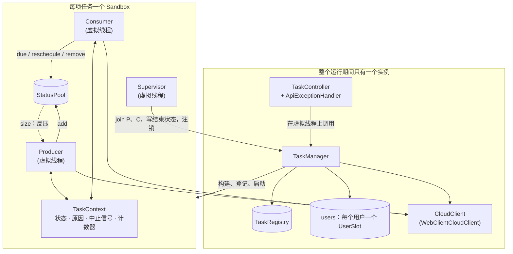
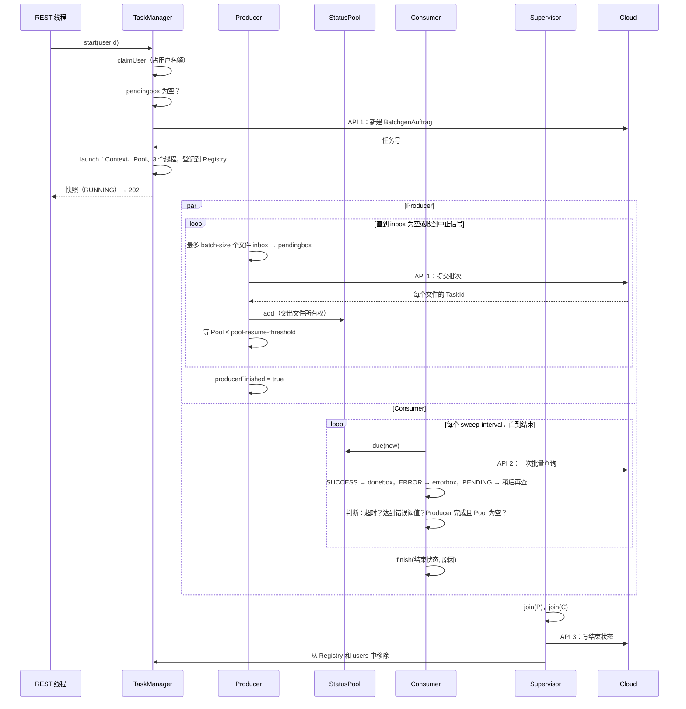
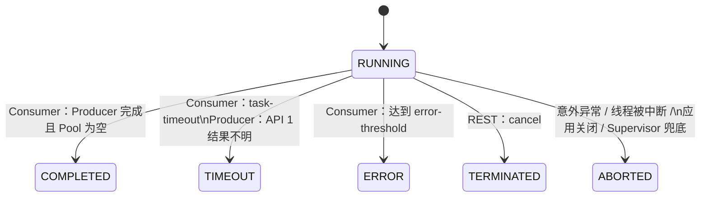
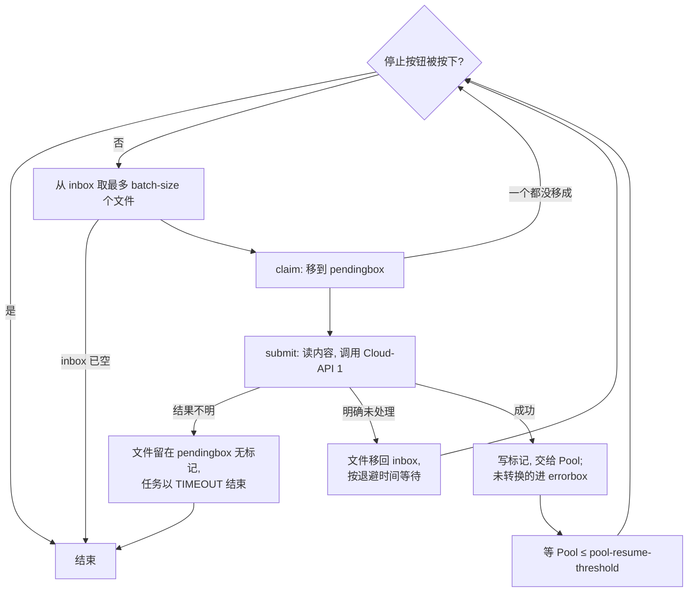
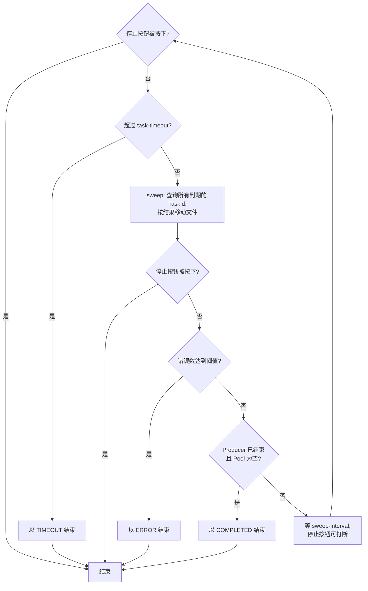

# 异步测试数据流水线——实现说明

本文以当前代码为准，逐个说明每个 package、每个类和每个方法做什么、为什么这样做，并详细说明 Producer、Consumer、TaskManager 和 TaskContext 之间如何协同。

- 业务流程的规范是 [`funktionsweise_sequenz_zh.md`](funktionsweise_sequenz_zh.md)（德文版 [`funktionsweise_sequenz.md`](funktionsweise_sequenz.md)），代码注释里的"Abschnitt n"指的就是那份文档的第 n 节。本文描述的是代码层面的实现。
- 使用说明、REST 接口和配置的速查见 [`README.md`](../../README.md)。
- 类名、方法名和德文领域术语（BatchgenAuftrag、inbox、pendingbox、donebox、errorbox 等）保持原样。

## 目录

1. [概览](#1-概览)
2. [核心机制](#2-核心机制)
   - 2.1 [一项任务的生命周期](#21-一项任务的生命周期)
   - 2.2 [TaskContext：共享状态和"先到先得"的结束](#22-taskcontext共享状态和先到先得的结束)
   - 2.3 [Producer 和 Consumer 如何协同](#23-producer-和-consumer-如何协同)
   - 2.4 [TaskManager 如何管理 Sandbox 和线程](#24-taskmanager-如何管理-sandbox-和线程)
   - 2.5 [文件、标记和崩溃安全](#25-文件标记和崩溃安全)
   - 2.6 [Cloud 调用：超时、重试和错误分类](#26-cloud-调用超时重试和错误分类)
   - 2.7 [结束原因（reason）](#27-结束原因reason)
3. [逐包、逐类、逐方法说明](#3-逐包逐类逐方法说明)
4. [配置项](#4-配置项)
5. [测试结构](#5-测试结构)
6. [已知限制和设计取舍](#6-已知限制和设计取舍)

---

## 1. 概览

### 1.1 要解决的问题

用户把要生成的测试数据文件放进自己的 `inbox`。应用把它们分批提交给云端（Cloud-API 1），云端为每个文件在 BatchgenAuftrag 的子表里建一条记录并自己更新状态。应用轮询这些状态（Cloud-API 2），按结果把文件移到 `donebox` 或 `errorbox`，最后把任务的结束状态写回云端（Cloud-API 3）。

决定整个设计的三个约束：

| 约束 | 后果 |
|---|---|
| Cloud-API 1 **不是幂等的**：同一文件提交两次会生成两条记录 | 文件在调用之前就移出 `inbox`（最多提交一次）；调用结果不明时不重试，任务立即结束 |
| 生成需要时间，状态由云端自己更新 | 需要一个独立的 Consumer 线程反复轮询，而不是"提交一次、等结果" |
| 每个用户的任务互相独立，不能互相影响 | 每项任务一个 Sandbox：自己的上下文、Status-Pool 和线程，什么都不共享 |

### 1.2 技术选择和理由

| 技术 | 用在哪里 | 为什么 |
|---|---|---|
| Java 21 虚拟线程 | Producer、Consumer、Supervisor，以及每个 REST 请求 | 线程大部分时间在等待（HTTP 应答、轮询间隔），虚拟线程阻塞时不占用平台线程，每个任务开 3 个线程的代价很小；代码可以写成直观的阻塞式循环 |
| Spring WebFlux（Netty） | REST 接口 | 事件循环模型，少量线程就能处理大量连接；阻塞的业务逻辑被转移到虚拟线程上，不会卡住事件循环 |
| WebClient（Reactor） | Cloud 客户端 | 需求要求非阻塞 HTTP 客户端；超时、重试和错误映射都能用声明式的 Reactor 算子表达 |
| Java NIO.2（`Files`、`DirectoryStream`） | 用户目录 | 需求要求；同一文件系统内的 `Files.move` 是重命名，开销小，并且能检测目标是否已存在 |
| Jackson 3 | JSON | Spring Boot 4 自带；Fake 后端也用它 |
| `ConcurrentHashMap`、`Atomic*`、`CountDownLatch` | TaskRegistry、Status-Pool、TaskContext | 第一阶段不用外部中间件；这些 JDK 原语足以保证线程安全 |

### 1.3 包结构

```
de.wwsstl.asynchrone
├── TestdatenPipelineApplication   Spring-Boot 入口
├── api/        REST 控制器和错误映射：只做转发，不含业务逻辑
├── task/       TaskManager、TaskRegistry、Sandbox、TaskContext、状态和快照
├── producer/   InboxProducer：读取 inbox，提交给 Cloud-API 1
├── consumer/   StatusConsumer：轮询 Cloud-API 2，移动文件，判定任务结束
├── pool/       Status-Pool：Producer 和 Consumer 之间的交接区
├── cloud/      Cloud 接口（CloudClient）、WebClient 实现、数据类型和异常
├── files/      用户目录（NIO.2）
├── config/     配置属性和 Spring Bean
└── fakecloud/  FakeCloudBackendApplication：独立运行、模拟云端的假后端
```

依赖方向：`api → task → producer/consumer → pool/files/cloud`；`config` 为所有部分提供配置和 Bean。`producer` 和 `consumer` 只通过 `TaskContext` 和 `StatusPool` 互相通信，彼此不直接引用。

### 1.4 运行时结构



### 1.5 线程一览

| 线程 | 数量 | 创建者 | 做什么 |
|---|---|---|---|
| Netty 事件循环 | 少量（平台线程） | WebFlux | 接收 HTTP 请求、发送应答；**从不阻塞** |
| `task-manager` 调度器线程 | 每个 REST 请求一个虚拟线程 | `PipelineConfiguration.taskManagerScheduler` | 执行 `TaskManager.start/status/cancel`，这些方法会阻塞（文件系统、等待 Cloud） |
| `producer-<任务号>` | 每个 Sandbox 一个 | `TaskManager.launch` | 读 inbox、提交批次、写标记、填 Pool |
| `consumer-<任务号>` | 每个 Sandbox 一个 | `TaskManager.launch` | 轮询状态、移动文件、判定 `COMPLETED`/`TIMEOUT`/`ERROR` |
| `sandbox-<任务号>`（Supervisor） | 每个 Sandbox 一个 | `TaskManager.launch` | 等 Producer 和 Consumer 都结束，写结束状态，注销 Sandbox |
| Reactor/Netty 客户端线程 | 少量 | WebClient | 执行 HTTP 调用和 `timeout` 计时；虚拟线程在 `Future.get` 上等待结果 |

所以每个 Sandbox 实际有 **3 个虚拟线程**：干活的 Producer 和 Consumer，加上只负责收尾的 Supervisor。

---

## 2. 核心机制

### 2.1 一项任务的生命周期



### 2.2 TaskContext：共享状态和"先到先得"的结束

`TaskContext` 是一个 Sandbox 的"中枢"：Producer、Consumer、REST 线程（中止、查询）、Supervisor 和应用关闭钩子都会并发访问它。它不包含任何流程逻辑，只负责以下三件事。

#### 1）一次性的状态转换



`finish(endState, reason)` 在 `transitionLock` 里做"检查后设置"：只有当前仍是 `RUNNING` 时才设置，并返回 `true`；之后的调用都返回 `false`，不改变任何东西。

**为什么这样做：** 可能有多个线程几乎同时想结束任务。例如 Consumer 刚判定 `COMPLETED`，用户就点了中止。只能有一个结束状态，而且必须稳定，否则写到云端的状态和本地看到的会不一致。所以规则是"先到先得"，输的一方通过返回值知道自己没有生效（比如 `cancel` 会记录"已经结束"）。

谁可以结束任务：

| 触发 | 所在线程 | 结束状态 | reason（示例） |
|---|---|---|---|
| Producer 已完成且 Pool 为空 | Consumer | `COMPLETED` | `inbox vollständig übermittelt, alle Ergebnisse verarbeitet` |
| 运行时间达到 `task-timeout` | Consumer | `TIMEOUT` | `maximale Laufzeit (task-timeout) überschritten`，可能附带最后一次失败的 API-2 查询 |
| 提交批次的结果不明 | Producer | `TIMEOUT` | `Cloud-API 1 (Batch übermitteln): Ergebnis unklar, keine Antwort innerhalb von submit-timeout` |
| 错误计数达到 `error-threshold` | Consumer | `ERROR` | `Fehlerschwelle (error-threshold) erreicht` |
| 外部中止 | REST 线程 | `TERMINATED` | `Abbruch über die REST-API` |
| Producer/Consumer 抛出意外异常 | 出错的线程 | `ABORTED` | `Producer fehlgeschlagen: …` |
| 等待时线程被中断 | 被中断的线程 | `ABORTED` | `beim Warten unterbrochen` |
| 应用关闭 | Spring 关闭线程 | `ABORTED` | `Anwendung wird beendet` |
| 两个线程都结束了却没有结束状态（兜底） | Supervisor | `ABORTED` | `Threads endeten ohne Endzustand` |

#### 2）中止信号

设置结束状态的同时会设置中止信号，由两部分组成：

- `stopRequested`（`AtomicBoolean`）：循环里随时可以低成本地检查（`isStopping()`）。
- `stopSignal`（`CountDownLatch(1)`）：`finish` 之后执行 `countDown()`，所有正在 `awaitStop(maxWait)` 里等待的线程会**立即**被唤醒。

**为什么不用 `Thread.interrupt()`：** 中断会打断任何阻塞操作，包括文件移动和正在进行的 HTTP 等待，容易让文件停在中间状态。这里的线程只在明确的位置（循环开头、批次之间、等待时）检查信号，所以总是在一致的状态下退出。中断只被当作"异常情况"处理：线程被中断就以 `ABORTED` 结束。

**为什么用 latch，而不是 `Thread.sleep` 加轮询：** `awaitStop(sweep-interval)` 既是"等一个间隔"，又能在收到中止信号时立刻返回。中止的响应时间因此不取决于间隔长短。

#### 3）计数器和快照

| 字段 | 谁写 | 谁读 |
|---|---|---|
| `errorCount` | Producer（未转换、不可读）、Consumer（`ERROR`、移动失败） | Consumer（阈值判断）、快照 |
| `submittedCount` | Producer | 快照 |
| `succeededCount` | Consumer | 快照 |
| `unclearCount` | Producer | 快照 |
| `producerFinished` | Producer（`finally` 里） | Consumer（`COMPLETED` 判断） |

全部使用原子类型，读取不需要加锁。`snapshot(pending)` 由此生成一个不可变的 `TaskSnapshot`。

**内存可见性的细节：** `finish` 先写 `finishedAt` 和 `reason`，最后才写 `state`。`snapshot()` 先读 `state` 再读 `reason`。因为 `AtomicReference` 具有 volatile 语义，看到结束状态的读者一定也能看到对应的原因，不会出现"状态是 TIMEOUT、原因却是 null"。

### 2.3 Producer 和 Consumer 如何协同

两个线程**不直接通信**，只通过两个对象协作：

| 共享对象 | Producer | Consumer | 用途 |
|---|---|---|---|
| `StatusPool` | `add`、`size`（反压） | `due`、`reschedule`、`remove`、`isEmpty` | 交接"已提交、等结果"的文件 |
| `TaskContext` | 计数、`finish`、`producerFinished`、`awaitStop` | 计数、`finish`、`isProducerFinished`、`awaitStop` | 结束状态、中止信号、计数 |
| 用户目录 | 移动 inbox↔pendingbox、pendingbox→errorbox，写标记 | 移动 pendingbox→donebox/errorbox，删标记 | 文件的持久状态 |

#### 文件所有权的交接

同一个文件在任意时刻只归一个线程处理，交接点是 `pool.add`：

1. Producer 把文件从 inbox 移到 pendingbox，此时文件归 Producer。
2. 收到 TaskId 后，Producer 先写标记，再调用 `pool.add`。从这一刻起文件归 Consumer，Producer 不再碰它。
3. Consumer 移动文件、删除标记、`pool.remove`。

没有收到 TaskId 的文件（未转换、不可读、结果不明、移回 inbox）永远不进 Pool，只由 Producer 处理。因此两个线程对同一个文件**不会竞争**，目录操作不需要加锁。

#### 反压（pool-resume-threshold）

每提交完一批，Producer 调用 `awaitPoolBelowThreshold()`：只要 `pool.size() > pool-resume-threshold` 就等一个 `sweep-interval`（期间可被中止信号唤醒），然后再检查。

**为什么需要反压：**

- 限制同时"在途"的文件数：Pool 最多 `pool-resume-threshold + batch-size` 个（默认 2 + 4 = 6）。如果云端变慢或 Cloud-API 2 出问题，Producer 会自动停下，而不是把整个 inbox 都提交上去。
- 遗留文件也因此有上限：任务以 `TIMEOUT`、`ERROR` 或 `TERMINATED` 结束时，pendingbox 里最多是这几个文件，人工处理的量很小。
- 阈值必须小于 `batch-size`（`PipelineProperties` 会校验），这样每批之后 Producer 一定会等到这一批里至少有一部分出了结果。

**为什么用轮询 Pool 大小，而不是让 Consumer 通知 Producer：** 实现最简单，Pool 不需要带通知功能。代价是 Producer 最多晚一个 `sweep-interval` 才发现 Pool 变小了，可以接受。

#### 为什么 Status-Pool 不是队列

一个 TaskId 的状态可能连续多次都是 `PENDING`，每次都要重新排期再查。用 FIFO 队列的话得"取出再放回"，还要处理顺序问题。Pool 用 `TaskId → PoolEntry(nextCheck)` 的 Map 实现，`due(now)` 取出所有到期条目，`reschedule` 只改下次检查时间，结构更自然。

#### COMPLETED 的判定为什么可靠

Consumer 在一轮 `sweep` 之后判断 `isProducerFinished() && pool.isEmpty()`。Producer 的顺序是：所有 `pool.add` → 发现 inbox 为空 → 返回 → `finally` 里 `producerFinished = true`。`AtomicBoolean` 的写和读建立了 happens-before 关系，所以 Consumer 看到 `producerFinished == true` 时，Producer 所有的 `pool.add` 都已经可见。这时 Pool 为空就意味着真的全部处理完了，不会漏掉最后一批。

**为什么由 Consumer 判定 `COMPLETED`，而不是 Producer：** Producer 结束只说明"提交完了"，结果要等 Consumer 拿到。只有 Consumer 知道最后一个结果什么时候到。

#### 一方结束时另一方如何退出

| 谁先结束 | 另一方怎么发现 |
|---|---|
| Consumer 判定 `COMPLETED`/`TIMEOUT`/`ERROR` | `finish` 设置中止信号；Producer 在循环开头或 `awaitStop` 里发现后退出。Producer 正在等 API-1 应答的话，会先把这一批处理完（写标记），但因为已经在中止，不会再 `pool.add`（见 `track`），文件带着标记留在 pendingbox |
| Producer 遇到结果不明，设 `TIMEOUT` | Consumer 如果正在 `awaitStop` 里等待，会被立即唤醒并退出；如果正在等 API-2 应答，要等这次调用返回，处理完这一块后退出 |
| Producer 正常结束（inbox 为空） | 不设任何结束状态，只设 `producerFinished`；Consumer 继续工作，直到 Pool 为空 |
| REST 中止 | 两个线程都通过中止信号退出 |

#### 时间线示例（默认配置，inbox 中 8 个文件）

| 时间 | Producer | Pool | Consumer |
|---|---|---|---|
| 0 s | 移动 4 个文件 → API 1 → 4 个 TaskId → 写标记 → `add` | 4 | sweep：Pool 为空，等待 |
| 0 s | 4 > 2，开始等待 | 4 | |
| 1 s | | 4 | sweep：4 个到期 → API 2 → 1 SUCCESS、3 PENDING；1 个进 donebox，3 个排期到 6 s |
| 1–6 s | 每秒检查：3 > 2，继续等 | 3 | 每秒 sweep：没有到期条目 |
| 6 s | | 3 | 3 个到期 → 2 SUCCESS、1 PENDING |
| 7 s | 1 ≤ 2：移动剩下 4 个文件 → 提交 → `add` | 5 | |
| … | inbox 为空 → 返回 → `producerFinished` | … | 继续轮询，直到 Pool 为空 |
| 结束 | | 0 | 判定 `COMPLETED` → `finish` |
| 之后 | | | Supervisor：join → API 3 = COMPLETED → 注销 |

### 2.4 TaskManager 如何管理 Sandbox 和线程

`TaskManager` 是唯一的 Spring 单例，整个运行期间都存在。它不参与 Producer/Consumer 的循环，只负责：启动、查询、中止、收尾。

#### 用户名额（UserSlot）

`users`（`ConcurrentHashMap<String, UserSlot>`）保证每个用户同一时间最多一项任务。名额从 `claimUser` 开始，直到 `deregister` 结束。

**为什么不直接用 TaskRegistry 判断：** Registry 按任务号索引，而任务号要先调用 Cloud-API 1 才能拿到。名额必须在调用云端**之前**占住，否则同一用户的两个并发启动请求可能都看到 pendingbox 为空，各自新建一个 BatchgenAuftrag。

`claimUser` 的细节：

1. `putIfAbsent` 成功 → 拿到名额。
2. 已有名额：如果它的任务**已经有结束状态**、只是还没注销完（Supervisor 正在写 Cloud-API 3），最多等 10 秒（`STOP_WAIT`）再试一次。这样用户在任务刚结束时立刻重新启动，不会无谓地收到 `409`。
3. 仍然被占 → `409 USER_TASK_RUNNING`。

#### 启动顺序和理由

| 步骤 | 方法 | 为什么在这个位置 |
|---|---|---|
| 1. 解析并创建目录 | `folderResolver.resolve` | 用户名不合法时直接 `400`，不占名额 |
| 2. 占名额 | `claimUser` | 必须在任何检查和云端调用之前，见上文 |
| 3. 检查 pendingbox | `hasPendingFiles` | 在新建 BatchgenAuftrag **之前**拒绝，不会在云端留下空任务 |
| 4. 新建 BatchgenAuftrag | `createBatchJob` | 同步进行，因为任务号是 Sandbox 和 Registry 的键，也要放进 `Location` 头；失败时还没有创建任何本地对象 |
| 5. 构建并启动 | `launch` | 先在 `UserSlot` 里记下 Sandbox 和 Supervisor，再登记、再启动线程，见下文 |
| 失败时 | `finally` | 没有成功启动的话释放名额（`users.remove(userId, slot)` 只删除自己的名额） |

`launch` 先把所有对象都构建好，Producer、Consumer、Supervisor 三个线程都处于 `unstarted` 状态。然后依次：记入 `UserSlot` → `registry.register` → `sandbox.start()` → `supervisor.start()`。先登记再启动，是为了线程一启动，查询和中止就能找到这个 Sandbox。启动失败时以 `ABORTED` 结束并从 Registry 移除。

#### Supervisor 和注销

`supervise` 依次 `join` Producer 和 Consumer，然后调用 `deregister`：

1. `finish(ABORTED, …)` 兜底：正常情况下结束状态早已设好，这次调用返回 `false`。
2. 把本地状态映射为云端状态（`TaskState.jobStatus()`）。`ABORTED` 映射为 `null`，表示不写，和崩溃时一样，BatchgenAuftrag 保持 `RUNNING`。
3. `writeEndState`：通过 Cloud-API 3 写入，失败只记日志。
4. 从 Registry 和 `users` 中移除，名额释放。

**为什么结束状态由 Supervisor 写，而不是由设置结束状态的线程写：**

- 结束状态只能在**两个线程都不再动文件之后**写，这样云端状态和目录内容是一致的。只有在两个线程之外的观察者才能确定这一点。
- `cancel` 在 REST 线程上执行，不应该阻塞到 Cloud-API 3 写完。所以中止接口立即返回 `202`，`TERMINATED` 稍后写入。
- 写结束状态、注销、释放名额都集中在一个地方，任何结束路径都会走到这里。

#### 中止、查询和关闭

| 方法 | 做什么 | 理由 |
|---|---|---|
| `cancel` | 找到本用户的 Sandbox，`finish(TERMINATED)`，返回当前快照 | 只设信号、不等待；任务不存在、属于别人或已经注销时返回 `404` |
| `status` | 先读本地快照，再通过 Cloud-API 3 读云端状态（只认本用户的） | 云端暂时不可达但任务还在本地运行时，只返回本地快照（`cloud = null`）；两边都没有时返回 `404` |
| `shutdown`（`@PreDestroy`） | 所有 Sandbox 以 `ABORTED` 结束，每个 Supervisor 最多等 10 秒 | 应用关闭就和崩溃一样处理：不写结束状态，遗留文件由用户处理 |

### 2.5 文件、标记和崩溃安全

目录不变式：

| 位置 | 含义 |
|---|---|
| `inbox/x` | 还没提交 |
| `pendingbox/x`，没有 `.taskids/x` | 已经移出 inbox，提交结果未知（正在提交，或者结果不明） |
| `pendingbox/x` 加上 `.taskids/x`（内容为 TaskId） | 已提交，云端有记录，等结果 |
| `donebox/x` / `errorbox/x` | 已有结果 |

关键顺序和理由：

1. **先移动，再提交：** 调用 Cloud-API 1 之前就把文件移出 inbox。即使提交过程中崩溃，下次也不会被重复提交（API-1 不是幂等的）。
2. **收到应答后才写标记：** 有标记就说明云端一定有这条记录，可以按 TaskId 查询。
3. **先移动文件，再删标记**（`UserFolders.settle`）：崩溃时最多留下一个多余的标记，而不会出现一个没有标记、看起来"结果不明"的文件。
4. **启动时 pendingbox 必须为空**（只统计普通文件，`.taskids` 目录不算）：没有"续跑"，遗留文件由用户先处理，因此不会有两个任务的文件混在一起。
5. **从不覆盖文件**（`moveInto`）：目标目录里已有同名文件时，加一个随机后缀，用户数据不会丢。

### 2.6 Cloud 调用：超时、重试和错误分类

| 调用 | 由谁发起 | 客户端超时 | 重试 | 等待上限（`Future.get`） | 失败时 |
|---|---|---|---|---|---|
| API 1 新建 BatchgenAuftrag | TaskManager | `submit-timeout` | 从不 | `submit-timeout` + 5 s | 明确未处理 → `502 CLOUD_UNAVAILABLE`；结果不明（含任务号无效） → `504 TIMEOUT`；都不创建 Sandbox |
| API 1 提交批次 | Producer | `submit-timeout` | 从不 | `submit-timeout` + 5 s | 明确未处理 → 文件移回 inbox，指数退避后重试；结果不明 → 文件不带标记留在 pendingbox，任务以 `TIMEOUT` 结束 |
| API 2 状态查询 | Consumer | `status-timeout` | `retries` 次（仅临时性错误） | `status-timeout` × (`retries` + 1) + 5 s | 按 `PENDING` 处理，`poll-interval` 后再查；记下原因 |
| API 3 写结束状态 | Supervisor | `status-timeout` | `retries` 次 | 同上 | 记日志；BatchgenAuftrag 保持 `RUNNING`，需要人工修正 |
| API 3 读 BatchgenAuftrag | TaskManager（查询） | `status-timeout` | `retries` 次 | 同上 | 本地仍在运行时只返回本地快照，否则返回 `502` |

**为什么 API-1 从不重试，而 API-2/3 会重试：** API-2 和 API-3 的读取是幂等的，写结束状态重复写同一个值也无害；API-1 每调用一次就在云端生成新记录。

**API-1 的错误分类**（`WebClientCloudClient.classify`）：

| 分类 | 情形 | 理由 |
|---|---|---|
| `NOT_PROCESSED`（明确未处理） | 连接失败（`ConnectException`、`UnknownHostException`、`NoRouteToHostException`）、`4xx`、`503` | 请求根本没到云端，或者被云端明确拒绝，重试是安全的 |
| `UNKNOWN`（结果不明） | 超时、其他 `5xx`、连接中途断开、应答无法解析 | 云端可能已经处理了，重试有重复提交的风险，所以不重试并结束任务 |

**为什么有"等待上限"这一层：** 真正起作用的超时是 WebClient 的 `timeout`，它的异常可以被分类。`Future.get` 的上限多留 5 秒余量（`RESULT_GRACE`），只防客户端出 bug、永远不返回的情况。这时同样按"结果不明"处理，并取消调用。

### 2.7 结束原因（reason）

- 每次 `finish` 都必须带一个原因，保存在 `TaskContext` 里，随 `TaskSnapshot.reason` 输出，并写进相关日志（"endet mit …"、"BatchgenAuftrag … auf … gesetzt (…)"、"abgemeldet: …"）。
- Cloud 错误由 `CloudErrors.describe` 生成简短描述：先解开 `ExecutionException` 和 `SubmitFailedException`；超时写成"在某某 timeout 之内没有应答"；其他错误直接用异常消息，例如 `500 Internal Server Error from POST http://…/tasks`，可以看出是哪个接口。
- Consumer 记下最后一次失败的 API-2 查询（`lastQueryFailure`），查询成功一次就清空。因 `task-timeout` 结束时，如果最后一次查询失败了，就把它附在原因后面。
- 原因**只在本地和日志里**，不写入云端（Cloud-API 3 的约定没有这个字段）。任务注销后 `local` 为 `null`，之后只能在日志里查到原因。

---

## 3. 逐包、逐类、逐方法说明

### 阅读说明

本节按 package 逐个讲解每个类。每个类先用一两句话说明它是什么、在整体中处于什么位置，然后逐个讲解方法，每个方法按下面几项展开（不需要的项省略）：

- **做什么**：一句话说明作用。
- **怎么做**：具体步骤。
- **为什么**：这样设计的理由。
- **如果不这样**：换一种做法会出什么问题。
- **例子**：具体的输入、输出或场景。

record 的访问器方法（例如 `taskId()`）不单独说明。

### 先打个比方

整个系统可以想象成一个**快递寄件站**：

| 系统里的东西 | 寄件站里的角色 |
|---|---|
| 用户的 `inbox` | 待寄的包裹堆 |
| `pendingbox` | "已交寄、等签收"的货架 |
| TaskId 标记（`.taskids/<文件名>`） | 贴在货架上的运单号 |
| Cloud-API 1 | 寄件柜台：交给它一批包裹，它给每件开一个运单号。**同一件包裹办两次就会开出两张运单**（不是幂等的） |
| Cloud-API 2 | 查件热线：报一串运单号，告诉你每件是"已签收"、"被退回"还是"在路上" |
| Cloud-API 3 | 总部的登记系统：记录这一整单任务的最终结果 |
| `donebox` / `errorbox` | "已签收"区 / "异常件"区 |
| **Producer** | 寄件员：每次从包裹堆里拿几件，先放到货架上，再去柜台办理，然后把运单号贴好、写到追踪板上 |
| **StatusPool** | 追踪板：写着所有"已寄出、还没结果"的运单号和下次该查的时间 |
| **Consumer** | 查件员：定时拿追踪板上到期的单号去查，签收的移到"已签收"区，退回的移到"异常件"区，还在路上的过一阵再查 |
| **TaskContext** | 这单任务的控制面板：当前状态、"停止"按钮、各种计数器 |
| **Sandbox** | 每单任务独立的工位：一个寄件员、一个查件员、一块追踪板、一块控制面板 |
| **TaskManager** | 前台经理：接单（启动）、回答查询、处理取消，给每单任务安排工位 |
| **Supervisor** | 收尾员：等寄件员和查件员都下班，向总部报告结果，然后撤掉工位 |
| **TaskRegistry** | 前台的登记簿：现在有哪些工位在运作 |

"柜台不能重复办理"是理解很多设计的关键：包裹在去柜台**之前**就放到货架上；柜台没给回音时，宁可停下来等人工核对，也不再办一次。

### 本节目录

- 3.1 [根包](#31-根包-dewwsstlasynchrone)
- 3.2 [`api`](#32-apirest-接口)：`TaskController`、`ApiExceptionHandler`
- 3.3 [`task`](#33-task任务管理)：`TaskManager`、`TaskContext`、`Sandbox`、`TaskRegistry`、`TaskState`、`TaskSnapshot`、`TaskStatus`、异常
- 3.4 [`producer`](#34-producer)：`InboxProducer`
- 3.5 [`consumer`](#35-consumer)：`StatusConsumer`
- 3.6 [`pool`](#36-pool)：`StatusPool`、`InMemoryStatusPool`、`PoolEntry`
- 3.7 [`cloud`](#37-cloudcloud-接口)：`CloudClient`、`WebClientCloudClient`、数据类型、异常、`CloudErrors`
- 3.8 [`files`](#38-files用户目录)：`UserFolderResolver`、`UserFolders`
- 3.9 [`config`](#39-config)：`PipelineProperties`、`PipelineConfiguration`
- 3.10 [`fakecloud`](#310-fakecloud)：`FakeCloudBackendApplication`

---

### 3.1 根包 `de.wwsstl.asynchrone`

#### `TestdatenPipelineApplication`

程序的入口。运行它，整个应用就启动了。

两个注解的作用：

- `@SpringBootApplication`：让 Spring 扫描本包及子包，自动创建所有带 `@Component`、`@Service`、`@RestController`、`@Configuration` 的类（`TaskController`、`TaskManager`、`InMemoryTaskRegistry`、`UserFolderResolver`、`PipelineConfiguration` 等），并启用自动配置（Netty Web 服务器、Jackson、WebClient.Builder 等）。
- `@ConfigurationPropertiesScan`：自动找到带 `@ConfigurationProperties` 的 `PipelineProperties`，把 `application.yml` 里 `pipeline.*` 的值填进去。**为什么用扫描：** 不用在别处再手动登记这个配置类，新增配置类时也不会忘。

##### `main(String[] args)`

- **做什么**：启动 Spring 应用。
- **怎么做**：调用 `SpringApplication.run`。Spring 读取配置，创建并连接所有 Bean，启动 Netty，默认监听 8080 端口。
- **补充**：配置不合法时（例如 `pool-resume-threshold` ≥ `batch-size`），`PipelineProperties` 的校验会让启动直接失败，并在日志里写明哪一项错了。

---

### 3.2 `api`：REST 接口

这个包是 HTTP 世界和业务逻辑之间的"翻译层"：把 HTTP 请求翻译成对 `TaskManager` 的方法调用，再把结果或异常翻译回 HTTP 应答。它**故意不包含任何业务逻辑**，这样业务规则只存在于 `task` 包，测试时也可以绕过 HTTP 直接测 `TaskManager`。

#### `TaskController`

三个接口，都在路径 `/api/users/{userId}/tasks` 下。构造器注入 `TaskManager` 和一个专用的调度器 `taskManagerScheduler`（见 `offload`）。

##### `start(userId)`：`POST /api/users/{userId}/tasks`

- **做什么**：为用户启动一项任务。
- **怎么做**：
  1. 通过 `offload` 在虚拟线程上调用 `taskManager.start(userId)`，得到本地快照 `TaskSnapshot`。
  2. 返回 `202 Accepted`，`Location` 头为 `/api/users/{userId}/tasks/{任务号}`，正文是快照。
- **为什么返回 202 而不是 200**：202 的意思是"已受理，正在处理"。任务要跑几分钟甚至更久，这个请求结束时任务远没有完成。
- **为什么带 Location**：告诉客户端"进度去这个地址查"，这是 REST 处理异步任务的惯例，客户端不用自己拼地址。
- **例子**：

  ```
  POST /api/users/alice/tasks
  → 202 Accepted
    Location: /api/users/alice/tasks/BJ-7
    {"taskNumber":"BJ-7","userId":"alice","state":"RUNNING","reason":null, ...}
  ```

  快照里的状态通常是 `RUNNING`。如果 inbox 是空的，任务可能瞬间就结束了，这时看到的也可能已经是 `COMPLETED`。
- **失败时**：`TaskManager` 抛出的异常（`409`、`502`、`504`、`400`）由 `ApiExceptionHandler` 统一转换。

##### `status(userId, taskNumber)`：`GET /api/users/{userId}/tasks/{taskNumber}`

- **做什么**：查询任务状态。
- **怎么做**：在虚拟线程上调用 `taskManager.status`，返回 `200` 和 `TaskStatus`（云端状态 + 本地快照）。

##### `cancel(userId, taskNumber)`：`POST /api/users/{userId}/tasks/{taskNumber}/cancel`

- **做什么**：从外部中止任务。
- **怎么做**：在虚拟线程上调用 `taskManager.cancel`，返回 `202 Accepted` 和当时的快照。
- **为什么是 202**：中止只是"按下停止按钮"。线程要把手头的事做完才会停，`TERMINATED` 要等它们都停了才写进云端，所以同样是"已受理"。
- **为什么用 `POST …/cancel` 而不是 `DELETE`**：中止是一个动作，任务在云端仍然存在，而且之后还能查询。用 `DELETE` 会让人误以为任务被删除了。

##### `offload(Callable<T> call)`

- **做什么**：把一个会阻塞的调用放到虚拟线程上执行，并包装成 WebFlux 能处理的 `Mono`。
- **怎么做**：`Mono.fromCallable(call).subscribeOn(taskManagerScheduler)`。`fromCallable` 把普通方法调用包装起来；`subscribeOn` 指定在 `taskManagerScheduler` 上执行，也就是每次一个新的虚拟线程。方法抛出的异常会变成 `Mono` 的错误信号，WebFlux 再交给 `ApiExceptionHandler`。
- **为什么**：WebFlux 底层的 Netty 只用很少几个"事件循环"线程处理**所有**请求。它们就像总机的几个接线员，必须一直有空接下一个电话。`TaskManager` 的方法会读写磁盘、等待云端应答（最长几十秒），如果让接线员去等，整个应用都会卡住。
- **如果不这样**：在事件循环线程上直接调用 `taskManager.start`，某个用户启动任务时云端慢了 30 秒，这 30 秒内其他所有用户的请求都得不到应答。

#### `ApiExceptionHandler`

所有异常的统一出口。把业务异常转换成标准的错误格式 `ProblemDetail`（RFC 9457），并额外加一个属性 `code`。

**为什么要有 `code`**：错误说明文字（`detail`）是给人看的，可能会改措辞、会翻译。前端要根据错误类型显示不同的提示（比如"请先清理 pendingbox"），需要一个稳定、机器可读的值，这就是 `code`。

一个错误应答大致如下：

```json
{
  "type": "about:blank",
  "title": "Conflict",
  "status": 409,
  "detail": "In der pendingbox von Benutzer 'alice' liegen noch Dateien einer früheren Aufgabe; bitte zuerst bearbeiten",
  "code": "PENDINGBOX_NOT_EMPTY"
}
```

##### `invalidUserId` 和 `invalidTaskNumber` → `400`

- **何时**：路径里的用户名或任务号格式不合法。
- **为什么是 400**：这是客户端的输入错误，换个合法的值重试就行，和服务器状态无关。

##### `notFound` → `404 TASK_NOT_FOUND`

- **何时**：任务不存在、属于别的用户，或者中止时任务已经结束并注销。
- **为什么"属于别人"也返回 404，而不是 403**：返回 403 等于告诉对方"这个任务号存在，只是不是你的"。统一返回 404，别人就无法通过试探任务号得知其他用户的任务。

##### `rejected` → `409`

- **何时**：启动被拒绝，`code` 是 `USER_TASK_RUNNING`（已经有一项任务在运行）或 `PENDINGBOX_NOT_EMPTY`（还有遗留文件）。
- **为什么是 409 Conflict**：请求本身没错，但和服务器的当前状态冲突。用户需要先等任务结束，或者先处理遗留文件，然后才能重试。

##### `cloudUnavailable` → `502 CLOUD_UNAVAILABLE`

- **何时**：云端连不上或明确拒绝了请求；查询时云端不可达、本地也没有这个任务。
- **为什么是 502 Bad Gateway**：说明问题出在本应用后面的服务（云端），不是本应用自己的错误。同时记一条 warn 日志，方便运维发现云端的问题。

##### `cloudTimeout` → `504 TIMEOUT`

- **何时**：启动时新建 BatchgenAuftrag 的结果不明，例如云端没有应答。
- **为什么是 504 Gateway Timeout**：后面的服务没有及时给出明确答复。`code` 用 `TIMEOUT`，和任务因为同样原因结束时的状态一致。`detail` 写明是哪个调用、什么原因，例如 `Cloud-API 1 (BatchgenAuftrag anlegen): Ergebnis unklar, keine Antwort innerhalb von submit-timeout`。

##### `problem(status, code, detail)`

- **做什么**：辅助方法，用 `ProblemDetail.forStatusAndDetail` 生成标准结构，再加上 `code` 属性。所有处理方法共用它，格式统一。

其他没有专门处理的异常（例如磁盘 I/O 错误）由 Spring 返回 `500`：那是本应用自身的意外错误。

---

### 3.3 `task`：任务管理

这是整个应用的"大脑"：管理任务从启动到结束的生命周期。

#### `TaskManager`

前台经理。整个应用里只有一个（Spring 单例），从启动到关闭一直存在。它负责：启动任务、回答查询、处理中止、在任务结束后收尾。它**不参与**寄件和查件的具体工作，那是 Producer 和 Consumer 的事。

主要字段：

| 字段 | 作用 |
|---|---|
| `registry` | 登记簿：运行中的 Sandbox，按任务号查找 |
| `folderResolver` | 根据用户名找到（并创建）用户目录 |
| `cloud` | 云端客户端 |
| `properties` | 配置 |
| `clock` | 时间来源（测试可以替换） |
| `users` | 每个用户一个"号牌"（`UserSlot`），保证一人同时只有一项任务 |

常量：`RESULT_GRACE` = 5 秒，等云端结果时在客户端超时之外再多等的余量；`STOP_WAIT` = 10 秒，等一项正在收尾的任务结束的上限。

内部类 `UserSlot`：一个用户的号牌，记着这个用户当前的 Sandbox 和 Supervisor 线程。两个字段是 `volatile`，因为写入它们的线程（启动请求的线程）和读取它们的线程（另一个启动请求、应用关闭）可能不同，`volatile` 保证读的线程能看到最新的值。

##### `start(userId)`

- **做什么**：为用户启动一项任务，返回本地快照。
- **怎么做**：
  1. `folderResolver.resolve(userId)`：校验用户名并找到（必要时创建）目录。用户名不合法会直接抛异常，这时还没占号牌。
  2. `claimUser(userId)`：占用户号牌，被占就拒绝（`409 USER_TASK_RUNNING`）。
  3. `hasPendingFiles`：pendingbox 里还有文件就拒绝（`409 PENDINGBOX_NOT_EMPTY`）。
  4. `createBatchJob`：在云端新建 BatchgenAuftrag，拿到任务号。
  5. `launch`：构建 Sandbox 并启动三个线程。
  6. 返回快照。
  7. 第 2 步之后，无论哪一步失败，`finally` 都会把号牌还回去（`users.remove(userId, slot)`，只还自己拿到的这一块）。
- **为什么是这个顺序**：
  - **先占号牌，再做检查**：假设同一用户几乎同时发出两个启动请求。如果先检查 pendingbox 再占号牌，两个请求都会看到"pendingbox 为空"，然后各自在云端新建一个 BatchgenAuftrag。先占号牌，第二个请求在第 2 步就被拒绝了。
  - **先检查 pendingbox，再调用云端**：被拒绝时云端不会多出一个空的 BatchgenAuftrag。
  - **新建 BatchgenAuftrag 是同步的**：任务号是 Sandbox 在登记簿里的键，也要放进 `Location` 头，必须先拿到；而且云端失败时本地还什么都没创建，不需要清理。
- **如果不还号牌**：一次失败的启动（例如云端不可达）会让这个用户永远无法再启动任务。

##### `claimUser(userId)`

- **做什么**：为用户占号牌。
- **怎么做**：
  1. `users.putIfAbsent(userId, 新号牌)`：没人占就成功，返回新号牌。
  2. 已经被占：调用 `awaitDeregistered(旧号牌)`，看看是不是"任务已经结束、正在收尾"，如果是就等它收尾完。
  3. 再试一次 `putIfAbsent`，成功就返回。
  4. 仍然被占，抛出 `TaskRejectedException(USER_TASK_RUNNING)`。
- **为什么要等收尾**：任务结束后，Supervisor 还要通过 Cloud-API 3 写结束状态，这一步可能要几百毫秒到几秒，写完才会还号牌。
- **例子**：任务在 12:00:00.000 以 `COMPLETED` 结束，Supervisor 写 Cloud-API 3 花了 300 毫秒。用户在 12:00:00.100 再次点"启动"。如果不等，会收到"已有任务在运行"，而界面上明明显示任务已完成。现在会等到 12:00:00.300，然后正常启动。

##### `awaitDeregistered(slot)`

- **做什么**：如果号牌上的任务已经有结束状态，最多等 `STOP_WAIT`（10 秒），让它的 Supervisor 收尾完成。
- **怎么做**：读出号牌上的 Sandbox 和 Supervisor。有一个为空（另一个启动请求还在进行中），或者任务仍是 `RUNNING`，就立即返回；否则 `supervisor.join(10 秒)`。
- **为什么不等正在运行的任务**：运行中的任务可能还要跑 30 分钟，启动请求不能挂这么久，应该立即告诉用户"已有任务在运行"。
- **为什么有 10 秒上限**：收尾通常很快；万一云端很慢，也不能让启动请求无限期地等。

##### `hasPendingFiles(folders)`

- **做什么**：问用户目录"pendingbox 里有没有文件"。
- **为什么要包一层**：`UserFolders.hasPendingFiles` 会抛出受检异常 `IOException`，`start` 的签名里没有声明它。这里把它转成 `UncheckedIOException`，最终由 Spring 返回 `500`，因为读不了磁盘属于本应用的故障。

##### `createBatchJob(userId)`

- **做什么**：调用 Cloud-API 1 新建 BatchgenAuftrag，返回任务号；失败时按失败类型抛出不同的异常。
- **怎么做**：
  1. 调用 `cloud.createBatchJob(userId)`，得到一个 `CompletableFuture`。
  2. 最多等 `submit-timeout` + 5 秒（`RESULT_GRACE`）。
  3. 按结果分情况处理：

     | 情况 | 处理 | 应答 |
     |---|---|---|
     | 成功，任务号格式合法 | 记日志，返回任务号 | 继续启动 |
     | 失败，分类为"明确未处理"（连接失败、4xx、503） | `CloudUnavailableException` | `502` |
     | 失败，分类为"结果不明"（超时、其他 5xx、应答无法解析） | `CloudTimeoutException` | `504 TIMEOUT` |
     | 外层等待也超时（客户端没按时返回） | 取消调用，`CloudTimeoutException` | `504 TIMEOUT` |
     | 成功，但任务号不合法（例如包含空格） | `CloudTimeoutException` | `504 TIMEOUT` |
     | 等待时线程被中断 | `CloudUnavailableException` | `502` |
- **为什么区分"明确未处理"和"结果不明"**：新建任务和提交批次一样，都不是幂等的。"明确未处理"说明云端肯定没建，用户可以放心重试。"结果不明"说明云端可能已经建了，只是我们不知道编号，这时只能停下来；如果云端确实建了，这个 BatchgenAuftrag 会一直是 `RUNNING`，需要人工修正。两种情况的应答不同，用户和运维才知道该怎么做。
- **为什么任务号不合法算"结果不明"**：云端回了一个我们无法使用的编号。它很可能已经建好了任务，但我们没法用这个编号做后续操作，这和"应答无法解析"是一回事。
- **为什么要多等 5 秒**：真正起作用的是 WebClient 自己的超时（`submit-timeout`），它产生的异常能被分类。外层等待只是安全网：万一客户端出 bug、永远不返回，请求也不会一直挂着。

##### `unclear(operation, detail)`

- **做什么**：生成"结果不明"的异常，消息格式统一为"调用：Ergebnis unklar, 原因"。
- **例子**：`Cloud-API 1 (BatchgenAuftrag anlegen): Ergebnis unklar, keine Antwort innerhalb von submit-timeout`。

##### `launch(folders, taskNumber, slot)`

- **做什么**：搭好一个 Sandbox（工位），登记，然后让三个线程开始工作。
- **怎么做**：
  1. 新建 `TaskContext`（控制面板）和 `InMemoryStatusPool`（追踪板）。
  2. 新建三个虚拟线程，此时**还没启动**（`unstarted`）：`producer-<任务号>` 运行 `InboxProducer`，`consumer-<任务号>` 运行 `StatusConsumer`，`sandbox-<任务号>` 运行 `supervise`。
  3. 把 Sandbox 和 Supervisor 记到用户号牌上。
  4. `registry.register(sandbox)`：登记。
  5. 启动 Producer 和 Consumer，再启动 Supervisor。
  6. 第 5 步失败时（极少见）：以 `ABORTED` 结束任务，从登记簿移除，然后把异常抛出去。
- **为什么先全部建好再启动**：线程一启动就会访问 Context、Pool 等对象。先建好，线程就不会看到一个只建了一半的工位。
- **为什么先登记再启动**：如果先启动再登记，在 inbox 为空的情况下，任务可能在几毫秒内就结束了，Supervisor 收尾时执行"从登记簿移除"，而这时还没登记；随后登记才发生，这个已经结束的 Sandbox 就会永远留在登记簿里。先登记还有一个好处：线程一开始工作，查询和中止就能找到这个任务。
- **为什么先记到号牌上**：`awaitDeregistered` 和 `shutdown` 都需要通过号牌找到 Supervisor。

##### `status(userId, taskNumber)`

- **做什么**：返回任务状态，包括云端状态和本地快照。
- **怎么做**：
  1. 校验任务号格式，不合法返回 `400`。
  2. 在登记簿里找这个任务，并核对属于该用户。找到就生成本地快照。
  3. 通过 Cloud-API 3 读 BatchgenAuftrag，只认属于该用户的；读到就转换成 `TaskStatus.Cloud`。
  4. 云端读取失败时：本地有快照就只返回本地（`cloud = null`，记 warn 日志）；本地也没有就抛 `CloudUnavailableException`（`502`）。
  5. 两边都没有：`TaskNotFoundException`（`404`）。
- **为什么先读本地**：本地快照不受云端是否可达影响，而且读起来很快。
- **为什么云端结果也要核对用户**：任务号可以猜。不核对的话，`bob` 用 `alice` 的任务号也能查到她的任务信息。
- **为什么云端不可达时返回本地**：任务还在跑，用户至少能看到本地的进度，而不是只得到一个错误。

##### `cancel(userId, taskNumber)`

- **做什么**：按下任务的"停止"按钮。
- **怎么做**：
  1. 校验任务号格式。
  2. 找到本用户的运行中任务，找不到就 `404`。
  3. `context.finish(TERMINATED, "Abbruch über die REST-API")`：成功就记"被外部中止"；失败说明任务已经以别的状态结束了，记"已经结束"。
  4. 返回当时的快照。
- **为什么不等线程停下**：线程可能正在等云端应答，要过一会儿才停。请求立即返回 `202`，`TERMINATED` 由 Supervisor 在线程停下之后写入。
- **例子**：Consumer 刚判定 `COMPLETED`，几乎同时用户点了"中止"。按"先到先得"，`finish(TERMINATED)` 返回 `false`，返回的快照显示 `COMPLETED`，云端写入的也是 `COMPLETED`。结果保持一致。

##### `findLocal(userId, taskNumber)`

- **做什么**：在登记簿里按任务号找 Sandbox，并核对是否属于该用户。
- **为什么**：理由同 `status`，不能让人操作或查看别人的任务。

##### `supervise(sandbox, slot)`（Supervisor 线程的工作）

- **做什么**：等 Producer 和 Consumer 都结束，然后收尾。
- **怎么做**：`joinQuietly(producer)` → `joinQuietly(consumer)` → `deregister`。
- **为什么要一个专门的线程**：总得有人在两个线程都停下之后做收尾，而 Producer 和 Consumer 都不知道对方什么时候停。专门的收尾员只做"等"这一件事，虚拟线程等待几乎没有开销。

##### `deregister(sandbox, slot)`

- **做什么**：收尾：写结束状态，撤掉工位，还号牌。
- **怎么做**：
  1. `finish(ABORTED, "Threads endeten ohne Endzustand")`，作为兜底。正常情况下结束状态早已设好，这次调用返回 `false`，什么都不变。如果返回 `true`，说明两个线程都结束了却没人设置结束状态（程序 bug），记一条警告。
  2. 把本地状态换算成要写入云端的状态（`TaskState.jobStatus()`）。`ABORTED` 换算为"不写"，记一条警告，说明 BatchgenAuftrag 保持 `RUNNING`、需要人工修正；其他状态调用 `writeEndState`。
  3. 从登记簿移除 Sandbox，还号牌。
  4. 记一条"已注销"的日志，带上最终快照，里面有结束原因和所有计数。
- **为什么等两个线程都停了才写结束状态**：写进云端的结束状态应该和磁盘上的文件状态一致。如果 Consumer 已经停了、Producer 还在移动文件，这时写入的状态就可能和最终的文件分布对不上。

##### `writeEndState(context, endState)`

- **做什么**：通过 Cloud-API 3 把结束状态写进 BatchgenAuftrag。
- **怎么做**：调用 `cloud.setJobStatus`，最多等 `statusWait()`。成功就记日志，日志里带上结束原因；失败就记 error 日志，说明需要人工修正。
- **为什么失败了不一直重试**：客户端已经按 `retries` 重试过了。再无限重试会让工位和号牌一直不释放，用户也无法启动新任务。写入失败是文档里明确列出的需要人工修正的情况之一。

##### `joinQuietly(thread)`

- **做什么**：等一个线程结束，期间被中断也继续等。
- **怎么做**：在循环里 `thread.join()`，捕获到 `InterruptedException` 就记下来、继续等；等完之后，如果曾被中断，就恢复中断标志。
- **为什么不能被中断打断**：被打断的话，Supervisor 会在线程还在工作时就开始收尾，提前写结束状态、撤掉工位，造成状态不一致。恢复中断标志是 Java 的惯例：不吞掉中断，留给上层知道。

##### `shutdown()`（`@PreDestroy`）

- **做什么**：应用关闭时（例如重新部署），停掉所有运行中的任务。
- **怎么做**：所有 Sandbox 以 `ABORTED`（"Anwendung wird beendet"）结束；然后对每个号牌上的 Supervisor 最多等 10 秒。
- **为什么是 `ABORTED`、不写云端**：任务不是用户中止的，写 `TERMINATED` 不符合事实；关闭过程中网络调用也不可靠。所以和崩溃一样处理：不写结束状态，遗留文件由用户处理。这种处理方式和文档第 7 节一致。
- **为什么要等 Supervisor**：让线程有机会把手头的文件操作做完，再让 JVM 退出。

##### `statusWait()`

- **做什么**：计算等待 Cloud-API 2 或 3 结果的上限：`status-timeout` × (`retries` + 1) + 5 秒。
- **为什么是这个公式**：每次尝试最多 `status-timeout`，一共最多 `retries` + 1 次尝试，再加上 5 秒余量（覆盖重试之间的短暂等待）。
- **例子**：默认值是 30 s × 3 + 5 s = 95 s；当前 `application.yml`（10 s、2 次重试）下是 10 s × 3 + 5 s = 35 s。

##### `await(call, wait, operation)`

- **做什么**：等一个 Cloud 调用的结果，任何失败都转换成 `CloudUnavailableException`。
- **怎么做**：`call.get(wait)`。被中断时恢复中断标志；调用失败时取出真正的原因；等待超时时取消调用。三种情况都抛 `CloudUnavailableException(operation, 原因)`。
- **为什么不区分"结果不明"**：它只用于 Cloud-API 3（读任务、写结束状态）。读是幂等的，写同一个结束状态重复写也无害，不存在"结果不明"的问题。

#### `TaskContext`

一项任务的控制面板。Producer、Consumer、REST 线程、Supervisor 和应用关闭都会同时读写它，所以每个字段都是线程安全的类型。

| 字段 | 类型 | 含义 |
|---|---|---|
| `userId`、`taskNumber`、`startedAt`、`timeout`、`errorThreshold`、`clock` | 不可变 | 基本信息和阈值 |
| `state` | `AtomicReference<TaskState>` | 当前状态，初始为 `RUNNING` |
| `finishedAt`、`reason` | `AtomicReference` | 结束时间和原因，运行中为 `null` |
| `stopRequested` | `AtomicBoolean` | 停止按钮是否被按下 |
| `stopSignal` | `CountDownLatch(1)` | 按下停止按钮时，叫醒所有正在等待的线程 |
| `errorCount`、`submittedCount`、`succeededCount`、`unclearCount` | `AtomicInteger` | 计数器 |
| `producerFinished` | `AtomicBoolean` | Producer 是否已经结束 |
| `transitionLock` | `Object` | 保护"检查并设置结束状态"这一步 |

**为什么用原子类型，而不是给整个对象加锁**：读操作（查询快照、循环里检查停止按钮）非常频繁，原子类型的读不需要加锁，几乎没有开销。只有"设置结束状态"这一步需要几个字段一起变，才用一把小锁。

##### 构造器 `TaskContext(userId, taskNumber, timeout, errorThreshold, clock)`

- **做什么**：保存基本信息，用 `clock` 记录开始时间。
- **为什么注入 `Clock`，而不是直接用系统时间**：测试时可以换成可控的时钟（`MutableClock`），把时间"快进"30 分钟来测试超时，而不用真的等。

##### `finish(endState, reason)`

- **做什么**：设置结束状态和原因，同时按下停止按钮。只有第一次调用有效。
- **怎么做**：
  1. 传入 `RUNNING` 就抛异常，因为它不是结束状态。
  2. 进入 `transitionLock`：
     - 状态已经不是 `RUNNING`，返回 `false`（已经有人先结束了任务）。
     - 否则依次写入 `finishedAt`、`reason`、`state`，并把 `stopRequested` 设为 `true`。
  3. 离开锁之后 `stopSignal.countDown()`，叫醒所有正在等待的线程。
  4. 返回 `true`。
- **为什么"先到先得"**：可能有好几个线程几乎同时想结束任务。结束状态只能有一个，并且之后不能再变，否则本地显示的、写进云端的和日志里记的会互相矛盾。
- **为什么"检查并设置"要加锁**：如果不加锁，两个线程可能同时看到 `RUNNING`，各自写入自己的状态，后写的覆盖先写的，还都以为自己赢了。
- **为什么 `reason` 在 `state` 之前写**：别的线程是先读 `state` 再读 `reason`。只要看到了结束状态，就一定能看到它的原因，不会出现"状态是 TIMEOUT、原因却是空"。
- **为什么返回 `boolean`**：调用方能知道自己是否生效。例如 `cancel` 据此记录"已中止"还是"已经结束"；Consumer 只在自己生效时才记"任务结束"的日志。

##### `state()`、`finishedAt()`、`reason()`

- **做什么**：读取当前状态、结束时间和结束原因。运行中后两者为 `null`。不加锁，可以随时调用。

##### `isStopping()`

- **做什么**：停止按钮是否已被按下。
- **为什么单独有这个方法**：Producer 和 Consumer 在循环里会频繁检查它，读一个 `AtomicBoolean` 几乎没有开销。

##### `awaitStop(maxWait)`

- **做什么**："等一会儿"：最多等 `maxWait`，但停止按钮一按下就立即醒来。返回停止按钮是否已被按下。
- **怎么做**：`stopSignal.await(maxWait)`。到时间或者 latch 被 `countDown` 都会返回。等待时线程被中断，就恢复中断标志，并以 `ABORTED` 结束任务。
- **为什么不用 `Thread.sleep`**：`sleep(1 秒)` 期间按停止按钮没有反应，要睡满才会发现。用 latch 能立即醒来。
- **例子**：Producer 在等 Pool 变小，每次等 1 秒（`sweep-interval`）。用户在第 0.2 秒点"中止"，Producer 在第 0.2 秒就醒来并退出，而不是第 1 秒。
- **为什么被中断就算 `ABORTED`**：本应用自己从不中断这些线程，被中断说明发生了意外（例如 JVM 正在关闭），按异常情况处理最安全。

##### `isTimedOut()`

- **做什么**：运行时间是否已经达到 `task-timeout`。
- **怎么做**：当前时间不早于 `startedAt + timeout` 就返回 `true`。
- **谁调用**：Consumer 在每轮循环开头调用。

##### `recordError()`、`errorThresholdReached()`

- **做什么**：错误计数加一（返回新值）；判断错误数是否已经达到阈值。
- **哪些算错误**：Cloud-API 1 没有转换的文件、无法读取的文件、Cloud-API 2 返回 `ERROR` 的文件、无法移到目标目录的文件。
- **为什么 Producer 和 Consumer 的错误合在一起计**：从用户角度看，这些都是"这个文件没能成功生成"，阈值关心的是一项任务里总共有多少个失败的文件。

##### `recordSubmitted()`、`recordSucceeded()`、`recordUnclear(n)`

- **做什么**：分别给"已提交（拿到了 TaskId）""成功（进了 donebox）""结果不明"计数，只用于快照显示。

##### `producerFinished()`、`isProducerFinished()`

- **做什么**：Producer 结束时设置标志（在 `finally` 里，无论正常结束还是出错）；Consumer 读这个标志。
- **为什么需要它**：Consumer 判定 `COMPLETED` 的条件是"Producer 已经结束，并且 Pool 为空"。只看 Pool 为空不够：任务刚开始、或者两批之间，Pool 也可能是空的，但 inbox 里还有文件没提交。为什么这个判断不会漏掉最后一批，见 [2.3](#23-producer-和-consumer-如何协同)。

##### `snapshot(pending)`

- **做什么**：生成一个当前状态的快照 `TaskSnapshot`。
- **为什么 `pending` 由调用方传入**：Pool 里的数量要问 Pool，而 Context 不持有 Pool，各自只管自己的事。`Sandbox.snapshot()` 会把两者组合起来。

#### `Sandbox`（record）

一项任务的工位，把四样东西打包在一起：`context`（控制面板）、`pool`（追踪板）、`producer` 和 `consumer`（两个线程）。

**为什么用 record**：工位的组成一旦确定就不再变，record 天然不可变，也不需要手写构造器、getter、equals。

##### `start()`

- **做什么**：启动 Producer 和 Consumer 线程。
- **为什么只在包内可见**：只有 `TaskManager` 能启动工位，外部代码不能绕过启动流程（登记、号牌）。

##### `isAlive()`

- **做什么**：两个线程中是否至少有一个还在运行。测试用它验证"关闭后线程都停了"。

##### `snapshot()`

- **做什么**：`context.snapshot(pool.size())`，把控制面板和追踪板上的信息合成一份快照。

#### `TaskRegistry`（接口）和 `InMemoryTaskRegistry`

前台的登记簿：所有运行中的 Sandbox，按任务号索引。整个应用只有一个，有 n 个任务在运行，里面就有 n 条记录。

**为什么定义成接口**：现在是一台服务器，用内存里的 `ConcurrentHashMap` 就够了。将来如果部署多台，可以换成 Redis 之类的分布式实现，`TaskManager` 不用改。

**为什么用 `ConcurrentHashMap`**：启动、查询、中止和收尾可能在不同线程上同时访问登记簿，它支持并发读写，不需要另外加锁。

##### `register(sandbox)`

- **做什么**：登记一个 Sandbox。
- **怎么做**：`putIfAbsent(任务号, sandbox)`，任务号已经存在就抛 `IllegalStateException`。
- **为什么不直接覆盖**：如果云端出错，两次返回了同一个任务号，直接覆盖会让第一个 Sandbox 从登记簿"消失"，但它的线程仍在运行，无法查询也无法中止。抛异常能让问题立即暴露。

##### `find(taskNumber)`

- **做什么**：按任务号查找，返回 `Optional`，没有就是空。

##### `remove(sandbox)`

- **做什么**：移除**这个** Sandbox。
- **怎么做**：`remove(任务号, sandbox)`，只有当前登记的正是这个对象时才删除。
- **为什么不只按任务号删**：防御性设计，确保一个 Sandbox 的收尾永远不会误删别的条目。

##### `all()`

- **做什么**：返回所有 Sandbox 的不可变副本。
- **为什么是副本**：关闭时遍历它、逐个结束任务，而收尾线程可能同时在删除条目。遍历副本就不受影响。

##### `size()`

- **做什么**：运行中的任务数，用于日志和测试。

#### `TaskState`（enum）

任务的本地状态，以及每个状态写进云端时对应什么。

| 状态 | 什么时候 | 写入云端 |
|---|---|---|
| `RUNNING` | 运行中 | 不写（云端新建任务时就已经是 `RUNNING`） |
| `COMPLETED` | inbox 全部提交完，所有结果都处理完 | `COMPLETED` |
| `TIMEOUT` | 运行时间达到 `task-timeout`，或者提交批次的结果不明 | `TIMEOUT` |
| `ERROR` | 错误数达到 `error-threshold` | `ERROR` |
| `TERMINATED` | 用户通过接口中止 | `TERMINATED` |
| `ABORTED` | 应用关闭或意外错误 | **不写**，云端保持 `RUNNING` |

##### `jobStatus()`

- **做什么**：返回要写进云端的状态，`null` 表示不写。
- **为什么 `ABORTED` 不写**：`ABORTED` 意味着应用自己出了问题或正在关闭，任务并没有按业务规则结束，和崩溃是一回事。云端保持 `RUNNING`，管理员一看就知道这个任务需要人工检查。
- **为什么把映射写在枚举里**：每加一个状态，就必须同时决定它对应的云端状态，不会遗漏。

#### `TaskSnapshot`（record）

某一时刻本地状态的"照片"，不可变。它是启动和中止接口的应答，也是查询应答里的 `local` 部分。

| 字段 | 含义 |
|---|---|
| `taskNumber`、`userId` | 任务号（= BatchgenAuftrag 编号）和用户 |
| `state`、`reason` | 状态和结束原因（运行中原因为 `null`） |
| `startedAt`、`finishedAt` | 开始和结束时间 |
| `submitted` | 拿到 TaskId 的文件数 |
| `succeeded` | 进了 donebox 的文件数 |
| `failed` | 错误计数 |
| `pending` | Pool 里还在等结果的文件数 |
| `unclear` | 结果不明的文件数 |

**为什么是不可变的"照片"**：交给 JSON 序列化时，线程还在不断改动计数。照片一旦生成就不会变，序列化出来的数字前后一致。

**注意**：它只包含 Consumer 已经处理过的结果，所以可能比云端的数字稍微晚一点。

#### `TaskStatus`（record）

查询接口的应答：`taskNumber`、`userId`、`cloud`、`local`。

- `cloud`（内部 record `Cloud`：`status`、`success`、`error`、`pending`）：云端看到的 BatchgenAuftrag 状态和各状态的记录数。为 `null` 表示云端暂时不可达。
- `local`：本地快照。为 `null` 表示任务已经结束并注销。
- `Cloud.of(BatchJob)`：把云端客户端返回的 `BatchJob` 转换成应答格式，只保留对外需要的字段。

例子（任务运行中）：

```json
{
  "taskNumber": "BJ-7",
  "userId": "alice",
  "cloud": {"status": "RUNNING", "success": 3, "error": 0, "pending": 2},
  "local": {"state": "RUNNING", "reason": null, "submitted": 5, "succeeded": 3, "failed": 0, "pending": 2, "unclear": 0, ...}
}
```

#### 异常类和原因代码

##### `TaskRejectedException` 和 `RejectReason`

- **何时**：启动被拒。`RejectReason` 是 `USER_TASK_RUNNING`（已有任务在运行）或 `PENDINGBOX_NOT_EMPTY`（有遗留文件）。
- **为什么用一个异常加一个枚举，而不是两个异常类**：两种情况的 HTTP 状态都是 `409`，只有 `code` 不同。用枚举的 `name()` 直接作为 `code`，处理代码只需要写一份。

##### `TaskNotFoundException`

- **何时**：任务不存在或不属于该用户，对应 `404`。为什么两种情况不区分，见 `ApiExceptionHandler.notFound`。

##### `InvalidTaskNumberException`

- **何时**：任务号格式不合法，对应 `400`。
- **`isValid(taskNumber)`**：只允许 1–64 个字母、数字、`.`、`_`、`-`。
- **`requireValid(taskNumber)`**：不合法就抛异常，合法就原样返回，方便在方法开头一行完成校验。
- **为什么要限制格式**：任务号会出现在 URL 路径和 `Location` 头里。只允许不需要编码的字符，就不会出现 `/`、空格、`?` 这类会改变 URL 含义的字符。它还被用来检查云端返回的任务号是否可用。
- **例子**：`BJ-7` 合法；`BJ 7`（含空格）、`../x`（含 `/`）、空字符串都不合法。

---

### 3.4 `producer`

#### `InboxProducer`

寄件员。运行在 `producer-<任务号>` 虚拟线程上，负责把 inbox 里的文件一批批提交给 Cloud-API 1。

工作流程：



字段：`context`、`pool`、`folders`、`cloud`、`properties`、`clock`，以及 `unmovable`：本次任务中无法移出 inbox 的文件，以后不再尝试。

常量和内部类型：`RESULT_GRACE`（5 秒，见 `TaskManager.createBatchJob`）；`SUBMIT`（原因文字里的调用名）；`Outcome`，一批提交的三种结果：`SUBMITTED`（成功）、`NOT_PROCESSED`（明确未处理）、`UNCLEAR`（结果不明）。

##### `run()`

- **做什么**：线程的入口。
- **怎么做**：调用 `produce()`。抛出任何意外异常时，记 error 日志，并以 `ABORTED` 结束任务（原因"Producer fehlgeschlagen: …"）。`finally` 里设置 `producerFinished`，并记"Producer 结束"的日志。
- **为什么 `producerFinished` 放在 `finally` 里**：Consumer 要靠这个标志判断任务是否完成。如果 Producer 因为异常结束却没设标志，Consumer 会一直等下去，直到 `task-timeout`。
- **为什么捕获 `Throwable`**：任何未预料的错误都必须让任务以确定的状态结束，而不是让线程悄无声息地死掉。

##### `produce()`

- **做什么**：主循环，见上面的流程图。
- **怎么做**：
  1. 只要停止按钮没按下，就循环。
  2. 从 inbox 取最多 `batch-size` 个文件（跳过 `unmovable`）。取不到，说明 inbox 空了，正常返回。
  3. `claim`：移到 pendingbox。一个都没移成，就回到第 1 步（这些文件已经记进 `unmovable`，下次不会再取到）。
  4. `submit`：提交，按结果：
     - `UNCLEAR`：返回。任务已经以 `TIMEOUT` 结束。
     - `NOT_PROCESSED`：连续失败次数加一，按 `retryWait` 等待（可被停止按钮打断），回到第 1 步。
     - `SUBMITTED`：连续失败次数清零，`awaitPoolBelowThreshold` 等 Pool 变小，回到第 1 步。
- **为什么明确未处理时不需要等 Pool 变小**：这批文件已经回到 inbox，Pool 没有增加。等待是为了退避，不是为了反压。

##### `claim(inboxFiles)`

- **做什么**：把取到的文件从 inbox 移到 pendingbox，返回移动成功的文件在 pendingbox 中的新路径。
- **怎么做**：逐个调用 `folders.moveToPending`。失败的（例如文件被其他程序锁住）记一条警告，并加入 `unmovable`。
- **为什么在调用 Cloud-API 1 之前移动**：这是"最多提交一次"的保证。如果先提交再移动，提交成功后、移动之前应用崩溃，重启后文件还在 inbox 里，会被再提交一次，云端就会出现重复记录。先移动的话，最坏情况是文件留在 pendingbox、没有标记，由人工核对。
- **为什么记入 `unmovable`**：否则下一轮又会取到同一个被锁住的文件，Producer 会在原地打转。

##### `submit(batch)`

- **做什么**：提交一批文件，并按应答处理每个文件。
- **怎么做**：
  1. **读文件内容**：逐个读取（UTF-8 文本）。读不了的（例如没有权限，或者不是合法的 UTF-8）直接调用 `fail` 移进 errorbox 并计一次错误；读得了的放进 `items` 列表，并在 `filesByName` 里记下"文件名 → 路径"（用 `LinkedHashMap`，保持批次里的顺序）。
  2. 一个都没读成，就返回 `SUBMITTED`，不调用云端。
  3. **调用** `cloud.submit(任务号, items)`，最多等 `submit-timeout` + 5 秒。
  4. **处理失败**：
     - 分类为"明确未处理"：`returnToInbox`，返回 `NOT_PROCESSED`。
     - 其他失败（结果不明）：`leaveUnclear(…, TIMEOUT, 原因)`。
     - 外层等待超时：取消调用，同样 `leaveUnclear(…, TIMEOUT, …)`。
     - 等待时被中断：`leaveUnclear(…, ABORTED, …)`。
  5. **处理成功的应答**：应答里列出了成功转换的文件及其 TaskId。对批次中的每个文件：应答里有，就调用 `track`；应答里没有，说明云端没转换，调用 `fail`。
  6. 记一条日志："N 个文件提交，M 个转换，K 个未转换"，返回 `SUBMITTED`。
- **为什么一批只调用一次**：减少网络往返；云端的接口本身就是按批设计的。
- **为什么按文件名匹配应答**：应答只告诉我们哪些文件名拿到了 TaskId，`filesByName` 用来从文件名找回 pendingbox 里的路径。
- **例子**：一批 4 个文件 `a`、`b`、`c`、`d`，应答为 `[{a, t1}, {b, t2}, {d, t4}]`。结果：`a`、`b`、`d` 写标记、进 Pool；`c` 进 errorbox，错误数加一。

##### `track(file, taskId)`

- **做什么**：处理一个成功转换的文件：贴运单号，写到追踪板上。
- **怎么做**：
  1. `folders.writeMarker(file, taskId)`：写标记。失败只记 error 日志，继续往下。
  2. "已提交"计数加一。
  3. 停止按钮没按下，就 `pool.add(taskId, file, 现在)`，交给 Consumer。
- **为什么标记写失败了还继续**：标记只用于崩溃后人工核对。写失败时文件照样可以被 Consumer 正常处理，只是失去了崩溃保护。如果因此中止任务，代价太大。
- **为什么停止后不再加入 Pool**：停止后 Consumer 已经不工作了，加进 Pool 也没人处理。文件带着标记留在 pendingbox，人工处理时可以凭标记查到云端记录。
- **为什么 `nextCheck` 是"现在"**：刚提交的文件在 Consumer 下一轮就查一次。

##### `returnToInbox(files, failure)`

- **做什么**：云端明确没处理这批文件，把它们移回 inbox，稍后重试。
- **怎么做**：逐个 `moveBackToInbox`。个别文件移不回去，就留在 pendingbox，计为"结果不明"（它不会被重试，需要人工处理）。最后记一条警告日志，带上失败原因。
- **为什么可以安全重试**：云端明确没处理，再提交也不会产生重复记录。

##### `leaveUnclear(files, endState, reason)`

- **做什么**：处理"结果不明"：不再做任何事，结束任务。
- **怎么做**：结果不明的计数加上这批文件数；`finish(endState, reason)`；记一条警告日志（带实际的结束状态和原因）；返回 `UNCLEAR`，`produce` 随即返回。
- **为什么什么都不做**：云端可能已经处理了这批文件，也可能没有。重试有重复的风险，把文件移回 inbox 下次也会被重复提交，移进 errorbox 又可能把成功的文件误判为失败。唯一安全的做法是原样留下，让人去核对。
- **为什么还要结束整个任务，而不是继续下一批**：结果不明通常意味着云端出了问题（不应答、内部错误）。继续提交，后面的批次很可能遇到同样的问题，最后整个 inbox 都会变成"结果不明"地堆在 pendingbox 里。这正是当初发现的问题：任务被标成 `COMPLETED`，文件却全部堆在 pendingbox。
- **为什么日志里用 `context.state()`，而不是 `endState`**：如果在这之前任务已经被别人结束了（例如用户刚好点了中止），`finish` 不会生效，日志应该如实反映真正的结束状态。

##### `unclearReason(cause)`

- **做什么**：生成结果不明时的原因文字："Cloud-API 1 (Batch übermitteln): Ergebnis unklar, " 加上 `CloudErrors.describe` 给出的具体原因。
- **例子**：`… keine Antwort innerhalb von submit-timeout`，或 `… 500 Internal Server Error from POST http://localhost:8081/tasks`。

##### `fail(file)`

- **做什么**：把文件移进 errorbox，错误数加一。移动失败只记日志，错误照样计入。
- **用于**：无法读取的文件、云端没有转换的文件。

##### `awaitPoolBelowThreshold()`

- **做什么**：反压：等追踪板上的单号少到 `pool-resume-threshold` 或以下，再去取下一批。
- **怎么做**：只要 `pool.size() > 阈值`，就 `awaitStop(sweep-interval)`；停止按钮被按下就立即返回。
- **为什么**：控制同时在途的文件数量，云端处理慢时 Producer 会自动放慢。详细讨论见 [2.3](#23-producer-和-consumer-如何协同)。
- **例子**：默认 `batch-size` 4、阈值 2。提交 4 个文件后 Pool 是 4，Producer 开始等；Consumer 处理完 2 个后 Pool 降到 2，Producer 去取下一批。

##### `retryWait(failedAttempts)`

- **做什么**：计算明确未处理之后、重试之前要等多久。
- **怎么做**：从 `sweep-interval` 开始，每多失败一次就翻倍，不超过 `submit-retry-max-wait`。
- **为什么指数退避**：云端短暂故障时能很快重试成功；故障持续时又不会每秒都去打扰它。
- **例子**（默认 1 秒起、上限 1 分钟）：第 1 次失败后等 1 秒，然后依次是 2、4、8、16、32 秒，之后都是 60 秒。

---

### 3.5 `consumer`

#### `StatusConsumer`

查件员。运行在 `consumer-<任务号>` 虚拟线程上，负责定期查询状态、移动文件，并判断任务是否该结束（`COMPLETED`、`TIMEOUT`、`ERROR`）。

每一轮的流程：



字段：`context`、`pool`、`folders`、`cloud`、`properties`、`clock`，以及 `lastQueryFailure`：最后一次失败的状态查询的原因，查询成功一次就清空。这个字段只有 Consumer 自己的线程访问，所以不需要任何同步。

##### `run()`

- **做什么**：线程入口。
- **怎么做**：调用 `loop()`。意外异常时以 `ABORTED` 结束任务（原因"Consumer fehlgeschlagen: …"）。`finally` 里记"Consumer 结束"的日志，带上最终快照。

##### `loop()`

- **做什么**：主循环，见上面的流程图。
- **为什么先查超时，再查询状态**：保证 `task-timeout` 一定生效，哪怕每一轮查询都很忙。
- **为什么完成判断放在 `sweep` 之后**：`sweep` 刚处理完最新的结果，这时判断 Pool 是否为空最准确。
- **为什么 `sweep` 之后要再查一次停止按钮**：`sweep` 可能要等云端应答好几秒，这期间用户可能已经点了中止，或者 Producer 已经以 `TIMEOUT` 结束了任务。这时就不该再以 `ERROR` 或 `COMPLETED` 结束（虽然"先到先得"也会挡住，但没必要再试）。
- **为什么判断 `COMPLETED` 的是 Consumer**：Producer 结束只说明提交完了，最后一个结果什么时候出来，只有 Consumer 知道。

##### `timeoutReason()`

- **做什么**：生成 `task-timeout` 的原因文字。如果最后一次状态查询失败了，就把它附在后面。
- **为什么**：超时可能只是云端处理得慢，也可能是因为 Cloud-API 2 一直不可用、根本查不到结果。附上最后一次失败，一眼就能看出是哪种情况。
- **例子**：`maximale Laufzeit (task-timeout) überschritten; letzte Statusabfrage (Cloud-API 2) fehlgeschlagen: 503 Service Unavailable from POST http://…/tasks/status`

##### `end(endState, reason)`

- **做什么**：`finish(endState, reason)`；只有真正生效时才记一条日志，说明结束状态、原因和 pendingbox 里还剩多少个文件。

##### `sweep()`

- **做什么**：查询所有到期的 TaskId。
- **怎么做**：`pool.due(现在)` 取出所有到期条目，按 `status-bulk-size` 分成若干块，每块调用一次 `queryAndRoute`。每块开始前检查停止按钮。
- **为什么批量查询**：一次 HTTP 调用查很多个，比每个 TaskId 查一次快得多，对云端的压力也小。
- **为什么要分块**：云端可能限制一次请求能查多少个。
- **例子**：到期 450 个，`status-bulk-size` 200：分三次调用，分别查 200、200、50 个。默认配置下 Pool 最多 6 个，实际上总是一次就够。

##### `queryAndRoute(chunk)`

- **做什么**：对一块 TaskId 调用一次 Cloud-API 2，并按结果处理每个文件。
- **怎么做**：
  1. 调用 `cloud.queryStatus`，最多等 `status-timeout` × (`retries` + 1) + 5 秒。
  2. 成功：把结果放进 `TaskId → 状态` 的映射，清空 `lastQueryFailure`。
  3. 失败：取消调用，用 `CloudErrors.describe` 记下原因到 `lastQueryFailure`，记警告日志，然后**照常往下走**，这时映射是空的。
  4. 等待时被中断：以 `ABORTED` 结束，直接返回。
  5. 对块里的每个条目：
     - `SUCCESS` → `settle(成功)`
     - `ERROR` → `settle(失败)`
     - `PENDING`、应答里缺少这个 TaskId、或者查询失败 → `reschedule(现在 + poll-interval)`
- **为什么查询失败时也走第 5 步**：映射为空，所有条目都按 `PENDING` 处理，也就是过 `poll-interval` 再查。Cloud-API 2 只读不写，再查一次没有任何副作用。
- **为什么缺少的 TaskId 当作 `PENDING`**：云端没回答，不代表成功，也不代表失败。当作"还没结果"最保守，不会把文件放错地方。
- **例子**：查询 `t1`、`t2`、`t3`，应答为 `t1 = SUCCESS`、`t2 = PENDING`，`t3` 缺失。结果：`t1` 对应的文件进 donebox；`t2`、`t3` 5 秒后再查。

##### `settle(entry, success)`

- **做什么**：处理一个有结果的文件。
- **怎么做**：
  1. 成功就 `moveToDone`，失败就 `moveToError`（`UserFolders` 会在移动后删除标记）。
  2. 无论移动是否成功，都从 Pool 移除。
  3. 计数：成功且移动成功，"成功"计数加一；其他情况（`ERROR`，或者移动失败），错误计数加一。
- **为什么移动失败也从 Pool 移除**：结果已经知道了，继续留在 Pool 里只会被一遍遍重复查询。文件带着标记留在 pendingbox，人工处理时能查到结果。
- **为什么移动失败算错误**：文件没能到达它应该在的地方，对用户来说就是没处理成功。

---

### 3.6 `pool`

#### `StatusPool`（接口）

追踪板：Producer 和 Consumer 之间交接文件的地方（需求文档中叫 TestdatenAnlegenStatusPool）。Producer 写上运单号，Consumer 按到期时间查件、更新下次查询时间、查到结果后擦掉。

**为什么定义成接口**：将来如果要分布式部署，可以换成消息队列（如 RabbitMQ）的实现，Producer 和 Consumer 的代码不用改。

**为什么不是队列（先进先出）**：一个运单可能要查很多次，每次都是"在路上"。队列只能"取出、再放回队尾"，还要考虑顺序。追踪板记的是"下次什么时候查"，更符合实际需求。

| 方法 | 作用 | 谁调用 |
|---|---|---|
| `add(taskId, file, nextCheck)` | 写上一个运单号，以及下次查询时间 | Producer |
| `due(now)` | 列出所有到期该查的条目 | Consumer |
| `reschedule(taskId, nextCheck)` | 修改下次查询时间 | Consumer |
| `remove(taskId)` | 有结果了，擦掉 | Consumer |
| `size()` | 板上还有几条 | Producer（反压）、快照 |
| `isEmpty()` | 是否为空（默认实现：`size() == 0`） | Consumer（完成判断） |

#### `InMemoryStatusPool`

内存里的实现，内部是 `ConcurrentHashMap<TaskId, PoolEntry>`。每个 Sandbox 一个，互不共享。

**为什么用 `ConcurrentHashMap`**：Producer 和 Consumer 在两个线程上同时读写，查询接口还会读 `size()`。

##### `add`

- **做什么**：放入一个新条目。Producer 加入时 `nextCheck` 是"现在"，所以 Consumer 下一轮就会查它。

##### `due(now)`

- **做什么**：返回所有 `nextCheck ≤ now` 的条目，作为一份副本列表。
- **为什么返回副本**：Consumer 遍历这份列表时，Producer 可能正在往 Pool 里加新条目。遍历副本不受影响。

##### `reschedule(taskId, nextCheck)`

- **做什么**：把一个条目的下次查询时间改为 `nextCheck`。
- **怎么做**：`computeIfPresent`，只有条目还在时才修改。
- **为什么不用 `put`**：如果条目已经被移除，`put` 会把它重新加回来，一个已经处理完的文件就会被一直查下去。`computeIfPresent` 不会出现这个问题。

##### `remove`、`size`

- **做什么**：直接交给 Map 处理。

#### `PoolEntry`（record）

追踪板上的一条：`taskId`（运单号）、`file`（文件在 pendingbox 里的路径）、`nextCheck`（下次查询时间）。不可变，`reschedule` 时整条替换。

**为什么记文件路径**：Consumer 查到结果后要移动文件，从这里直接拿到路径，不用再去目录里找。

---

### 3.7 `cloud`：Cloud 接口

#### `CloudClient`（接口）

本应用对云端的全部需求，共五个方法。所有方法都**立即返回**一个 `CompletableFuture`，结果稍后填进去，调用方自己决定等多久。

| 方法 | 对应接口 | 失败时 |
|---|---|---|
| `createBatchJob(userId)` | Cloud-API 1：新建 BatchgenAuftrag | `SubmitFailedException`，带分类 |
| `submit(jobId, items)` | Cloud-API 1：提交一批文件 | `SubmitFailedException`，带分类 |
| `queryStatus(taskIds)` | Cloud-API 2：批量查询状态 | 原始异常（已经按配置重试过） |
| `setJobStatus(jobId, status)` | Cloud-API 3：写结束状态 | 原始异常（已经重试过） |
| `batchJob(jobId)` | Cloud-API 3：读 BatchgenAuftrag | 不存在时返回空的 `Optional` |

**为什么定义成接口**：业务代码只依赖"能做这五件事"，不关心是用 WebClient 还是别的方式实现。测试时可以用几行代码写一个假的实现（`TaskManagerTest` 里的 `StubCloud`），精确控制云端的每一种反应。

**为什么返回 `CompletableFuture`**：底层的 HTTP 调用是非阻塞的；调用方（虚拟线程）用 `get(超时)` 等结果，既简单，又能自己控制等多久。

#### `WebClientCloudClient`

基于 Spring WebClient 的实现。WebClient 用"响应式"写法：一个调用由若干步骤串起来，每一步说明"接下来做什么"。下面的说明会逐步解释这些步骤。

##### `createBatchJob(userId)`

- **做什么**：新建 BatchgenAuftrag，返回编号。
- **步骤**：
  1. `post().uri(job-path).bodyValue({"userId"})`：准备 `POST /jobs`，请求体为 `{"userId":"alice"}`。
  2. `retrieve().bodyToMono(CreateJobResponse)`：发出请求，把应答 JSON 解析成对象。HTTP 状态是 4xx 或 5xx 时会产生 `WebClientResponseException`。
  3. `timeout(submit-timeout)`：超过这个时间还没拿到应答，就产生 `TimeoutException`，并放弃这次请求。
  4. `map(…requireNonNull(jobId))`：应答里没有 `jobId` 也算错误。
  5. `onErrorMap(…SubmitFailedException(classify(error), error))`：所有错误都包装成 `SubmitFailedException`，并附上分类。
  6. `toFuture()`：转换成 `CompletableFuture` 返回。
- **为什么不重试**：新建任务不是幂等的，重试可能建出两个任务。是否重试、怎么处理，交给调用方根据分类决定。

##### `submit(jobId, items)`

- **做什么**：提交一批文件，返回成功转换的文件及其 TaskId。
- **步骤**：和 `createBatchJob` 类似，请求是 `POST /tasks`，请求体为 `{"jobId", "items":[{"fileName","content"}]}`。拿到应答后，只保留文件名和 TaskId 都不为空的条目，转换成 `SubmittedFile` 列表。应答里根本没有 `tasks` 字段时返回空列表，相当于"全部未转换"。错误同样包装成带分类的 `SubmitFailedException`。
- **为什么过滤不完整的条目**：一个没有 TaskId 的条目没法用来查询，把它当作"未转换"处理（进 errorbox）最清楚。

##### `queryStatus(taskIds)`

- **做什么**：批量查询状态。
- **步骤**：`POST /tasks/status`，请求体为 `{"taskIds":[…]}`；每次尝试最多 `status-timeout`；用 `withRetry` 包装，遇到临时性错误自动重试；最后把应答里完整的条目转换成 `RecordStatusResult` 列表。
- **为什么超时设置在重试之前**：这样每一次尝试都有自己的 `status-timeout`，而不是所有尝试共用一个。

##### `setJobStatus(jobId, status)`

- **做什么**：写结束状态：`PUT /jobs/{jobId}/status`，请求体为 `{"status":"COMPLETED"}`。不关心应答内容（`toBodilessEntity`），只关心是否成功。带超时和重试。

##### `batchJob(jobId)`

- **做什么**：读 BatchgenAuftrag：`GET /jobs/{jobId}`。带超时和重试，成功时转换成 `BatchJob`。
- **云端返回 `404` 时**：转换成空的 `Optional`，表示"没有这个任务"。这是正常情况（例如任务号是用户随便输的），不是错误。`404` 不是临时性错误，不会被重试。

##### `toBatchJob(response)`

- **做什么**：把应答里"状态 → 数量"的映射拆成三个数字（成功、错误、处理中）。缺少的状态按 0 计；整个映射缺失也按全 0 处理。

##### `classify(error)`

- **做什么**：判断 Cloud-API 1 调用的失败属于哪一类，这是整个错误处理的核心判断。
- **规则**：

  | 错误 | 分类 | 理由 |
  |---|---|---|
  | HTTP 4xx | 明确未处理 | 云端认为请求有问题，拒绝了 |
  | HTTP 503 | 明确未处理 | "服务暂时不可用"：云端说明自己现在不接活 |
  | 连接失败（连不上、主机名解析不了、没有路由） | 明确未处理 | 请求根本没到达云端 |
  | 超时 | 结果不明 | 请求可能已经到了，云端也许正在处理 |
  | 其他 5xx（例如 500） | 结果不明 | 云端内部出错，不知道出错前做到了哪一步 |
  | 连接中途断开 | 结果不明 | 请求可能已经被收到 |
  | 应答无法解析 | 结果不明 | 云端也许已经处理完了，只是应答格式不对 |
- **为什么宁可判为"结果不明"**：判错的代价不对称。把"已处理"误判成"未处理"会导致重复提交，云端出现重复数据，事后很难清理；把"未处理"误判成"结果不明"，只是多一些需要人工核对的文件。所以只有确定没处理时，才判为"明确未处理"。
- **为什么只在包内可见**：方便测试直接验证分类规则，又不对外暴露。

##### `isConnectFailure(error)`

- **做什么**：沿着异常的"原因链"（cause）往下找，看有没有连接类的异常。
- **为什么要沿链查找**：连接失败的异常通常被包了好几层（`WebClientRequestException` 里面包着 Netty 的异常，里面才是 `ConnectException`），只看最外层看不出来。

##### `withRetry(call)`

- **做什么**：给 Cloud-API 2 和 3 的调用加上自动重试。
- **怎么做**：`retries` 为 0 就不加。否则用 `Retry.backoff(retries, 200 毫秒)`：第一次重试前等大约 200 毫秒，之后大约翻倍，并带少量随机抖动；只对 `isTransient` 认为是临时性的错误重试；次数用完后抛出最后一次的原始错误。
- **为什么带随机抖动**：许多任务同时遇到云端故障时，不会在完全相同的时刻一起重试，减轻云端恢复时的压力。
- **为什么抛出原始错误**：原始错误里有具体原因（例如 `503 Service Unavailable from …`），结束原因和日志会用到它。

##### `isTransient(error)`

- **做什么**：判断一个错误是否值得重试。
- **规则**：5xx、请求异常（网络问题）、超时、I/O 异常值得重试；4xx 不值得，因为请求本身有问题，重试多少次结果都一样。

##### 内部 record（`CreateJobRequest`、`CreateJobResponse`、`SubmitRequest`、`SubmitResponse`、`SubmitEntry`、`StatusRequest`、`StatusResponse`、`StatusEntry`、`JobStatusRequest`、`JobResponse`）

- **作用**：和云端接口的 JSON 结构一一对应，由 Jackson 自动转换。
- **为什么放在类内部、不公开**：它们只是传输格式的细节。云端格式变了，只需要改这个类，其他代码用的都是 `SubmittedFile`、`BatchJob` 这些稳定的类型。

#### 数据类型

| 类型 | 含义 | 补充 |
|---|---|---|
| `TaskId` | 子表记录的编号（运单号） | 构造时拒绝空值，不会出现"空运单号"；`toString()` 返回编号本身，日志里显示 `t-123` 而不是 `TaskId[value=t-123]` |
| `TestdataItem(fileName, content)` | 要提交的一个文件 | |
| `SubmittedFile(fileName, taskId)` | Cloud-API 1 对一个成功转换文件的应答 | |
| `RecordStatus` | `SUCCESS`、`ERROR`、`PENDING` | 记录的状态，由云端自己更新 |
| `RecordStatusResult(taskId, status)` | Cloud-API 2 对一个 TaskId 的应答 | |
| `JobStatus` | `RUNNING`、`COMPLETED`、`TIMEOUT`、`ERROR`、`TERMINATED` | BatchgenAuftrag 的状态；云端新建时是 `RUNNING`，结束状态由本应用写入 |
| `BatchJob(jobId, userId, status, success, error, pending)` | 从 Cloud-API 3 读到的 BatchgenAuftrag | |

**为什么 `TaskId` 是一个类，而不直接用 `String`**：方法签名里写 `TaskId`，就不会把文件名、任务号之类的其他字符串误传进去；空值在创建时就被拒绝。

#### 异常和辅助类

##### `SubmitFailedException` 和 `Kind`

- **何时**：Cloud-API 1 的两个调用（新建任务、提交批次）失败。
- **`Kind`**：`NOT_PROCESSED`（明确未处理）或 `UNKNOWN`（结果不明）。
- **为什么要带分类**：分类决定了接下来怎么做：明确未处理就重试或拒绝启动，结果不明就停下来。分类由最了解 HTTP 细节的 `WebClientCloudClient` 来做，业务代码只看分类结果。

##### `CloudUnavailableException(operation, cause)`

- **何时**：云端明确不可用；Cloud-API 3 调用失败。
- **消息格式**："调用 fehlgeschlagen: 原因"，例如 `Cloud-API 3 (BatchgenAuftrag lesen) fehlgeschlagen: …`。
- **对应**：`502 CLOUD_UNAVAILABLE`。

##### `CloudTimeoutException(reason)`

- **何时**：启动时新建 BatchgenAuftrag 的结果不明。
- **对应**：`504 TIMEOUT`，消息就是原因。
- **为什么不复用 `CloudUnavailableException`**：两者的含义不同。"不可用"说明可以放心重试；"结果不明"说明云端可能已经建了任务，需要人工核对。不同的异常对应不同的 HTTP 状态和 `code`。

##### `CloudErrors.describe(error, timeoutProperty)`

- **做什么**：把一个 Cloud 调用的错误变成一句简短、人能看懂的原因。
- **怎么做**：
  1. 剥掉外层的包装（`ExecutionException`、`SubmitFailedException`），找到真正的原因。
  2. 是超时，就写"keine Antwort innerhalb von <timeoutProperty>"，例如 `submit-timeout`。
  3. 否则用异常消息；没有消息就用异常的类名。
- **为什么要有 `timeoutProperty` 参数**：同一个方法要服务三个调用，提交用的是 `submit-timeout`，状态查询用的是 `status-timeout`。原因里直接写明配置项名，运维知道该调哪一个。
- **例子**：
  - 超时 → `keine Antwort innerhalb von submit-timeout`
  - 500 → `500 Internal Server Error from POST http://localhost:8081/tasks`（能看出是哪个接口）
  - 503 → `503 Service Unavailable from POST http://localhost:8081/tasks/status`

---

### 3.8 `files`：用户目录

#### `UserFolderResolver`

根据用户名找到这个用户的四个目录，第一次使用时自动创建。

##### 构造器

- **做什么**：把配置里的 `base-directory` 转成绝对路径并规范化（去掉 `./`、`..`）。
- **为什么**：相对路径会随应用的启动目录变化，转成绝对路径后行为确定，日志里显示的路径也清楚。

##### `resolve(userId)`

- **做什么**：校验用户名，返回 `UserFolders`，并确保四个目录都存在。
- **怎么做**：
  1. 用户名必须匹配 `[A-Za-z0-9][A-Za-z0-9._-]{0,63}`：以字母或数字开头，最长 64 个字符，只能包含字母、数字、`.`、`_`、`-`。不符合就抛 `InvalidUserIdException`（`400`）。
  2. 拼出 `<base>/<userId>/inbox`、`pendingbox`、`donebox`、`errorbox`。
  3. `Files.createDirectories` 逐个创建，已存在的不受影响。创建失败抛 `UncheckedIOException`。
- **为什么校验用户名**：用户名会直接成为目录名。如果允许 `../bob`，`alice` 就能操作 `bob` 的目录（路径穿越）；以 `.` 开头的名字可能变成隐藏目录，或者被解释为 `..`。
- **例子**：`base-directory` 为 `./data/users`，用户名 `alice`，得到 `…/data/users/alice/inbox` 等四个目录。

#### `UserFolders`（record）

一个用户的四个目录，以及对它们的所有文件操作。全部使用 Java NIO.2。

目录结构：

```
<base>/alice/
├── inbox/        待提交
├── pendingbox/   已提交，等结果
│   └── .taskids/ 每个文件一个标记，内容是 TaskId
├── donebox/      成功
└── errorbox/     失败
```

##### `listInbox(max, excluded)`

- **做什么**：从 inbox 取出最多 `max` 个普通文件，跳过 `excluded` 里的文件。
- **怎么做**：用 `DirectoryStream` 逐个遍历，只要普通文件（不要子目录），取够 `max` 个就停。
- **为什么用 `DirectoryStream`**：它是边遍历边读取的，inbox 里有十万个文件也只读取需要的几个，不会一次把整个目录列表载入内存。
- **注意**：返回的顺序由文件系统决定，不保证按文件名排序。

##### `hasPendingFiles()`

- **做什么**：pendingbox 里有没有普通文件。
- **为什么不算 `.taskids` 目录**：标记目录一旦建立就会一直存在。如果把它也算上，pendingbox 永远"不为空"，用户就再也无法启动任务了。

##### `moveToPending(file)` / `moveBackToInbox(file)`

- **做什么**：inbox → pendingbox / pendingbox → inbox，都是不覆盖的移动（见 `moveInto`）。

##### `writeMarker(file, taskId)`

- **做什么**：在 `pendingbox/.taskids/<文件名>` 里写入 TaskId，必要时先创建 `.taskids` 目录。
- **为什么每个文件一个标记，而不是全部写进一个文件**：写一个标记不会影响其他标记；Producer 写、Consumer 删，两个线程不会争同一个文件；万一写坏了，也只影响一个文件。

##### `markerOf(file)`

- **做什么**：返回某个文件对应的标记路径。这个路径不一定存在，只有写过标记才有。

##### `moveToDone(file)` / `moveToError(file)`

- **做什么**：移到 donebox / errorbox，并删除标记。具体由 `settle` 完成。

##### `settle(file, targetDir)`

- **做什么**：把文件移到结果目录，然后删除它的标记（仅当文件来自 pendingbox 时）。
- **为什么先移动、后删标记**：如果两步之间应用崩溃：
  - 先移动后删标记：文件已经在正确的位置，只多留下一个没用的标记，无害。
  - 先删标记后移动：文件还在 pendingbox，但没有标记，看起来像"结果不明"，会引起不必要的人工核对。

##### `moveInto(file, targetDir)`

- **做什么**：把文件移到目标目录，**绝不覆盖**已有的文件。
- **怎么做**：先尝试 `Files.move`，不带"替换已有文件"的选项。目标已存在时会抛 `FileAlreadyExistsException`，这时在文件名后加一个 8 位随机后缀，再移动一次。
- **为什么**：用户可能多次放入同名文件，例如上次的 `a.json` 已经在 donebox 里。覆盖会让上一次的结果悄无声息地消失。
- **例子**：donebox 里已有 `a.json`，新的一个会变成 `a-1f3c9a2b.json`。
- **补充**：同一个磁盘上，`Files.move` 就是改名，几乎瞬间完成。

#### `InvalidUserIdException`

- **何时**：用户名不合法，对应 `400 INVALID_USER_ID`。消息里写明允许的格式，用户一看就知道该怎么改。

---

### 3.9 `config`

#### `PipelineProperties`（record）

所有配置项，自动从 `application.yml` 的 `pipeline.*` 读取。每项都有默认值（`@DefaultValue`），配置文件里没写也能运行。各项的含义见[第 4 节](#4-配置项)。内部 record `Cloud` 存放云端相关的配置（`pipeline.cloud.*`）。

**为什么用 record**：配置在启动后就不再变化，record 天然不可变，任何线程都可以放心读取。

##### 构造器中的校验

| 校验 | 为什么 |
|---|---|
| `batch-size`、`status-bulk-size`、`error-threshold` > 0 | 0 或负数没有意义；例如 `batch-size` 为 0，Producer 永远取不到文件 |
| 0 ≤ `pool-resume-threshold` < `batch-size` | 阈值不小于 `batch-size` 时，提交完一批后 Pool 不一定超过阈值，反压就起不到作用 |
| 所有时长 > 0 | 例如 `sweep-interval` 为 0，Consumer 会以最快速度空转，占满 CPU |
| `cloud.retries` ≥ 0 | 负的重试次数没有意义 |

**为什么在启动时校验**：配置写错时，应用直接启动失败，并在日志里写明哪一项错了。如果启动时不校验，应用可能在运行几小时后才出现难以理解的行为。

##### `requirePositive(name, value)`（两个重载：整数和时长）

- **做什么**：值不是正数就抛异常，异常消息里带完整的配置项名（例如 `pipeline.batch-size muss > 0 sein, ist aber 0`）。

#### `PipelineConfiguration`

手动定义的几个 Spring Bean。`proxyBeanMethods = false` 表示这些方法之间没有互相调用，Spring 不用为这个类生成代理，启动更快。

##### `clock()`

- **做什么**：提供统一的时间来源 `Clock.systemUTC()`。
- **为什么**：所有需要当前时间的地方都通过它获取，测试时换成可控的时钟，就能模拟时间流逝（例如"30 分钟后"）。

##### `cloudClient(builder, properties)`

- **做什么**：创建 `WebClientCloudClient`。
- **怎么做**：用 Spring 自动配置好的 `WebClient.Builder`（已经配好了 Jackson 的 JSON 转换），设置云端的基础地址，再连同云端配置一起交给 `WebClientCloudClient`。
- **为什么用 Spring 提供的 Builder**：自动带上 Spring Boot 对 JSON、编解码等的统一配置，不用自己再配一遍。

##### `taskManagerScheduler()`

- **做什么**：提供一个"每个任务一个新虚拟线程"的 Reactor 调度器，供 `TaskController.offload` 使用；应用关闭时自动释放（`destroyMethod = "dispose"`）。
- **为什么**：见 `TaskController.offload`，让会阻塞的业务调用离开 Netty 的事件循环线程。

---

### 3.10 `fakecloud`

#### `FakeCloudBackendApplication`

一个独立运行的"假云端"，用来在没有真实云端的情况下调试和测试。它不依赖 Spring，只用 JDK 自带的 `HttpServer`，启动很快。它只监听本机回环地址（外部机器访问不到），每个请求用一个虚拟线程处理。

**最重要的特点：没有任何自动行为。** 新建的任务一直是 `RUNNING`，新建的记录一直是 `PENDING`，状态只有在你通过管理接口修改时才会变。这样你可以一步一步、精确地制造想要的情况：某个文件成功、某个文件失败、下一次提交返回 500 等。黑盒测试 `PipelineBlackBoxIT` 也是这样用它的。

内部数据：`jobs`（任务号 → 任务）、`records`（TaskId → 记录）、`rejectNext`（下次提交时不转换的文件名）、`nextResponses`（下次提交直接返回的 HTTP 状态码队列）。

##### 构造器 `FakeCloudBackendApplication(port, jobPath, submitPath, statusPath)`

- **做什么**：创建 HTTP 服务器，为三个路径注册处理器。
- **补充**：`HttpServer` 按"最长匹配的路径前缀"分发请求，所以 `/tasks/status` 和 `/tasks` 不会混淆。管理接口（`/tasks/{id}/status`、`/tasks/reject`、`/tasks/next-response`）都挂在 `/tasks` 下，由 `handleSubmitOrAdmin` 进一步区分。

##### `start()`、`stop()`、`port()`

- **做什么**：启动服务器、立即停止服务器、返回实际监听的端口（端口传 0 时由系统分配一个空闲端口）。

##### `handleJobs(exchange)`

- **做什么**：处理 `/jobs` 下的所有请求：

  | 请求 | 作用 |
  |---|---|
  | `POST /jobs` | 新建任务（`createJob`） |
  | `GET /jobs` | 列出所有任务，按创建顺序 |
  | `GET /jobs/{id}` | 读一个任务，返回状态和各状态的记录数；不存在返回 `404` |
  | `PUT /jobs/{id}/status` | 写结束状态（模拟 Cloud-API 3），并在控制台打印 |

##### `createJob(exchange)`

- **做什么**：新建任务，编号依次为 `BJ-1`、`BJ-2` 等，状态 `RUNNING`。请求里没有 `userId` 时返回 `400`。

##### `view(Job)`

- **做什么**：把任务转换成应答格式，包括按状态统计的记录数（每次实时统计）。

##### `handleSubmitOrAdmin(exchange)`

- **做什么**：`/tasks` 下的请求分发：
  - `/tasks/{taskId}/status` → `handleAdminStatusChange`
  - `/tasks/reject`、`/tasks/next-response` → `handleAdminSubmitBehavior`
  - `POST /tasks` → `handleSubmit`；`GET /tasks` → `handleList`
  - 其他路径返回 `404`

##### `handleSubmit(exchange)`

- **做什么**：模拟提交批次（Cloud-API 1）。
- **怎么做**：
  1. 任务号不存在，返回 `400`。
  2. 如果预设了"下次应答"（`next-response`），直接用那个状态码回答，**不处理**这批文件，然后返回。
  3. 对每个文件：如果在 `rejectNext` 里，就不转换（应答里不包含它），同时把它从 `rejectNext` 里删掉；否则生成一个 UUID 作为 TaskId，新建 `PENDING` 记录。
  4. 返回所有转换成功的文件及其 TaskId。控制台为每个文件打印一行。

##### `handleList(exchange)`

- **做什么**：`GET /tasks`：列出所有记录（任务号、文件名、TaskId、状态），以及还没生效的 `rejectNext` 和 `nextResponses` 设置。调试时用它查 TaskId。

##### `view(DataRecord)`

- **做什么**：把一条记录转换成应答格式。

##### `handleStatus(exchange)`

- **做什么**：模拟批量查询（Cloud-API 2）：对请求里的每个 TaskId 返回当前状态，不认识的直接省略。

##### `handleAdminStatusChange(exchange, taskId)`

- **做什么**：管理接口 `POST /tasks/{taskId}/status?status=SUCCESS|ERROR|PENDING`：手动设置一条记录的状态。
- **例子**：

  ```bash
  curl -X POST "http://localhost:8081/tasks/<taskId>/status?status=SUCCESS"
  ```

  Pipeline 的 Consumer 下次查询时就会看到 `SUCCESS`，把文件移进 donebox。

##### `handleAdminSubmitBehavior(exchange, reject)`

- **做什么**：预设下一次提交时的异常情况：
  - `POST /tasks/reject?fileName=a.json`：下次提交时不转换 `a.json`，Pipeline 会把它移进 errorbox。
  - `POST /tasks/next-response?status=503`：下次提交直接返回 503，Pipeline 判为明确未处理，文件回到 inbox 并重试。
  - `POST /tasks/next-response?status=500`：下次提交直接返回 500，Pipeline 判为结果不明，任务以 `TIMEOUT` 结束。
- **校验**：`fileName` 不能为空；`status` 必须是 400–599 之间的状态码。

##### `handle(exchange, handler)`

- **做什么**：所有处理器外面的统一错误处理：参数不合法或 JSON 无法解析返回 `400`，其他异常返回 `500`。
- **为什么**：保证假后端在任何情况下都会给出一个 HTTP 应答，而不是让连接悬着。

##### `readJson`、`queryParam`、`reply`

- **做什么**：读取请求体 JSON、读取 URL 查询参数（会做 URL 解码）、以 JSON 格式发送应答。

##### `main(args)`

- **做什么**：独立启动假后端。
- **参数**（都可省略）：端口（默认 `8081`）、任务路径（`/jobs`）、提交路径（`/tasks`）、状态路径（`/tasks/status`）。它们必须和 Pipeline 的 `pipeline.cloud.*` 配置一致。
- **怎么做**：启动服务器；注册关闭钩子（按 Ctrl+C 时停止服务器）；打印所有接口的说明；然后一直等待。
- **启动方式**：`mvn spring-boot:run@fake-backend`，或者在 IDE 里直接运行 `main`。

**调试提示**：在调试器里让假后端停在断点上，对 Pipeline 来说就等于"云端不应答"。停住超过 `submit-timeout` 后，启动请求会得到 `504 TIMEOUT`；运行中的任务会在下一次提交时以 `TIMEOUT` 结束，结束原因写着 `keine Antwort innerhalb von submit-timeout`。

---

## 4. 配置项

所有配置都在 `pipeline.*` 下（[`application.yml`](../../src/main/resources/application.yml)）。下表是 `PipelineProperties` 中的默认值。

| 配置项 | 默认值 | 影响 |
|---|---|---|
| `base-directory` | `./data/users` | 用户目录的根目录 |
| `batch-size` | `4` | 每次调用 Cloud-API 1 提交多少个文件 |
| `pool-resume-threshold` | `2` | 反压阈值：Pool 降到这个数或更少时，Producer 才读下一批；必须小于 `batch-size` |
| `sweep-interval` | `1s` | Consumer 每轮的间隔；Producer 检查反压的间隔；提交重试的初始等待时间 |
| `poll-interval` | `5s` | 同一个 TaskId 两次查询之间的间隔 |
| `status-bulk-size` | `200` | 每次调用 Cloud-API 2 最多查询多少个 TaskId |
| `error-threshold` | `10` | 错误数达到这个值时以 `ERROR` 结束 |
| `task-timeout` | `30m` | 运行时间达到这个值时以 `TIMEOUT` 结束 |
| `submit-retry-max-wait` | `1m` | 明确未处理时，重试前的最长等待时间 |
| `cloud.base-url` | `http://localhost:8081` | 云端地址 |
| `cloud.job-path` / `submit-path` / `status-path` | `/jobs`、`/tasks`、`/tasks/status` | 接口路径 |
| `cloud.submit-timeout` | `30s` | 等待 Cloud-API 1 应答的时间；超时即结果不明：启动以 `504 TIMEOUT` 被拒，或任务以 `TIMEOUT` 结束 |
| `cloud.status-timeout` | `30s` | 每次调用 Cloud-API 2 和 3 的超时 |
| `cloud.retries` | `2` | Cloud-API 2 和 3 的重试次数 |

注：当前的 `application.yml` 把 `cloud.submit-timeout` 设为 `15s`，`cloud.status-timeout` 设为 `10s`，覆盖了上面的默认值。

调整时要考虑的相互关系：

- Consumer 等一次 API-2 调用最多需要 `status-timeout` × (`retries` + 1) + 5 s。这段时间里它察觉不到中止和 `task-timeout`，所以这个值也决定了外部中止最晚多久生效。
- 在途文件的上限是 `pool-resume-threshold + batch-size`。

---

## 5. 测试结构

| 测试类 | 层次 | 覆盖内容 |
|---|---|---|
| `TaskContextTest` | 单元 | 先到先得、中止信号、超时、错误阈值、快照、状态映射 |
| `InMemoryStatusPoolTest` | 单元 | 到期查询、重新排期、已移除条目不会被加回 |
| `UserFoldersTest` | 单元 | 目录创建、用户名校验、列表、标记、移动、重名 |
| `PipelinePropertiesTest` | 单元 | 默认值和校验 |
| `WebClientCloudClientTest` | 组件（对 `FakeCloud`） | 约定、API-1 的错误分类、重试 |
| `TaskManagerTest` | 组件（桩 Cloud，无 HTTP） | 启动、拒绝、中止、注销、关闭、各种结束原因 |
| `PipelineIntegrationTest`、`PipelineTimeoutIntegrationTest` | 集成（完整 Spring 应用对 `FakeCloud`，同一 JVM） | 所有结束状态、API-1 的错误类型、启动被拒的原因、隔离性 |
| `PipelineBlackBoxIT` | 黑盒（应用 JAR 和 `FakeCloudBackendApplication` 各自独立运行，只通过 HTTP 交互） | 主要流程，作为外部视角的验收 |

测试辅助类：`FakeCloud`（同一 JVM 里的云端替身，行为由文件内容和预设控制，例如 `REJECT`、`FAIL`、`SLOW`、延迟应答）、`FakeBackendClient`（`FakeCloudBackendApplication` 管理接口的客户端）、`PipelineApi`（REST 接口和用户目录的客户端）、`ExternalProcess`（启动外部进程）、`MutableClock`、`TestProperties`、`PipelineTestSupport`（集成测试的公共配置：短间隔、随机端口）。

`mvn test` 运行单元、组件和集成测试；`mvn verify` 另外打包 JAR 并运行黑盒测试，两个进程的输出在 `target/it-logs`。

---

## 6. 已知限制和设计取舍

| 内容 | 说明 |
|---|---|
| 只支持单台服务器 | TaskRegistry、Status-Pool 和用户名额都在内存里。接口抽象（`TaskRegistry`、`StatusPool`）为将来分布式化留了余地 |
| 不续跑 | 遗留在 pendingbox 的文件必须先人工处理，否则启动被拒（`409 PENDINGBOX_NOT_EMPTY`） |
| 结果不明时可能留下孤立任务 | 新建 BatchgenAuftrag 时结果不明，云端可能已经建好，但应用不知道它的编号，任务保持 `RUNNING`，需要人工修正 |
| 结果不明的文件只能人工处理 | 没有 TaskId，就无法通过 Cloud-API 2 查询 |
| 结束原因不持久 | 只在本地快照（注销前）和日志里 |
| Consumer 等待 API-2 时不响应中止 | 最长 `status-timeout` × (`retries` + 1) + 5 s，然后才会察觉中止或超时 |
| 反压靠轮询 | Producer 最多晚一个 `sweep-interval` 察觉 Pool 变小 |
| inbox 读取顺序不固定 | 由文件系统决定（`DirectoryStream`） |
| 无法移动的文件 | 无法从 inbox 移走的文件会被跳过；如果只剩下这样的文件，任务仍会以 `COMPLETED` 结束，这些文件留在 inbox |
| 应用关闭等同崩溃 | 以 `ABORTED` 结束，不写结束状态；BatchgenAuftrag 保持 `RUNNING` |
