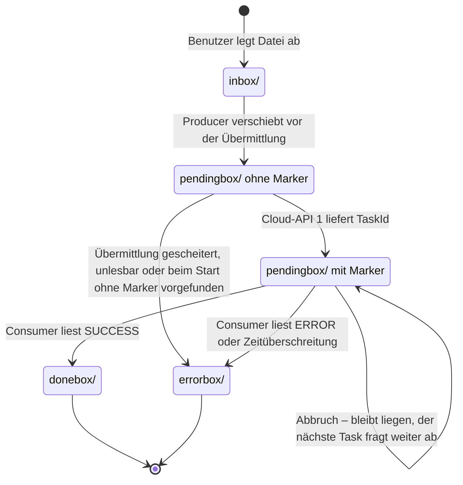

# Architekturalternative: Abgleichsschleife mit Zustand im Dateisystem

> **Fragestellung:** Gibt es – gemessen an den Anforderungen (`architect/anforderungen.md`, `anforderungen_datenverarbeitung.md`) – eine bessere Architektur als das heutige Sandbox-Modell mit In-Memory-Status-Pool (`loesung_final.md`)?

Ergänzt `sandbox_und_containerisierung.md` (Phase A, Schritte 1–3) und `batchauftrag_verwaltung_durch_cloud_api.md`. Der Ordner `processing/` ist dort bereits vorgeschlagen; im Code heißt er inzwischen `pendingbox/`. Dieses Dokument macht daraus das tragende Prinzip der Architektur und prüft es gegen alle Anforderungen.

> **Stand: 28.09.2026.** Die erste Fassung vom 27.09. beschrieb den Code vor PR #2. Seitdem ist ein Teil dieses Vorschlags umgesetzt:
>
> - **PR #2:** Ordner `pendingbox/` (= `processing/` dieses Dokuments) mit TaskId-Markern in `pendingbox/.taskids/`; Dateien werden vor der Übermittlung beansprucht, ein neuer Task nimmt markierte Dateien wieder auf; Startsperre, bis die Threads des vorigen Tasks ausgelaufen sind.
> - **PR #3:** Lebenszyklus-Zähler: Der zuletzt endende Thread meldet den Task ab, der Endzustand wandert in die `TaskHistory`.
> - **PR #5:** REST-API auf Spring WebFlux; für dieses Dokument ohne Belang.
>
> Diese Fassung gleicht alle Aussagen mit `main` ab und kennzeichnet je Abschnitt, was umgesetzt ist und was offen bleibt: ✔ umgesetzt · ◐ teilweise · ✘ offen.

## Kurzantwort

**Ein Neuentwurf ist nicht nötig.** Unter den Randbedingungen von Phase 1 (ein Server, keine externe Middleware; Sandbox, TaskRegistry und dedizierte Threads sind in den Anforderungen vorgegeben) ist die heutige Zerlegung in `TaskManager`, `TaskRegistry`, Sandbox, `InboxProducer`, `StatusConsumer` und `CloudClient` angemessen.

**Zu ändern ist das Zustandsmodell – und das ist zur Hälfte geschehen.** Vor PR #2 lag der fachlich entscheidende Zustand nur im Speicher der JVM. Seitdem steht der wichtigste Teil im Dateisystem: Welche Dateien übermittelt sind und unter welcher Cloud-TaskId, zeigen `pendingbox/` und die Marker in `pendingbox/.taskids/`. Ein abgebrochener Task lässt dort nichts verloren gehen; der nächste Task fragt weiter ab, statt erneut zu übermitteln.

Im Speicher liegen aber weiterhin `InboxProducer.seen`, der `InMemoryStatusPool` (während des Laufs die einzige Quelle des Consumers) und `TaskContext.producerFinished`. Die Wiederaufnahme ist ein eigener Schritt beim Start eines Tasks (`InboxProducer.resumeSubmitted`), nicht der normale Durchlauf. Der verbleibende Schritt: Producer und Consumer werden zu **Abgleichsschleifen**. Jeder Durchlauf liest den tatsächlichen Stand ab, führt einen wiederholbaren Schritt aus und hält im Speicher nichts, was er nicht jederzeit wieder ablesen könnte.

| Ziel | Vor PR #2 | Heute (`main`) | Mit Abgleichsschleife |
|---|---|---|---|
| Neustart der Anwendung | Cloud-TaskIds gehen verloren; offene Dateien werden erneut übermittelt | Dateien mit Marker werden weiter abgefragt; verwaiste Marker bleiben liegen (1.1) | wie heute, verwaiste Marker werden vor dem Start bereinigt |
| Abschlusserkennung | `producerFinished` plus leerer Pool; die Reihenfolge der Threads muss stimmen | unverändert | `inbox` leer, danach `pendingbox/` leer |
| Koordination zwischen Producer und Consumer | gemeinsame Speicherstrukturen und Signale | unverändert; die Marker dienen nur der Wiederaufnahme | feste Zuständigkeit je Datei (Abschnitt 3.3) |
| Übergang auf eine Datenbank („Statusfelder INBOX, DONE, ERROR“) | Zustand muss erst aus dem Speicher herausgelöst werden | Ordner und Marker entsprechen Statuswerten; Prüfzeitpunkte und Abschluss noch nicht | Ordner entspricht 1:1 einem Statusfeld |
| Übernahme eines Auftrags durch einen anderen Pod | eigener Wiederaufnahme-Code nötig | eigener Wiederaufnahme-Code vorhanden (`resumeSubmitted`), läuft nur beim Start | derselbe Code wie im Normalbetrieb |

Für Phase 2 empfiehlt dieses Dokument außerdem, die Anforderung „Status-Pool durch eine MQ, Register durch Redis ersetzbar“ zu ändern: **Eine Datenbanktabelle ersetzt beides** (Abschnitt 6).

## 1. Ausgangslage: Warum das Zustandsmodell das eigentliche Problem ist

Die Codeanalyse vom 27.09. hat mehrere Fehler gefunden. Die meisten hatten dieselbe Ursache: Zustand, den nur ein einzelner Thread im Speicher kennt.

| Befund (27.09.) | Ursache im Zustandsmodell | Stand `main` |
|---|---|---|
| Abbruch und sofortiger Neustart: Zwei Sandboxen arbeiten auf derselben `inbox`. Dateien werden doppelt übermittelt, und der alte Producer verschiebt Dateien des neuen Tasks nach `errorbox` (`InboxProducer.submit`, Fehlerzweig). | Welche Dateien „in Arbeit“ sind, weiß nur `seen` des alten Producers. Der neue Producer kann es nicht sehen. | ✔ **Behoben (PR #2).** `TaskManager.start` wartet bis zu 10 s, bis beide Threads des vorigen Tasks ausgelaufen sind, sonst `409`. Dateien verlassen die `inbox` vor der Übermittlung. |
| Nach einem Neustart der Anwendung werden alle nicht entschiedenen Dateien erneut an Cloud-API 1 übermittelt. | Die Cloud-TaskIds stehen nur im `InMemoryStatusPool`. | ◐ **Weitgehend behoben (PR #2).** Markierte Dateien werden vom nächsten Task weiter abgefragt. Offen sind die Lücken aus 1.1. |
| Die Abschlusserkennung braucht `producerFinished` und eine genaue Reihenfolge (`StatusConsumer.isFinished`). | Der Consumer kann nicht ablesen, ob der Producer noch Dateien hält. | ✘ **Offen**, unverändert. |
| Bei Zeitüberschreitung kann der Producer noch Einträge in den Pool legen, nachdem der Consumer ihn geleert hat. | Pool und Abbruchsignal sind getrennte Speicherstrukturen ohne gemeinsamen Zeitpunkt. | ◐ **Entschärft.** Späte Einträge räumt `abandonRemaining` ab; die Dateien bleiben mit Marker in `pendingbox/` und werden vom nächsten Task weiter abgefragt – genau der Effekt aus Abschnitt 2 („Wettläufe am Rand werden unschädlich“). |

Nicht vom Zustandsmodell abhängig und weiterhin offen: Die Wartezeit auf Cloud-API 2 in `StatusConsumer.queryAndRoute` (`status-timeout` + `RESULT_GRACE`) ist kürzer als die mögliche Dauer aller Wiederholungen (`status-retries + 1` × `status-timeout`). Mit den Werten aus `application.yml` (30 s, 2 Wiederholungen) sind das rund 90 s gegenüber 35 s Wartezeit. Der Consumer gibt vorher auf und startet im nächsten Durchlauf eine weitere Abfrage, während die alte noch wiederholt.

### 1.1 Neue Befunde am umgesetzten Teil

| Befund | Folge | Abhilfe |
|---|---|---|
| **Verwaiste Marker werden nie entfernt.** `UserFolders.settle` verschiebt erst die Datei und löscht dann den Marker (richtige Reihenfolge, 3.4). Stürzt die Anwendung dazwischen ab, bleibt der Marker liegen. `resumeSubmitted` betrachtet nur Dateien, keine Marker. | Wird später eine gleichnamige Datei beansprucht und stürzt die Anwendung vor dem Schreiben ihres eigenen Markers erneut ab, erbt sie beim nächsten Start die alte Cloud-TaskId und landet ohne Erzeugung in `donebox` (das Szenario am Ende von 3.4). Selten, weil zwei Abstürze nötig sind, aber ein stiller Datenfehler. | Marker ohne Datei vor dem Start der Threads löschen (Schritt 5). |
| **Marker werden nicht atomar geschrieben** (`UserFolders.recordTaskId` mit `Files.writeString`). | Ein Absturz während des Schreibens hinterlässt eine abgeschnittene TaskId. Die Datei bleibt bis `task-timeout` `PENDING` und geht dann nach `errorbox`. | Temporäre Datei, dann `ATOMIC_MOVE` (3.1). |
| **Verschieben ohne `ATOMIC_MOVE`** (`UserFolders.moveInto`). | Auf demselben Dateisystem in der Praxis ein Umbenennen, aber nicht zugesichert. | `StandardCopyOption.ATOMIC_MOVE` (Schritt 2). |
| **`seen` merkt sich `inbox`-Pfade.** Legt der Benutzer während des Laufs eine gleichnamige Datei erneut ab, erkennt der Producer den Pfad wieder. | Die neue Datei bleibt bis zum nächsten Task liegen. | `seen` entfällt (Schritt 4). |

## 2. Prinzip: Abgleichsschleife

Das Muster ist aus Kubernetes-Controllern bekannt (Reconciliation Loop). Es beruht auf drei Regeln:

1. **Die Wahrheit liegt außerhalb der Threads.** In Phase 1 ist das das Dateisystem, in Phase 2 die Datenbank bzw. der Cloud-Dienst.
2. **Jeder Schritt ist wiederholbar.** Wird er zweimal oder nach einem Absturz erneut ausgeführt, ändert sich am Ergebnis nichts.
3. **Jeder Durchlauf beginnt mit Ablesen, nicht mit Erinnern.** Speicherstrukturen sind nur noch Zwischenspeicher und dürfen jederzeit verloren gehen.

Die Thread-Topologie bleibt, wie sie ist: zwei Virtual Threads je Sandbox, `InboxProducer` und `StatusConsumer`. Es ändert sich nur, **woher** sie ihren Zustand nehmen.

Der wichtigste Nebeneffekt: **Wettläufe am Rand werden unschädlich.** Bleibt durch einen Absturz, einen Abbruch oder ein ungünstiges Timing ein Zwischenzustand zurück, liegt er sichtbar im Dateisystem, und der nächste Durchlauf oder der nächste Task nimmt ihn auf. Es gibt keinen Zustand mehr, der nur in einem beendeten Thread existierte. PR #2 zeigt diesen Effekt bereits für übermittelte Dateien (Abschnitt 1, vierter Befund).

## 3. Zustandsmodell in Phase 1

### 3.1 Ordner

```
<base-directory>/<userId>/
├── inbox/          vom Benutzer abgelegt, noch nicht beansprucht
├── pendingbox/     beansprucht (und ggf. schon übermittelt)          ✔ PR #2
│   └── .taskids/   je übermittelter Datei ein Marker mit der TaskId  ✔ PR #2
├── donebox/
├── errorbox/
└── .pipeline/                                                        ✘ vorgeschlagen
    ├── lock        optional, Sperre gegen einen zweiten Prozess (3.7)
    └── auftrag.json  optional, für automatische Wiederaufnahme (3.8)
```

**Umgesetzt** ist der Marker als Datei gleichen Namens in `pendingbox/.taskids/`; ihr Inhalt ist nur die Cloud-TaskId. **Vorgeschlagen** bleibt eine Begleitdatei mit mehr Inhalt, die für die Diagnose und für `task-timeout` nach einer automatischen Wiederaufnahme nützlich ist:

```json
{ "cloudTaskId": "…", "pipelineTaskId": "…", "uebermitteltAm": "2026-09-27T12:00:00Z" }
```

- **Namenskollisionen** sind mit der umgesetzten Lösung ausgeschlossen: Der Marker trägt exakt den Dateinamen und liegt in einem eigenen Unterordner, und `UserFolders.openPendingbox()` listet nur reguläre Dateien. Eine Benutzerdatei wird also nie als Marker missverstanden. `lock` und `auftrag.json` gehören aus demselben Grund nicht in den Ordner der Marker, sondern nach `.pipeline/`.
- **Atomar schreiben** (✘): erst in eine temporäre Datei mit eindeutigem Namen, dann `Files.move(…, ATOMIC_MOVE)` an den Zielort. Ein halb geschriebener Marker kann so nie gelesen werden (1.1).
- **Atomar verschieben** (✘): Alle Ordner eines Benutzers liegen auf demselben Dateisystem. Nur dann ist `Files.move` ein atomares Umbenennen. `UserFolders.moveInto` verschiebt noch ohne `StandardCopyOption.ATOMIC_MOVE`; das wird ergänzt.

### 3.2 Zustände einer Datei

| Zustand | Erkennbar an | Zuständig |
|---|---|---|
| neu | Datei in `inbox/` | Producer |
| beansprucht | Datei in `pendingbox/`, **kein** Marker | Producer |
| übermittelt | Datei in `pendingbox/`, Marker vorhanden | Consumer |
| erledigt | Datei in `donebox/` oder `errorbox/` | niemand |
| Rest eines Absturzes | Marker ohne Datei in `pendingbox/` | Consumer löscht ihn – ✘ heute nicht umgesetzt (1.1) |

Das Diagramm zeigt das Verhalten auf `main`. Offen ist nur der Übergang für beansprucht vorgefundene Dateien beim Start (Entscheidung 9.3).



### 3.3 Feste Zuständigkeit statt gemeinsamer Speicherstruktur

**Dateien ohne Marker gehören dem Producer, Dateien mit Marker dem Consumer.** Die Zuständigkeit wechselt genau in dem Moment, in dem der Marker atomar erscheint. Producer und Consumer bearbeiten dadurch nie dieselbe Datei und brauchen untereinander keine Sperren.

Das ist weiterhin das geforderte Producer-Consumer-Muster. Der Puffer zwischen beiden ist nur nicht mehr eine `ConcurrentHashMap`, sondern `pendingbox/` mit den Markern, und er übersteht einen Neustart.

**Stand `main`** (◐): Die Regel gilt heute nur beim Start eines Tasks (`resumeSubmitted`). Während des Laufs übergibt der Producer die TaskIds weiter über den `InMemoryStatusPool`; die Marker schreibt er zusätzlich.

### 3.4 Ablauf je Durchlauf

**Producer (`InboxProducer`):**

1. Abbruchsignal prüfen.
2. Rückstau: Gibt es mehr **übermittelte** Dateien (mit Marker) als `pool-resume-threshold`, mit `awaitCancel(sweep-interval)` warten und neu zählen (`anforderungen_datenverarbeitung.md`, Punkte 1 und 3). Beanspruchte Dateien ohne Marker zählen nicht mit: Sie gehören dem Producer selbst, und würde er auf sie warten, blockierte er sich nach einer gescheiterten Übermittlung dauerhaft.
3. Batch zusammenstellen: zuerst beanspruchte Dateien ohne Marker aus einer gescheiterten, wiederholbaren Übermittlung (Schritt 6), dann weitere Dateien aus der `inbox` mit `ATOMIC_MOVE` nach `pendingbox/` verschieben, bis `batch-size` erreicht ist.
   - Scheitert das Verschieben mit `NoSuchFileException`, hat jemand anderes die Datei genommen; sie wird übersprungen.
   - Liegt in `pendingbox/` schon eine gleichnamige Datei, hängt `UserFolders.moveInto` heute einen eindeutigen Suffix an, und beide Dateien laufen unabhängig (✔). Das ist gleichwertig zum ursprünglichen Vorschlag, die neue Datei bis zur Erledigung der älteren in der `inbox` zu lassen, solange der geänderte Name in `donebox/` bzw. `errorbox/` akzeptiert ist.
4. Batch an Cloud-API 1 übermitteln.
5. Je zurückgelieferter TaskId den Marker schreiben (✔ PR #2, noch nicht atomar). Ab jetzt gehört die Datei dem Consumer.
6. Übermittlung gescheitert, je nach Art des Fehlers (✘ heute gehen alle Fälle nach `errorbox`):
   - **Verbindungsfehler, 503:** Die Cloud hat nichts angelegt. Die Dateien bleiben beansprucht und werden im nächsten Durchlauf erneut versucht. Das zählt nicht als Dateifehler. Begrenzt wird das durch `task-timeout`, optional durch einen eigenen Schwellenwert für aufeinanderfolgende Übermittlungsfehler.
   - **Zeitüberschreitung nach dem Senden:** Der Ausgang ist unklar. Erneutes Übermitteln ist nur sicher, wenn Cloud-API 1 idempotent ist. Bis das geklärt ist, bleibt es beim heutigen Verhalten: Die Dateien kommen nach `errorbox`.
   - **Dauerhaft (4xx) oder Datei unlesbar:** Datei nach `errorbox`, Fehlerzähler erhöhen.

**Consumer (`StatusConsumer`):**

1. Zeitüberschreitung prüfen (`TaskContext.checkTimeout`) und Abbruchsignal prüfen.
2. Marker lesen, fällige Einträge sammeln und in einem Bulk-Aufruf an Cloud-API 2 übergeben (✘ heute aus dem `InMemoryStatusPool`). Der nächste Prüfzeitpunkt je Eintrag (heute `PollEntry.nextPollAt`) bleibt im Speicher. Nach einem Neustart ist jeder Eintrag sofort fällig; mehr geht nicht verloren.
3. Ergebnis verarbeiten:
   - `SUCCESS`: Datei `pendingbox/ → donebox/`, **danach** Marker löschen (✔ `UserFolders.settle`).
   - `ERROR`: Datei `pendingbox/ → errorbox/`, danach Marker löschen, Fehlerzähler erhöhen (✔).
   - `PENDING`: nächsten Prüfzeitpunkt im Speicher setzen.
4. Marker ohne Datei in `pendingbox/` löschen (✘).
5. Abschluss prüfen (Abschnitt 3.5).

Die Reihenfolge in Schritt 3 ist wichtig. Stürzt die Anwendung zwischen Verschieben und Löschen ab, bleibt nur ein überzähliger Marker zurück, den Schritt 4 entfernt. Umgekehrt (erst löschen, dann verschieben) sähe der Producer eine beanspruchte Datei ohne Marker und würde sie erneut übermitteln.

Überzählige Marker aus einem abgestürzten Lauf müssen **vor dem Start** von Producer und Consumer entfernt werden, nicht erst im ersten Durchlauf des Consumers. Sonst könnte der Producer eine gleichnamige, neu abgelegte Datei nach `pendingbox/` holen, bevor der alte Marker gelöscht ist. Die neue Datei erbte dann die Cloud-TaskId der bereits erledigten Datei und käme ohne Übermittlung nach `donebox`. **Auf `main` ist diese Bereinigung nicht umgesetzt** (1.1); sie ist der dringendste offene Schritt.

### 3.5 Abschluss ohne `producerFinished` (✘ offen)

Der Consumer erklärt den Task für abgeschlossen, wenn er **zuerst** eine leere `inbox` und **danach** ein leeres `pendingbox/` abliest.

Warum diese Reihenfolge genügt: Eine Datei liegt zu jedem Zeitpunkt in genau einem Ordner, weil jedes Verschieben atomar ist. Ist die `inbox` leer, kann keine Datei mehr aus ihr nach `pendingbox/` wandern. Liegt beim anschließenden Blick in `pendingbox/` nichts, ist alles erledigt.

Daraus folgt:

- Der Producer beendet sich nicht mehr selbst, wenn die `inbox` leer ist. Er wartet weiter, bis der Task nicht mehr läuft. Dateien, die der Benutzer während des Laufs ablegt, werden damit zuverlässig mitverarbeitet; nach dem Abschluss abgelegte Dateien gehören zum nächsten Task. Heute werden solche Dateien nur mitgenommen, solange der Producer noch liest.
- `TaskContext.complete()` muss dasselbe Signal auslösen wie `cancel()`, damit der wartende Producer sofort aufwacht. Heute zählt weiterhin nur `cancel()` das `cancelSignal` herunter.
- `producerFinished` wird für die Logik nicht mehr gebraucht und kann höchstens als Anzeige im `TaskSnapshot` bleiben.

Beansprucht der Producer genau im Moment des Abschlusses noch eine Datei, bleibt sie in `pendingbox/` liegen und wird vom nächsten Task aufgenommen (Abschnitt 2, „Wettläufe am Rand“).

### 3.6 Abbruch, Zeitüberschreitung und Herunterfahren

Aufgeräumt wird erst, **wenn beide Threads beendet sind**: Der Thread, der den Lebenszyklus-Zähler (Abschnitt 3.7) als Letzter herunterzählt, führt das Aufräumen aus. So kann nie ein noch laufender Producer mit dem Aufräumen um dieselben Dateien konkurrieren.

**Stand `main`** (◐): Die **Abmeldung** des Tasks (Endzustand in die `TaskHistory`, Sandbox aus dem Register) übernimmt seit PR #3 der zuletzt endende Thread. Die **Dateibehandlung** liegt dagegen noch im Consumer (`failPendingAfterTimeout`, `abandonRemaining`). Das ist unkritisch, weil übermittelte Dateien ohnehin liegen bleiben und ein danach noch schreibender Producer sie nur zusätzlich markiert.

Verhalten auf `main` je Abbruchgrund:

| Abbruchgrund | übermittelte Dateien (mit Marker) | beanspruchte Dateien (ohne Marker) |
|---|---|---|
| `USER_REQUEST` | bleiben in `pendingbox/`; der nächste Task fragt weiter ab, ohne erneut zu übermitteln (PR #2) | gibt es nur während einer laufenden Übermittlung: Nach der Antwort erhalten sie ihren Marker, bei einem Fehler gehen sie nach `errorbox` |
| `ERROR_THRESHOLD` | wie `USER_REQUEST` | wie `USER_REQUEST` |
| `TIMEOUT` | nach `errorbox` (`failPendingAfterTimeout`); danach noch eintreffende bleiben mit Marker liegen | wie `USER_REQUEST` |
| `SHUTDOWN`, `INTERNAL_ERROR` | bleiben liegen | bricht die JVM mitten in der Übermittlung ab, findet der nächste Start sie ohne Marker vor (3.8) |

Damit ist die frühere Entscheidung 9.1 getroffen: Übermittelte Dateien wandern bei einem Abbruch **nicht** mehr zurück in die `inbox`. Der Cloud-Auftrag läuft also nicht umsonst, und es wird nichts doppelt übermittelt. Die Frage, ob der Cloud-Dienst Aufträge stornieren soll (offene Frage 4 in `batchauftrag_verwaltung_durch_cloud_api.md`), betrifft damit nur noch `TIMEOUT`.

### 3.7 Genau ein Ausführer je Benutzer (✔ umgesetzt, PR #2 und #3)

- **Lebenszyklus-Zähler:** Er liegt nicht wie ursprünglich vorgeschlagen im `TaskContext`, sondern in `TaskManager.launch` (`AtomicInteger` mit Startwert 2). Producer und Consumer laufen in einem Wrapper, der ihn im `finally` herunterzählt. Wer ihn auf 0 bringt, meldet den Task ab: Endzustand in die `TaskHistory`, Sandbox aus `TaskRegistry` und Startsperre.
- **Startsperre:** `TaskManager.start` wartet bei einem bereits beendeten Vorgänger bis zu 10 s auf dessen Threads und weist den Start danach mit `409` ab („noch aktiv“), solange der Vorgänger läuft oder seine Threads leben. Es prüft also nicht mehr nur `state() == RUNNING`.
- `cancel` löscht die taskId sofort aus der `TaskRegistry` (bisherige Vorgabe), lässt den Eintrag in `latestByUser` aber stehen, bis die Threads ausgelaufen sind.
- **Gegen einen zweiten Prozess auf denselben Ordnern** (z. B. versehentlich zwei Instanzen): optional `FileChannel.tryLock()` auf `.pipeline/lock` (✘). In Phase 2 übernimmt die Lease diese Rolle.

### 3.8 Neustart der Anwendung

Nach einem Neustart sind `TaskRegistry` und `TaskHistory` leer. Startet der Benutzer den Task erneut, nimmt der neue Task auf, was im Dateisystem steht:

| Vorgefunden | Heute (`main`) | Mit Abgleichsschleife |
|---|---|---|
| Marker ohne Datei in `pendingbox/` | bleibt liegen (1.1) | wird vor dem Start der Threads gelöscht (3.4) |
| Datei in `pendingbox/` mit Marker | wird weiter abgefragt, **nicht** erneut übermittelt (✔) | gleich |
| Datei in `pendingbox/` ohne Marker | geht nach `errorbox`: höchstens einmal übermittelt | Entscheidung 9.3 |
| Datei in `inbox/` | normal | normal |

Grenzen:

- **Zwischen der Antwort von Cloud-API 1 und dem Schreiben des Markers** bleibt ein Fenster. Heute geht die Datei dann nach `errorbox`; der Cloud-Auftrag existiert, sein Ergebnis wird aber nicht abgeholt. Würde sie stattdessen erneut übermittelt (ursprünglicher Vorschlag), entstünde ein Doppel. Schließen lässt sich das Fenster nur mit einem idempotenten Cloud-Dienst, wie in `batchauftrag_verwaltung_durch_cloud_api.md`, Abschnitt 2.4, beschrieben.
- Die Zähler im `TaskContext` (`succeeded`, `failed` …) bleiben Statistik des laufenden Tasks und beginnen bei jedem Task bei 0. Das gilt auch für den Fehlerzähler und damit für `error-threshold`. Die Endzustände in der `TaskHistory` überstehen einen Neustart nicht. In Phase 2 wird beides aus der Datenbank berechnet.
- Eine **automatische** Wiederaufnahme nach dem Neustart, ohne dass der Benutzer neu startet, ist optional (✘): Eine Datei `.pipeline/auftrag.json` mit `pipelineTaskId` und Startzeitpunkt genügt, damit `TaskManager` beim Hochfahren laufende Tasks findet und mit dem ursprünglichen Startzeitpunkt für `task-timeout` fortsetzt.

## 4. Abgleich mit den Anforderungen

✔ erfüllt · ◐ erfüllt, aber der Wortlaut der Anforderung sollte angepasst werden

| Anforderung | | Umsetzung |
|---|---|---|
| Nutzung von Cloud-Diensten | ✔ | unverändert über `CloudClient` |
| Lokale Dateiverwaltung (`inbox`, `errorbox`, `donebox`) | ✔ | zusätzlich `pendingbox/` mit `.taskids/` (umgesetzt) und `.pipeline/` (vorgeschlagen) |
| Stapelverarbeitung | ✔ | `batch-size`, unverändert |
| Parallele Statusüberwachung in eigenem Thread | ✔ | `StatusConsumer` bleibt eigener Virtual Thread |
| Unabhängige Benutzeraufgaben | ✔ | Zustand je Benutzerordner, genau ein Ausführer je Benutzer (3.7, umgesetzt) |
| Externer Abbruch | ✔ | REST-API im Vertrag unverändert (seit PR #5 auf WebFlux); Verhalten je Abbruchgrund (3.6) |
| Nicht-blockierender HTTP-Client | ✔ | `WebClient`, unverändert |
| Java NIO.2 | ✔ | zusätzlich `ATOMIC_MOVE` |
| Jackson | ✔ | auch für die Begleitdateien, falls sie JSON werden (3.1) |
| Virtual Threads | ✔ | unverändert |
| Producer-Consumer-Muster | ✔ | Puffer ist `pendingbox/` mit Markern; Zuständigkeit strikt getrennt (3.3) |
| Zentrales Task-Management (`TaskRegistry`, `TaskContext`) | ✔ | unverändert; seit PR #3 ergänzt um `TaskHistory` für die Endzustände |
| Übergang auf Spring Batch möglich | ✔ | nicht berührt |
| Sandbox-Muster mit eigenem Status-Pool **im Speicher** | ◐ | Jede Sandbox behält ihre eigene `StatusPool`-Instanz. Die Implementierung schreibt aber ins Dateisystem durch; im Speicher liegen nur noch die Prüfzeitpunkte. |
| Ordner durch DB-Tabellen mit Statusfeldern (INBOX, DONE, ERROR) ablösbar | ✔ | direkt: Jeder Ordner entspricht einem Statuswert. Zu ergänzen sind die Werte für „beansprucht“ und „übermittelt“. |
| Status-Pool durch MQ, Register durch Redis ersetzbar | ◐ | Die Abstraktionen bleiben erhalten. Empfehlung: Anforderung ändern (Abschnitt 6). |
| Einzelserver ohne externe Middleware | ✔ | nur Dateisystem |
| Container-Ready | ✔ | besser als heute (Abschnitt 5) |
| Rückstau: nächste Charge erst bei `pool-resume-threshold` (`anforderungen_datenverarbeitung.md`) | ✔ | gezählt werden die übermittelten Dateien (mit Marker), also dieselbe Größe wie heute `pool.size()` |

## 5. Phase 2: Container und Datenbank

Die Schleifen bleiben dieselben; es ändert sich nur, wo die Wahrheit liegt.

### 5.1 Der Cloud-Dienst führt `batchauftrag` und Dateistatus (aktueller Entwurf)

Das ist der Entwurf aus `batchauftrag_verwaltung_durch_cloud_api.md`.

- **Die Marker entfallen**, sobald Cloud-API 1 Übermittlungen idempotent je `(batchauftrag_id, dateiname)` speichert. „Übermittelt“ heißt dann: Es gibt einen Unterdatensatz. Der Consumer liest ihn über Cloud-API 2 nach Auftrag.
- **`pendingbox/` bleibt**, weil es im Dateisystem zeigt, welche Dateien beansprucht sind.
- **Übernahme nach einem Pod-Absturz:** Der neue Besitzer (Lease, dort Abschnitt 2.7) startet einfach dieselben zwei Schleifen. Der Abgleich von `pendingbox/` mit den Unterdatensätzen, der dort als eigener Schritt beschrieben ist (`sandbox_und_containerisierung.md`, Schritt 12), **ist hier der ganz normale erste Durchlauf**. Es gibt keinen gesonderten Wiederaufnahme-Code, der nur im Fehlerfall läuft und entsprechend selten getestet wird. Heute ist `resumeSubmitted` genau so ein gesonderter Schritt.

### 5.2 Die Pipeline führt eine eigene Tabelle

Das ist Variante b) aus `batchauftrag_verwaltung_durch_cloud_api.md`, Abschnitt 2.2, und entspricht am direktesten der Anforderung „Statusfelder INBOX, DONE, ERROR“:

```
datei (
  batchauftrag_id, dateiname,     -- Primärschlüssel
  status,                         -- INBOX | BEANSPRUCHT | UEBERMITTELT | DONE | ERROR
  cloud_task_id,
  naechste_pruefung,              -- ersetzt PollEntry.nextPollAt
  versuche                        -- ersetzt PollEntry.attempts
)
```

- Die Regel aus 3.3 gilt unverändert: Der Statuswert bestimmt, welche Schleife zuständig ist.
- Mehrere Pods holen sich fällige Zeilen mit `SELECT … WHERE naechste_pruefung <= now() FOR UPDATE SKIP LOCKED`. Das verteilt die Arbeit ohne zusätzliche Komponente.
- Abbruchwunsch, Benutzersperre (partieller Unique-Index) und Lease sind Spalten beim Auftrag. Der Endzustand eines Auftrags ersetzt die `TaskHistory`; `task-retention` wird zur Löschregel.
- Die Dateien selbst bleiben im gemeinsamen Volume; für die Reihenfolge zwischen Dateisystem und Tabelle gilt `batchauftrag_verwaltung_durch_cloud_api.md`, Abschnitt 2.8.

## 6. Empfehlung zur Anforderung „MQ und Redis“

`architect/anforderungen.md` verlangt, den Status-Pool durch eine Message Queue (RabbitMQ, RocketMQ) und das Register durch Redis ersetzbar zu machen. Für dieses Problem ist eine Datenbanktabelle die bessere Zielarchitektur:

| Bedarf | Message Queue | Tabelle |
|---|---|---|
| „Status unverändert, später erneut prüfen“ | nur über verzögerte Neuzustellung (TTL mit Dead-Letter oder Zusatz-Plugin); jede unveränderte Antwort ist ein weiterer Nachrichtenumlauf | Spalte `naechste_pruefung` aktualisieren |
| Rückstau: Wie viele Dateien dieses Auftrags sind offen? | nicht je Auftrag abfragbar | `COUNT(*)` je Auftrag und Status |
| Bulk-Abfrage an Cloud-API 2: alle fälligen Einträge auf einmal | Nachrichten einzeln entnehmen | eine Abfrage |
| Statusanzeige für den Benutzer, auch nach Ende des Tasks (heute `TaskHistory`) | Nachrichten sind nicht abfragbar | Abfrage |
| Abbruch, Benutzersperre, Lease (heute für Redis vorgesehen) | eigene Komponente nötig | Spalten und Constraints in derselben Datenbank |

Die Zweifel an einer Warteschlange wurden schon früh geäußert (`prompt.md`, Rückmeldung zu Punkt 7; `loesung.md`, Abschnitt 7). Aus denselben Gründen wurde `DelayQueue` als Status-Pool verworfen (`loesung_final.md`, Abschnitt 5). Eine verteilte MQ hätte dieselben Schwächen. Redis bleibt nur dann sinnvoll, wenn es in Phase 2 keine Datenbank gibt (`abbruch_im_containerbetrieb.md`).

**Vorschlag für den neuen Wortlaut in `architect/anforderungen.md`, Abschnitt Skalierbarkeit:**

> Austauschbare Zustandshaltung: Der Status-Pool ist hinter der Schnittstelle `StatusPool` so zu abstrahieren, dass er künftig durch eine relationale Tabelle mit Statusfeld und nächstem Prüfzeitpunkt ersetzt werden kann. Abbruchwunsch, Benutzersperre und Zuständigkeit eines Pods (Lease) werden im Cluster-Betrieb in derselben Datenbank geführt.

## 7. Geprüfte und verworfene Alternativen

| Alternative | Vorteil | Warum nicht (jetzt) |
|---|---|---|
| **Ein Thread je Task** statt Producer und Consumer: eine Schleife, die beansprucht, übermittelt, abfragt und verschiebt | Noch einfacher. Bei `batch-size` 4 und Schwellenwert 2 arbeiten beide Threads ohnehin fast im Gleichschritt; mit der Abgleichsschleife entfiele jede Koordination zwischen ihnen. | Widerspricht dem Wortlaut „separater Prozess (oder Thread)“ und dem geforderten Producer-Consumer-Muster. Sinnvoll, falls die Anforderung gelockert wird. |
| **Workflow-Engine** (z. B. Temporal, Camunda) | Zeitüberschreitung, Wiederholung, Abbruch, Wiederaufnahme und Übersichtsoberfläche sind fertig vorhanden. | Braucht einen eigenen Server, also externe Middleware, die in Phase 1 ausgeschlossen ist. Für zwei Schritte je Datei überdimensioniert. |
| **Spring Batch** | Etabliertes Chunk-Modell mit Job-Repository | Das Chunk-Modell passt nicht zum überlappenden Fenster: Charge N+1 wird übermittelt, während Charge N noch abgefragt wird. Bestätigt `loesung_final.md`, Abschnitt 5. |
| **Reaktive Pipeline** (Reactor `Flux`) | Rückstau ist eingebaut. | Mit Virtual Threads kein Durchsatzvorteil; schwerer zu lesen und zu debuggen. Löst das Zustandsproblem nicht. Die REST-Schicht läuft seit PR #5 auf WebFlux; das betrifft nur die Annahme der Anfragen, nicht die Pipeline. |
| **Rückruf (Webhook) von Cloud-API 2** statt Abfragen | Das regelmäßige Abfragen entfällt. | Hängt vom Cloud-Dienst ab. Auch dann braucht es einen Abgleich als Absicherung gegen verlorene Rückrufe; die Abgleichsschleife bleibt also richtig. Beim Cloud-Dienst nachfragen. |
| **Zentraler Scheduler** statt Threads je Sandbox | Weniger Threads | Bereits in `loesung_final.md`, Abschnitt 5, aus Wartbarkeitsgründen verworfen; keine neue Erkenntnis. |

## 8. Umsetzungsschritte

| # | Schritt | Stand `main` | Betroffene Klassen |
|---|---|---|---|
| 1 | Lebenszyklus-Zähler und Sperre je Benutzer (3.7). Behebt den Neustart-Wettlauf auch ohne die übrigen Schritte. | ✔ PR #2, #3; der Zähler liegt in `TaskManager.launch` statt im `TaskContext` | `TaskManager` |
| 2 | Ordner `pendingbox/` mit Markern und `.pipeline/` anlegen, Verschieben mit `ATOMIC_MOVE`, Marker atomar schreiben (3.1) | ◐ `pendingbox/` und `.taskids/` umgesetzt; `ATOMIC_MOVE`, atomare Marker und `.pipeline/` offen | `UserFolders`, `NioUserFolderResolver` |
| 3 | Dateibasierter Status-Pool als neue Implementierung von `StatusPool`: `add` schreibt den Marker, `due` liest ihn, `remove` löscht ihn, `size` zählt die Marker. Die Schnittstelle bekommt eine Methode für beanspruchte Dateien ohne Marker. `InMemoryStatusPool` kann für Unit-Tests bleiben. | ✘ Die Marker schreibt heute der Producer über `UserFolders`; der Consumer arbeitet weiter aus dem `InMemoryStatusPool`. | `pool/*` |
| 4 | Producer: `seen` entfällt; erst beanspruchen, dann lesen; Fehlerarten unterscheiden (3.4). Dafür muss `CloudClient` die Fehlerart erkennbar machen (Verbindungsfehler, Zeitüberschreitung, Ablehnung). | ◐ Beanspruchen vor der Übermittlung umgesetzt (PR #2); `seen` und Fehlerarten offen | `InboxProducer`, `WebClientCloudClient` |
| 5 | Consumer: Reihenfolge „verschieben, dann Marker löschen“; überzählige Marker vor dem Start der Threads entfernen (3.4); neue Abschlussbedingung (3.5); `complete()` weckt den Producer | ◐ Reihenfolge umgesetzt (`UserFolders.settle`). **Zuerst** die Bereinigung verwaister Marker (1.1): klein und sofort wirksam. Abschlussbedingung und Wecken offen. | `StatusConsumer`, `TaskContext`, `TaskManager` |
| 6 | Aufräumen je Abbruchgrund nach Ende beider Threads (3.6); ersetzt `abandonRemaining` und `failPendingAfterTimeout` | ◐ Abmeldung nach Ende beider Threads umgesetzt (PR #3); die Dateibehandlung liegt noch im Consumer | `StatusConsumer` bzw. neue Klasse für das Aufräumen |
| 7 | Tests, siehe unten | ◐ | `src/test/…` |
| 8 | Dokumente nachziehen: `loesung_final.md` 4.6, 4.7 und 4.9 (4.7 beschreibt noch „sofort weiterlesen“ statt Rückstau, 4.9 kennt `pendingbox/` nicht), `asynchrone-anwendungsarchitektur_final.mmd`, `architect/anforderungen.md` (Abschnitt 6) | ◐ PR #5 hat `loesung_final.md` für Starter, Registry und WebFlux angeglichen; die genannten Abschnitte sind offen | Dokumentation |

Tests:

| Test | Stand `main` |
|---|---|
| **Abbruch und sofortiger Neustart:** Der zweite Start wird abgewiesen oder wartet, bis der erste beendet ist; keine Datei landet fälschlich in `errorbox`. | ✔ `zweiterStartDesselbenBenutzersWirdAbgewiesenSolangeDerTaskLaeuft`, `nachAbbruchNimmtDerNaechsteTaskUebermittelteDateienWiederAufOhneSieErneutZuUebermitteln` |
| **Datei ohne Marker in `pendingbox/` beim Start:** wird nicht erneut übermittelt. | ✔ `dateiOhneTaskIdInDerPendingboxWirdNichtErneutUebermittelt` |
| **Neustart mitten im Lauf:** Anwendung mit offenen Dateien beenden und neu starten. Erwartung: Keine Datei wird ein zweites Mal übermittelt. | ◐ Der Mechanismus ist innerhalb einer JVM über Abbruch und Neustart getestet; der Test-`FakeCloud` hält dafür die übermittelten Dateinamen fest (`submittedFileNames()`). Ein echter Neustart der Anwendung ist nicht getestet. |
| **Datei während des Laufs ablegen:** Sie wird mitverarbeitet, der Task endet danach. | ✘ |
| **Absturz zwischen Verschieben und Löschen des Markers:** Marker ohne Datei anlegen und eine gleichnamige neue Datei in die `inbox` legen. Erwartung: Der Marker wird vor dem Start entfernt, und die neue Datei wird übermittelt, statt die alte Cloud-TaskId zu erben. | ✘ deckt die Lücke aus 1.1 auf |

**Unverändert bleiben:** `TaskController` (seit PR #5 WebFlux), `ApiExceptionHandler`, `TaskRegistry` und `TaskHistory` mit ihren In-Memory-Implementierungen, die `CloudClient`-Schnittstelle bis auf die Fehlerarten, `PipelineProperties` bis auf mögliche neue Werte, und das Fake-Backend (`FakeCloudBackendApplication`).

**Aufwand:** Die Bereinigung verwaister Marker und das atomare Schreiben sind klein. Der Rest (Schritte 3, 4 und 6 sowie die Abschlussbedingung aus Schritt 5) ist mittel; der Schwerpunkt liegt in `InboxProducer`, `StatusConsumer` und dem dateibasierten Pool. REST-Schicht, Register und Historie bleiben unberührt.

## 9. Zu entscheiden

1. ~~**Abbruch durch den Benutzer:** Übermittelte Dateien zurück in die `inbox` legen, oder in `processing/` lassen?~~ **Entschieden (PR #2):** Sie bleiben in `pendingbox/`, und der nächste Task fragt ohne erneute Übermittlung weiter ab (3.6).
2. **Automatische Wiederaufnahme nach einem Neustart** schon in Phase 1 (`.pipeline/auftrag.json`, 3.8) oder erst mit Phase 2?
3. **Unklarer Übermittlungsstatus**, bis die Idempotenz von Cloud-API 1 geklärt ist:
   - bei Zeitüberschreitung von Cloud-API 1 (heute: `errorbox`);
   - für Dateien, die ein Start ohne Marker in `pendingbox/` vorfindet (heute: `errorbox`, also höchstens einmal übermittelt; Alternative: erneut übermitteln, also mindestens einmal).

   Heute gilt in beiden Fällen: lieber eine Datei in `errorbox` als ein doppelter Cloud-Auftrag.
4. **Anforderungstext ändern:** „Status-Pool im Speicher“ und „MQ/Redis“ (Abschnitt 6)?
5. **Zwei Threads je Sandbox beibehalten** oder zu einer Schleife zusammenlegen (Abschnitt 7)?
6. **Sichtbarkeit von `pendingbox/` (mit `.taskids/`) und `.pipeline/`** für Benutzer: `pendingbox/` liegt heute sichtbar im Benutzerordner und ist in der README beschrieben. Dürfen Benutzer dort Dateien anfassen? Löscht jemand einen Marker, geht die Datei beim nächsten Start nach `errorbox`. Falls nein: Rechte setzen oder deutlich kennzeichnen.

## Fazit

Die Aufteilung in Sandbox, Producer, Consumer und Register ist richtig und bleibt. Der Mangel lag darin, dass der Zustand nur in den Threads lebte. PR #2 und #3 haben den ersten Teil dieses Vorschlags umgesetzt: Übermittelte Dateien und ihre Cloud-TaskIds liegen im Dateisystem, und ein Benutzer hat immer genau einen Ausführer. Abbrüche und Neustarts führen dadurch nicht mehr zu doppelten Übermittlungen.

Offen ist der zweite Teil: Während des Laufs lebt der Zustand noch im Speicher, und die Wiederaufnahme ist ein Sonderweg beim Start statt der normale Durchlauf. Als Nächstes lohnen sich die kleinen Schritte, verwaiste Marker vor dem Start zu bereinigen und Marker atomar zu schreiben (1.1). Danach werden Producer und Consumer zu Abgleichsschleifen über `pendingbox/` (Schritte 3 bis 6). Dann werden aus Ordnern Statuswerte und aus der Wiederaufnahme der normale erste Durchlauf, und der Weg zu Datenbank und Containern wird kürzer.
