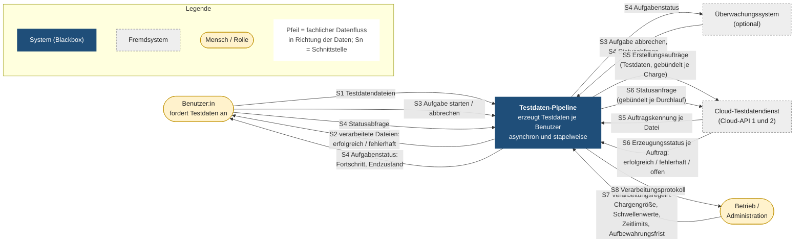

# Fachlicher Kontext der Testdaten-Pipeline

> Kontextabgrenzung aus fachlicher Sicht (arc42, Abschnitt 3.1), erstellt nach G. Starke, *Effektive Softwarearchitekturen*, 10. Auflage: Abschnitt 3.6 („Kontext als Diagramm – Erläuterung als Tabelle“), 4.2.4.2 und 5.4.1.
>
> **Stand:** `main` vom 28.09.2026 (nach PR #1–#5).

Die Kontextabgrenzung zeigt die Testdaten-Pipeline als **Blackbox** mit allen Nachbarn – Menschen und Fremdsystemen – und allen ein- und ausgehenden **fachlichen** Daten und Ereignissen. Kanäle, Protokolle und Formate (HTTP, Pfade, Ordner auf dem Server, Netty, WebClient) gehören in den technischen Kontext. Für ein Informationssystem wie dieses genügt nach Starke der fachliche Kontext.

## Diagramm

## Schnittstellen

Richtung aus Sicht der Pipeline: **angeboten** (provided) – die Pipeline stellt die Schnittstelle bereit; **benötigt** (required) – die Pipeline nutzt eine Schnittstelle des Nachbarn.

| Nr. | Schnittstelle | Nachbar | Richtung | Ausgetauschte Daten und Ereignisse | Fachliche Bedeutung |
|---|---|---|---|---|---|
| S1 | Testdateneingang | Benutzer:in | angeboten | Testdatendateien, eine Datei je gewünschtem Testdatensatz | Auftrag an die Pipeline: Diese Testdaten sollen erzeugt werden. Jede:r Benutzer:in hat einen eigenen Eingang (`inbox`). |
| S2 | Ergebnisablage | Benutzer:in | angeboten | die verarbeiteten Eingangsdateien, getrennt nach Ergebnis; Dateien in Arbeit sind sichtbar | Rückmeldung je Datei: erfolgreich erzeugt (`donebox`), fehlgeschlagen oder Status unklar (`errorbox`), in Bearbeitung (`pendingbox`). |
| S3 | Aufgabensteuerung | Benutzer:in, Überwachungssystem | angeboten | Ereignisse „Aufgabe starten“ und „Aufgabe abbrechen“ | Start verarbeitet alle Dateien im Eingang eines Benutzers; je Benutzer:in läuft höchstens eine Aufgabe. Abbruch beendet sie vorzeitig, z. B. bei zu vielen Fehlern. |
| S4 | Statusauskunft | Benutzer:in, Überwachungssystem | angeboten | Aufgabenstatus: Zustand (läuft, abgeschlossen, abgebrochen), Abbruchgrund, Anzahl übermittelter, wiederaufgenommener, erfolgreicher, fehlerhafter und offener Dateien, Start- und Endzeit | Fortschritt verfolgen; nach dem Ende ist der Endzustand 24 Stunden abrufbar. |
| S5 | Testdaten erzeugen (Cloud-API 1) | Cloud-Testdatendienst | benötigt | hin: Erstellungsaufträge mit Dateiname und Inhalt, gebündelt je Charge; zurück: Auftragskennung je Datei | Übergibt die Erzeugung an den Cloud-Dienst. Ein Auftrag darf höchstens einmal übermittelt werden, weil der Dienst nicht idempotent ist. |
| S6 | Erzeugungsstatus (Cloud-API 2) | Cloud-Testdatendienst | benötigt | hin: Statusanfrage für mehrere Auftragskennungen; zurück: Status je Auftrag (erfolgreich, fehlerhaft, offen) | Stellt fest, wann und mit welchem Ergebnis die Erzeugung abgeschlossen ist. |
| S7 | Verarbeitungsregeln | Betrieb / Administration | angeboten | Chargengröße, Rückstau-Schwelle, Fehlerschwelle, Zeitlimits, Abfrageintervall, Aufbewahrungsfrist, Adresse des Cloud-Dienstes | Legt fest, wie schnell, wie lange und bis zu welcher Fehlerzahl verarbeitet wird. |
| S8 | Verarbeitungsprotokoll | Betrieb / Administration | angeboten | Protokolleinträge zu Start, Abbruch, Wiederaufnahme, Abmeldung mit Endzustand und Zusammenfassung jeder Aufgabe sowie zu allen Fehlern (Übermittlung, Statusabfrage, Dateiverschiebung, Zeitüberschreitung) | Nachvollziehbarkeit der Verarbeitung über Konsole oder Logdatei (Arbeitsauftrag in `prompt.md`); Lücke siehe offene Frage 5. |

## Nachbarn

| Nachbar | Art | Rolle |
|---|---|---|
| Benutzer:in | Mensch | Legt Testdatendateien ab, startet, verfolgt und bricht eigene Aufgaben ab, holt Ergebnisse ab. Aufgaben verschiedener Benutzer:innen sind voneinander unabhängig. |
| Überwachungssystem | Fremdsystem, optional | Fragt Aufgabenstatus ab und bricht Aufgaben von außen ab. Im Architekturdiagramm (`asynchrone-anwendungsarchitektur_final.mmd`) als „Benutzer B / Überwachungssystem“ vorgesehen; ein konkretes System ist nicht benannt. |
| Betrieb / Administration | Mensch | Legt die Verarbeitungsregeln fest und wertet das Protokoll aus. |
| Cloud-Testdatendienst | Fremdsystem | Erzeugt die eigentlichen Testdaten. Zwei fachliche Schnittstellen: Aufträge annehmen (Cloud-API 1) und Status melden (Cloud-API 2). |

Das Fake-Backend (`FakeCloudBackendApplication`) und der `FakeCloud` der Integrationstests ersetzen den Cloud-Testdatendienst nur für manuelle und automatische Tests und gehören nicht zum Kontext.

## Offene Fragen an den Schnittstellen

Starke empfiehlt, die Kontextabgrenzung mit den Stakeholdern zu besprechen und dabei nach Risiken an den externen Schnittstellen und nach fehlenden Ein- und Ausgaben zu fragen (Abschnitt 5.4.1). Aus dem heutigen Stand ergeben sich diese Fragen:

1. **Wo landen die erzeugten Testdaten?** Laut angenommenem Vertrag (`WebClientCloudClient`) liefert der Cloud-Dienst nur Auftragskennung und Status, nicht die Testdaten selbst. Die Ergebnisablage (S2) enthält die Eingangsdateien, sortiert nach Ergebnis. Fehlt eine Ausgabe „erzeugte Testdaten“ an die Benutzer:innen, oder erhalten sie diese auf einem anderen Weg vom Cloud-Dienst?
2. **Vertrag des Cloud-Dienstes (S5, S6):** Die Spezifikation liegt nicht vor; Formate und Pfade sind angenommen. S5 ist nicht idempotent. Stabilität, Fehlerverhalten und Grenzen der Bündelung (z. B. Anzahl Kennungen je Statusanfrage) sind mit dem Betreiber des Dienstes zu klären.
3. **Wer ist berechtigt?** S3 und S4 prüfen heute nicht, wer aufruft. Jede:r mit Netzzugang kann Aufgaben für beliebige Benutzerkennungen starten. Die fachliche Regel „nur die eigene Aufgabe“ ist technisch nicht abgesichert.
4. **Aktive Benachrichtigung:** Über das Ende einer Aufgabe erfahren Benutzer:innen und Überwachungssystem nur durch Abfragen (S4) oder durch Blick in die Ablage (S2). Wird ein Ereignis „Aufgabe beendet“ benötigt?
5. **Vollständigkeit des Protokolls (S8):** Erfolgreiche Übermittlungen, Statusergebnisse und Dateiverschiebungen werden nicht einzeln protokolliert, nur Fehler und Zusammenfassungen. Laut Arbeitsauftrag (`prompt.md`) sollen alle Verarbeitungsschritte aus `anforderungen_datenverarbeitung.md` nachvollziehbar sein.
6. **Überwachungssystem:** Welches System ist gemeint, und welche Rechte soll es haben (z. B. fremde Aufgaben abbrechen)?
7. **Phase 2:** Mit Datenbank und Containern (`sandbox_und_containerisierung.md`, `batchauftrag_verwaltung_durch_cloud_api.md`) bleibt der fachliche Kontext gleich; neue Nachbarn entstehen erst, wenn z. B. Benutzer:innen den Status direkt aus der Datenbank lesen.
